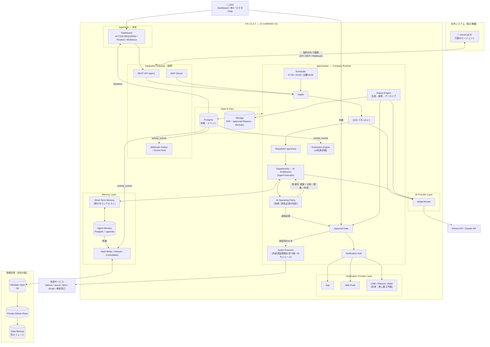
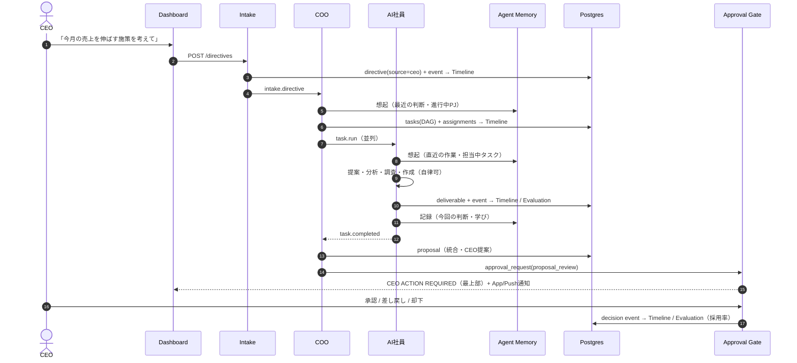
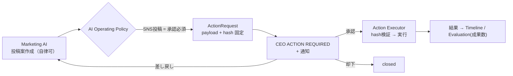
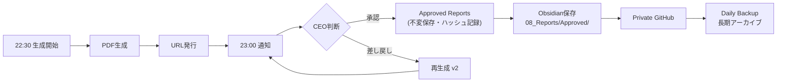
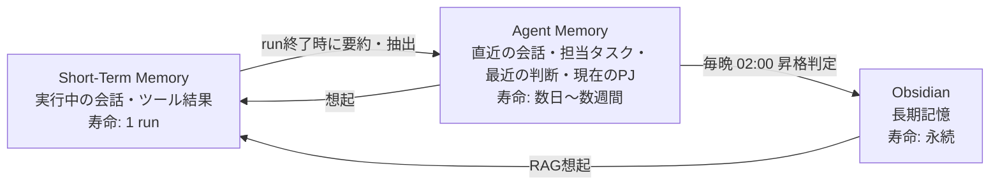
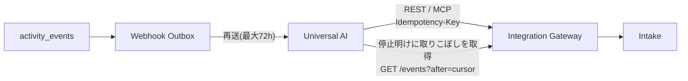

# 01. システム概要・全体アーキテクチャ・データフロー（v1.0）

## 1.1 コンセプト

| 項目 | 内容 |
|---|---|
| プロダクト名 | F.R.I.D.A.Y. — AI COMPANY OS |
| ユーザー | CEO 1名（陽大）。シングルテナント・シングルユーザー前提 |
| 体験目標 | 画面を開いた瞬間「AI会社の本社に入った」と感じる。AI社員が"今"働いている様子が見える |
| CEOの仕事 | 指示を出す / 判断する（承認・却下・差し戻し）/ レポートを読む。それ以外はAIがやる |
| 非目標 | 汎用チャットUI、マルチユーザーSaaS、人間チームのタスク管理ツール |

### 設計原則

1. **Chain of Command** — すべての依頼は COO（F.R.I.D.A.Y.）を経由する。
2. **AI運用ルールの強制** — AIは「提案・分析・調査・作成」は自律、社外に影響する8種の行為は CEO 承認必須（[02章](./02-ai-operating-rules.md)）。ルールはプロンプトではなく**構造で強制**する。
3. **3層メモリ** — Short-Term Memory → Agent Memory → Obsidian。短期と長期を分離し、昇格ルールで橋渡しする（[06章](./06-agent-memory.md)）。
4. **Memory is Markdown, and never lost** — 会社の記憶は Obsidian に Markdown で残し、Git → Private GitHub → Daily Backup の多重化で失わない（[10章](./10-obsidian.md)）。
5. **Loosely Coupled Universal AI** — 万能AIは社外の別システム。契約（API/Webhook/MCPスキーマ）だけで接続し、片方が止まってももう片方は動き続ける（[15章](./15-universal-ai.md)）。
6. **Data-Driven Extensibility** — プロジェクト・部署・AI社員・KPI・評価指標・通知チャネルは**データとして追加**できる。コード修正なしで会社を拡張できる。
7. **Provider Agnostic** — AIモデルも通知チャネルも差し替え可能なアダプタ構造。
8. **Event Sourced Activity** — 会社で起きたことは `activity_events` に記録し、Company Timeline・評価・Vault・通知はそこから派生させる。

## 1.2 技術スタック

| レイヤー | 採用技術 | 理由 |
|---|---|---|
| 言語 | TypeScript（全レイヤー共通） | 型をUI〜Worker〜外部APIまで共有 |
| モノレポ | pnpm workspaces + Turborepo | apps / packages 分離 |
| Web | Next.js（App Router）+ React + Tailwind CSS + shadcn/ui + Framer Motion | ダッシュボード表現力 |
| チャート | Recharts | 進捗リング・スパークライン |
| DB | Supabase Postgres + Drizzle ORM | 型安全なスキーマ、マイグレーション |
| リアルタイム | Supabase Realtime | Live Workforce / Timeline / Action Required |
| ジョブキュー・スケジューラ | pg-boss（Postgres上） | Redis不要。リトライ・cron・優先度 |
| ベクトル検索 | pgvector | Agent Memory と Vault の想起 |
| ストレージ | Supabase Storage（private + 署名付きURL） | PDF・成果物・バックアップ |
| PDF | React テンプレート → HTML → Playwright(Chromium) | 日本語・デザイン再現性 |
| 認証 | Supabase Auth（CEOのメールのみ許可、パスキー推奨） | |
| Vault | Git + Private GitHub Repository + Git LFS（PDF） | 履歴・多重化 |
| 外部接続 | REST API + MCP Server + Webhook（Outbox方式） | 疎結合 |
| AI | Provider Layer（Gemini 初期 / Claude 将来 / Mock） | |
| 通知 | Notification Provider Layer（App / Web Push 必須、LINE / Discord / Slack 将来） | |

## 1.3 全体アーキテクチャ図

### コンポーネント責務

| コンポーネント | 責務 | 持たない責務 |
|---|---|---|
| Integration Gateway | 外部との唯一の接点。認証・scope・レート制限・冪等性・契約バージョン管理、Webhook Outbox、Event Feed | 社内ロジック |
| Dashboard | 可視化、指示入力、判断操作 | ビジネスロジック |
| Intake | 依頼の正規化（Directive化）、出所記録、重複排除 | タスク分解 |
| COO（F.R.I.D.A.Y.） | 理解・分解・振分・統合・提案・全社最適化、Weekly Board Meeting の議長 | 実作業 |
| Dispatcher | キュー投入、依存解決、並列度・優先度制御 | 判断 |
| Agent Executor | AI社員の実行ループ。Memory Layer から想起・記録 | 外部副作用 |
| AI Operating Policy | 行為の分類（自律可 / 承認必須 / 禁止）。最低ラインは設定で緩和不可 | |
| Approval Gate | 承認リクエストの作成・遷移・ペイロード固定・監査 | 実行 |
| Action Executor | 承認済みアクションの冪等実行。**外部サービスの認証情報にアクセスできる唯一のモジュール** | 判断 |
| Report Engine | 収集→執筆→PDF→承認→**Approved Reports→Obsidian→長期アーカイブ** | |
| Evaluation Engine | AI社員の成果指標を集計（日次スナップショット） | 評価の自動処罰 |
| Memory Layer | 3層メモリの保存・想起・昇格・忘却 | |
| Vault Writer/Indexer/Consolidator | DB→Markdown、Vault→DB取込・ベクトル化、Agent Memory→Obsidian 昇格 | |
| Notification Hub | ルール評価・重複抑制・プロバイダへの配信 | チャネル固有処理（アダプタ側） |
| Scheduler | 定時ジョブ（[1.5](#15-定時ジョブ一覧jst)） | |

## 1.4 データフロー図

### (A) CEO指示 → 成果物 → 判断（メインフロー）

### (B) 承認必須アクション（例: SNS投稿）

### (C) レポート：生成 → 承認 → アーカイブ

### (D) 3層メモリ

### (E) Universal AI との疎結合

## 1.5 定時ジョブ一覧（JST）

| 時刻 | ジョブ | 出力 |
|---|---|---|
| 毎日 06:30 | Morning Briefing 生成開始 | |
| **毎日 07:00** | **Morning Briefing 配信** | Home ヒーロー + 通知 |
| 毎日 22:15 | AI社員評価スナップショット | `agent_metric_snapshots` |
| 毎日 22:30 | Daily Executive Report 生成開始 | |
| **毎日 23:00** | **Daily Executive Report 配信**（PDF + 承認依頼） | ACTION REQUIRED |
| 毎日 02:00 | Memory Consolidation（Agent Memory → Obsidian 昇格・期限切れ整理） | Vault commit |
| 毎日 03:00 | Daily Backup（Vault / DB / Approved Reports） | `backup_runs` |
| 日曜 18:30 | Weekly Board Meeting 準備（各部署の週次報告 → COO が議題化） | |
| 日曜 19:30 | Board Pack（PDF）配信 | 通知 |
| **日曜 20:00** | **Weekly Board Meeting**（CEO出席。議題ごとに判断） | 議事録 + Weekly Board Report |
| 日曜 04:00 | バックアップ復元テスト（自動検証） | `backup_runs` |

時刻はすべて `company_settings.schedule` で変更可能。

## 1.6 非機能要件

| 項目 | 目標 |
|---|---|
| ダッシュボード初期表示 | < 1.5s |
| ライブ更新遅延 | < 2s |
| 承認の整合性 | 承認時ペイロードと実行ペイロードのハッシュ一致を保証 |
| 実行の冪等性 | 全 ActionRequest に idempotency_key |
| 独立稼働 | Universal AI 停止中も全機能が稼働。F.R.I.D.A.Y. Worker 停止中も Web は閲覧・受付可能（キューに滞留） |
| 記憶の保全 | Vault RPO ≤ 5分（push間隔）、バックアップ RPO ≤ 24h、RTO ≤ 1h。3-2-1 ルール（3コピー・2媒体・1つは別系統） |
| コスト制御 | 全社 / 社員 / タスクの3段予算 |
| セキュリティ | CEO 1アカウント。外部認証情報は Action Executor のみが参照 |
| タイムゾーン | UTC保存、表示とスケジュールは Asia/Tokyo |
