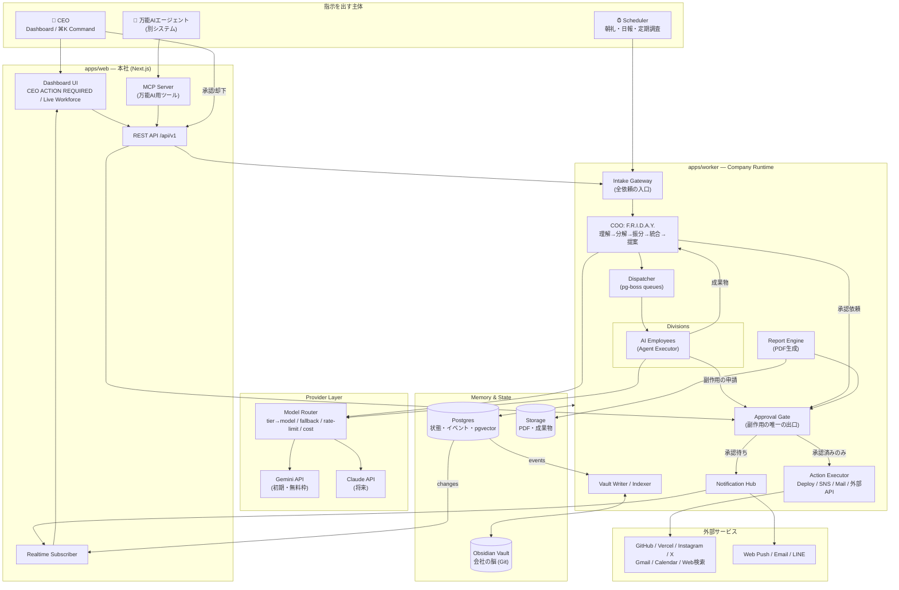
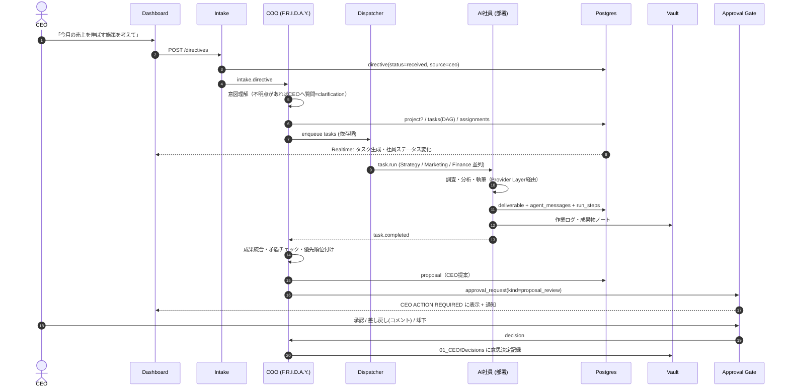
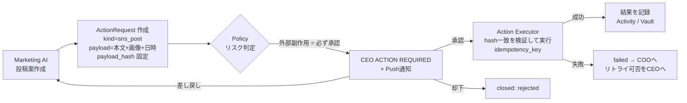
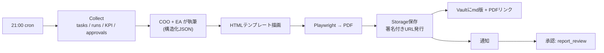
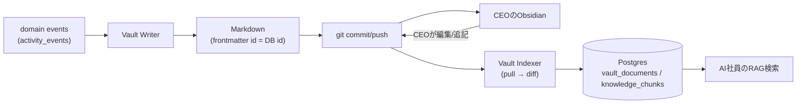

# 01. システム概要・全体アーキテクチャ・データフロー

## 1.1 コンセプト

| 項目 | 内容 |
|---|---|
| プロダクト名 | F.R.I.D.A.Y. — AI COMPANY OS |
| ユーザー | CEO 1名（陽大）。シングルテナント・シングルユーザー前提 |
| 体験目標 | 画面を開いた瞬間「AI会社の本社に入った」と感じる。AI社員が"今"働いている様子が見える |
| CEOの仕事 | 指示を出す / 承認・却下・差し戻しをする / レポートを読む。それ以外はAIがやる |
| 非目標 | 汎用チャットUI、マルチユーザーSaaS、人間チームのタスク管理ツール |

### 設計原則

1. **Chain of Command** — すべての依頼は COO を経由する。部署は部署の仕事だけ、COO は統合と最適化。
2. **Human-in-the-Loop for Side Effects** — 社外に影響する行為は必ず CEO 承認。AI社員に「実行権限」はなく「申請権限」だけを与える。
3. **Memory is Markdown** — 会社の記憶は人間が読める Markdown（Obsidian）で残す。DBが消えても会社の歴史は残る。
4. **Provider Agnostic** — どのAIモデルにも依存しない。モデルは設定値。
5. **Observable by Default** — AI社員の状態・思考の要約・成果物・コストは常に可視。"ブラックボックスな自動化"を作らない。
6. **Event Sourced Activity** — 会社で起きたことはすべてイベントとして記録し、ダッシュボード・ログ・Vault・通知はそのイベントから派生させる。

## 1.2 技術スタック（推奨）

| レイヤー | 採用技術 | 理由 |
|---|---|---|
| 言語 | TypeScript（全レイヤー共通） | 型をUI〜Worker〜外部APIまで共有 |
| モノレポ | pnpm workspaces + Turborepo | apps / packages 分離、型共有 |
| Web | Next.js（App Router）+ React + Tailwind CSS + shadcn/ui + Framer Motion | ダッシュボード表現力、Server Actions |
| チャート | Recharts（＋必要に応じ visx） | 進捗リング・スパークライン |
| DB | Supabase Postgres + Drizzle ORM | 型安全なスキーマ、マイグレーション |
| リアルタイム | Supabase Realtime（Postgres Changes / Broadcast） | AI社員の稼働状況をライブ表示 |
| ジョブキュー | pg-boss（Postgres上のキュー） | Redis不要。リトライ・スケジュール・優先度 |
| スケジューラ | pg-boss の cron 機能 | 朝礼・日報・定期調査 |
| ベクトル検索 | pgvector | Vault の知識・AI社員メモリの検索（RAG） |
| ストレージ | Supabase Storage（署名付きURL） | PDFレポート・成果物ファイル |
| PDF | React テンプレート → HTML → Playwright(Chromium) で PDF化 | 日本語フォント・デザイン再現性が高い |
| 認証 | Supabase Auth（パスキー or Magic Link）、CEO 1アカウントのみ許可 | |
| 外部連携 | REST API + **MCP Server**（万能AIエージェント向け）+ Webhook | |
| AI | Provider Layer（Gemini / Claude / Mock） | 06章 |
| 監視 | 構造化ログ（pino）+ Sentry（任意） | |

## 1.3 全体アーキテクチャ図

### コンポーネント責務

| コンポーネント | 責務 | 持たない責務 |
|---|---|---|
| Dashboard UI | 会社の可視化、指示入力、承認操作 | ビジネスロジック |
| REST API | 認証、入力検証、Intakeへの投入、照会 | 長時間処理（Workerへ） |
| MCP Server | 万能AI向けのツール公開（REST APIの薄いラッパー） | 独自ロジック |
| Intake Gateway | 依頼の正規化（`Directive`化）、出所(source)と権限の記録、重複排除 | タスク分解 |
| COO（F.R.I.D.A.Y.） | 指示理解・タスク分解・部署振分け・成果統合・CEO提案・全社最適化 | 実作業 |
| Dispatcher | キュー投入、依存解決、並列度/優先度制御、リトライ | 判断 |
| Agent Executor | AI社員の実行ループ（思考→ツール→成果物）、状態の発行 | 外部副作用の実行 |
| Approval Gate | 承認リクエストの作成・状態遷移・ペイロード固定・監査 | 実行そのもの |
| Action Executor | 承認済みアクションの冪等実行 | 判断 |
| Report Engine | データ収集→AI執筆→PDF→保存→URL発行 | |
| Notification Hub | 通知のルーティング・重複抑制・既読管理 | |
| Vault Writer/Indexer | DBイベント→Markdown書き出し、Vault変更→DB取込・ベクトル化 | |
| Model Router | モデル解決・フォールバック・レート制御・コスト記録 | プロンプト設計 |

## 1.4 データフロー図

### (A) CEO指示 → 成果物 → CEO提案（メインフロー）

### (B) 副作用アクション（例: Instagram投稿）

### (C) 日次レポート

### (D) 記憶の流れ（DB ⇄ Obsidian）

## 1.5 非機能要件

| 項目 | 目標 |
|---|---|
| ダッシュボード初期表示 | < 1.5s（サーバーコンポーネントで集計済みデータを返す） |
| ライブ更新遅延 | < 2s（Realtime） |
| 承認の整合性 | 承認したペイロードと実行ペイロードのハッシュ一致を保証 |
| 実行の冪等性 | 全 ActionRequest に idempotency_key、二重実行なし |
| コスト制御 | 日次/月次のトークン予算。超過時は fast tier に自動降格し CEO に通知 |
| 可用性 | Worker 停止時も Dashboard は閲覧可能。復帰時にキューから再開 |
| セキュリティ | CEO 1アカウントのみ。外部APIキーはサーバー側環境変数（DBに平文保存しない）。万能AI用APIキーはスコープ付き・ハッシュ保存 |
| バックアップ | Vault は Git 履歴、DB は日次バックアップ |
| タイムゾーン | すべて UTC 保存、表示とスケジュールは Asia/Tokyo |
