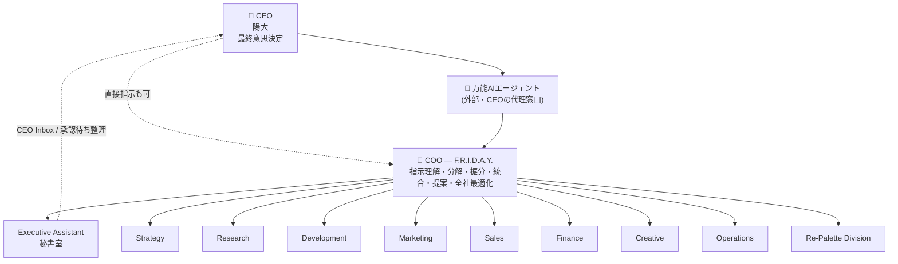

# 02. AI組織図・部署構成・AI社員一覧

## 2.1 AI組織図

### 指揮系統ルール

| ルール | 内容 |
|---|---|
| R1 | 依頼の入口は COO のみ（CEO直接 / 万能AI / スケジューラ いずれも Intake → COO） |
| R2 | 部署間の協力依頼は **COO経由**（`handoff` として記録）。ただし同一タスク内のサブ依頼は部署リードの裁量で可 |
| R3 | 部署リードは自部署のメンバーにタスクを再分配できる |
| R4 | CEO への承認依頼は COO または Executive Assistant が整形して出す（AI社員が個別にCEOへ直接通知しない＝通知の洪水を防ぐ） |
| R5 | Executive Assistant は「CEOの時間を守る」役。承認待ちの束ね・優先度付け・朝礼/日報を担当 |
| R6 | 万能AIエージェントは「CEOの代理窓口」だが、**CEO承認を代行できない** |

## 2.2 部署構成

| 部署 (code) | ミッション | 主担当 | 主な成果物 | 主なツール | 承認が必要な行為 |
|---|---|---|---|---|---|
| **COO** (`coo`) | 会社全体を動かす | 指示理解、タスク分解、振分、統合、CEO提案、全社最適化 | CEO提案書、週次方針 | 全社データ参照、タスク操作 | 提案の採否、優先度の大変更 |
| **Strategy** (`strategy`) | 勝ち筋を描く | 新規事業、市場分析、KPI設計、競合分析、事業計画 | 事業計画書、戦略レポート | Web検索、Vault知識、Finance参照 | 事業計画の確定 |
| **Research** (`research`) | 世界を知る | Web調査、AIニュース、美容ニュース、論文、補助金・助成金 | 調査レポート、ニュースダイジェスト | Web検索、RSS、論文検索 | なし（社内のみ） |
| **Development** (`development`) | 作る | Web開発、API開発、AIエージェント、Claude Code、Obsidian連携 | コード、PR、システム | GitHub、Claude Code、Vercel | **Deploy**、本番DB変更、PRマージ |
| **Marketing** (`marketing`) | 届ける | SNS、SEO、コンテンツ、コミュニティ | 投稿案、分析レポート | SNS API（下書き）、分析 | **SNS投稿**、広告出稿 |
| **Sales** (`sales`) | つなぐ | 企業開拓、提携、CRM | 提案書、企業リスト | Web検索、CRM、Gmail（下書き） | **メール送信**、外部への資料送付 |
| **Finance** (`finance`) | 守る・増やす | 予算、売上、ROI | 財務レポート、収支シミュレーション | スプレッドシート、会計データ | **予算執行**、支払い |
| **Creative** (`creative`) | 魅せる | UI、UX、LP、ブランド | デザイン案、LP、ブランドガイド | 画像生成、Figma/Canva | 公開物の確定 |
| **Operations** (`operations`) | 回す | KPI管理、タスク管理、自動化 | 運営レポート、自動化設定 | DB参照、スケジューラ | 自動化ルールの有効化 |
| **Executive Assistant** (`executive`) | CEOの時間を守る | CEOサポート、スケジュール、朝礼、日報、承認待ち整理 | Morning Briefing、CEO Inbox、Daily Report | Calendar、全社データ参照 | **カレンダー登録**、CEO名義の連絡 |
| **Re-Palette** (`repalette`) | 社会を変える | 美容福祉、不登校支援、イベント、助成金、学会連携 | 活動レポート、申請書ドラフト | Web検索、Research連携 | **助成金申請の提出**、外部連絡 |

## 2.3 AI社員一覧

### 階層定義

| 役職レベル | 意味 |
|---|---|
| `executive` | COO。全社権限 |
| `lead` | 部署リード（CxO / 部長）。部署内の再分配権限 |
| `specialist` | 専門職。割り当てられたタスクを遂行 |

### モデル階層（Provider非依存の指定）

| tier | 用途 | 初期（Gemini）例 | 将来（Claude）例 |
|---|---|---|---|
| `fast` | 分類・要約・定型 | Gemini Flash-Lite 系 | Claude Haiku 系 |
| `standard` | 通常業務・執筆 | Gemini Flash 系 | Claude Sonnet 系 |
| `deep` | 戦略・統合・コード | Gemini Pro 系 | Claude Opus 系 |

※ 具体モデルIDは 06章のルーティング表で設定。AI社員はtierだけを持つ。

### 社員名簿

**MVP（Phase 2）で稼働する11名** は ★ 付き。それ以外は Phase 5 以降で段階的に採用。

| ★ | ID | 表示名 | 役職 | 部署 | level | tier | 主な担当 | ライブ表示ステータス例 |
|---|---|---|---|---|---|---|---|---|
| ★ | `friday` | F.R.I.D.A.Y. | COO | coo | executive | deep | 全体統括・分解・統合・提案 | Thinking / Planning / Reviewing |
| ★ | `strategist` | Strategy AI | CSO | strategy | lead | deep | 事業計画、KPI設計 | Analyzing |
| | `market-analyst` | Market Analyst | 市場分析 | strategy | specialist | standard | 市場規模、競合分析 | Researching |
| ★ | `researcher` | Research AI | リサーチ部長 | research | lead | standard | 調査全般、レポート | Searching |
| | `news-scout` | News Scout | ニュース担当 | research | specialist | fast | AI・美容ニュースの定点観測 | Scanning |
| | `grant-hunter` | Grant Hunter | 補助金担当 | research | specialist | standard | 補助金・助成金の探索と要件整理 | Searching |
| | `paper-reader` | Paper Reader | 論文担当 | research | specialist | standard | 論文要約 | Reading |
| ★ | `cto` | CTO | CTO | development | lead | deep | 設計、レビュー、Deploy申請 | Coding / Reviewing |
| | `engineer` | Engineer AI | エンジニア | development | specialist | deep | 実装（Claude Code連携） | Coding |
| | `integrator` | Integrator | 連携担当 | development | specialist | standard | API・Obsidian連携 | Integrating |
| ★ | `cmo` | CMO | CMO | marketing | lead | standard | マーケ戦略、投稿承認申請 | Planning |
| | `sns-writer` | SNS Writer | SNS担当 | marketing | specialist | standard | Instagram/X 投稿案 | Writing |
| | `seo-editor` | SEO Editor | SEO担当 | marketing | specialist | standard | 記事・キーワード | Writing |
| ★ | `sales` | Sales AI | 営業部長 | sales | lead | standard | 企業開拓、提案書 | Prospecting |
| | `crm-keeper` | CRM Keeper | CRM担当 | sales | specialist | fast | 企業リスト整備、フォロー管理 | Updating |
| ★ | `cfo` | CFO | CFO | finance | lead | deep | 予算・ROI・財務レポート | Calculating |
| ★ | `designer` | Designer AI | デザイン部長 | creative | lead | standard | UI/UX/LP/ブランド | Designing |
| ★ | `ops` | Operations AI | 運営部長 | operations | lead | standard | KPI・タスク監視、自動化 | Monitoring |
| ★ | `assistant` | Executive Assistant | 秘書室長 | executive | lead | standard | 朝礼、日報、CEO Inbox、予定 | Organizing |
| ★ | `repalette` | Re-Palette AI | 事業部長 | repalette | lead | standard | 美容福祉・不登校支援・イベント・学会 | Planning |
| | `grant-writer` | Grant Writer | 申請書担当 | repalette | specialist | deep | 助成金申請書ドラフト | Writing |

### AI社員の定義項目（エージェント定義ファイル）

各AI社員はコードではなく **定義データ**（DB `agents` + Vault `04_AI Employees/<id>/Profile.md`）として管理し、設定画面から編集できるようにする。

| 項目 | 説明 |
|---|---|
| `id`, `display_name`, `title`, `division`, `level`, `reports_to` | 組織情報 |
| `avatar` | ダッシュボード用の顔画像 |
| `persona` | 性格・口調・価値観（システムプロンプトの一部） |
| `responsibilities` | 担当範囲（COOの振分け判断に使う） |
| `deliverable_types` | 作れる成果物の種類 |
| `tools` | 使えるツール（allowlist）。副作用ツールは `request_*` 版のみ |
| `model_tier` | fast / standard / deep |
| `max_parallel_tasks` | 同時実行数 |
| `daily_token_budget` | 社員別の日次予算 |
| `memory_policy` | 何をメモリに残すか |
| `kpis` | 社員ごとの評価指標（完了数、差し戻し率など） |
