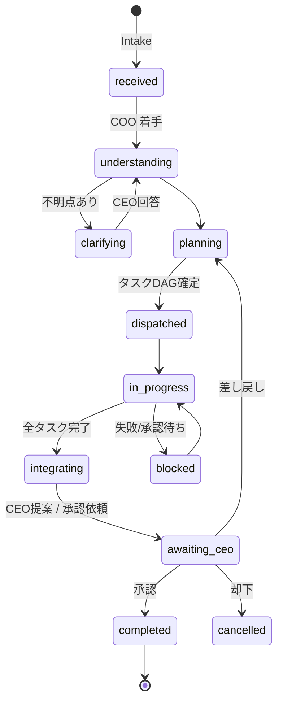
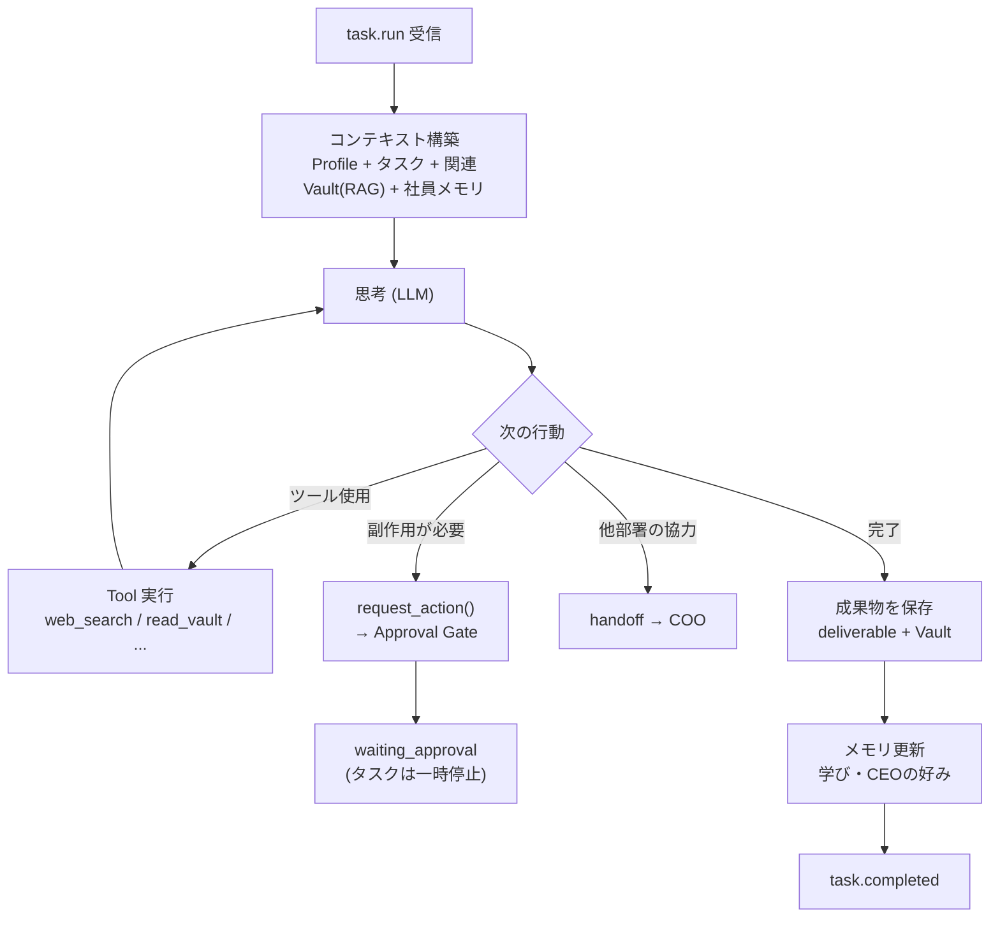

# 03. エージェント実行基盤（COOオーケストレーション）

AI社員が「本当に働いている」ように見えるための実行モデル。

## 3.1 COO パイプライン

| ステージ | COOがやること | 出力（構造化） |
|---|---|---|
| Understand | 目的・制約・期限・成功条件を抽出。曖昧なら CEO に最大3問まで質問 | `DirectiveSpec { goal, constraints, deadline, success_criteria, priority }` |
| Plan | 既存プロジェクトとの関係判定、タスク分解、依存関係、担当部署・社員、見積り | `Plan { project_id?, tasks[{title, division, assignee?, depends_on[], deliverable_type, est_minutes}] }` |
| Dispatch | キュー投入（依存順）、優先度・並列度設定 | `task` レコード |
| Monitor | 進捗監視、詰まり検知（タイムアウト・失敗）、再割当 | `activity_event` |
| Integrate | 成果物を読み、矛盾チェック・統合・要約 | `deliverable(kind=integrated)` |
| Propose | CEOへの提案（推奨案＋代替案＋根拠＋リスク＋必要な承認） | `proposal` + `approval_request` |
| Optimize | 週次で全社の負荷・コスト・差し戻し率を見て配置を提案 | `weekly_optimization` レポート |

※ 「COOの判断」はすべて LLM の構造化出力（JSON Schema検証）で受け取り、スキーマ不一致は自動リトライ→失敗時は CEO にエスカレーション。

## 3.2 AI社員（Agent Executor）の実行ループ

- 1タスクあたり `max_steps`（例: 15）と `max_tokens` の上限。超過したら `blocked` で COO へ。
- 各ステップは `run_steps` に記録（思考は**要約のみ**保存し、ダッシュボードの「現在の作業」表示に使う）。
- 状態変化は `agent_presence` を更新 → Realtime でダッシュボードの LIVE AI WORKFORCE に即時反映。

## 3.3 ツール体系

| 区分 | ツール例 | 実行 |
|---|---|---|
| Read（社内） | `read_vault`, `search_knowledge`, `query_tasks`, `query_kpis`, `get_deliverable` | 即時 |
| Read（社外） | `web_search`, `fetch_url`, `rss_fetch`, `paper_search` | 即時（レート制御） |
| Write（社内） | `create_deliverable`, `write_vault_note`, `update_task`, `post_message`, `remember` | 即時 |
| Coordination | `handoff`, `ask_ceo`（clarification）, `create_subtask` | 即時（COOが仲介） |
| Side Effect | `request_deploy`, `request_sns_post`, `request_email_send`, `request_calendar_event`, `request_external_call`, `request_budget_spend` | **ActionRequest作成のみ**。実行は承認後に Action Executor |

ツールは `packages/tools` に登録し、AI社員ごとの allowlist で公開範囲を制御する。

## 3.4 状態（ダッシュボード表示用）

| presence | 表示 | 色 |
|---|---|---|
| `idle` | 待機中 | gray |
| `thinking` | Thinking | violet |
| `researching` | Researching / Searching | cyan |
| `coding` | Coding | blue |
| `writing` | Writing | teal |
| `designing` | Designing | pink |
| `meeting` | In Meeting（AI社員同士の協議） | amber |
| `waiting_approval` | 承認待ち | orange |
| `blocked` | 要対応 | red |
| `offline` | 停止中（予算超過/無効） | dim |

`agent_presence.activity_label`（例:「Instagramトレンド分析」）はタスクタイトルから自動生成。

## 3.5 AI社員同士の会話（会話ログ）

- 部署間の handoff・レビュー・会議は `agent_messages` に記録（スレッド単位）。
- ダッシュボードの「AI社員の会話ログ」はこれをタイムライン表示。
- **AI会議**: COOが複数社員を招集して議題を議論させる機能（Phase 5）。議事録は `07_Meetings` に保存。

## 3.6 キュー設計（pg-boss）

| queue | 内容 | 並列度 | リトライ |
|---|---|---|---|
| `intake` | 依頼の受付 | 2 | 3 |
| `coo.plan` / `coo.integrate` | COO処理 | 1（直列化で判断の一貫性を保つ） | 3 |
| `agent.<division>` | 部署別タスク | 部署ごとに設定（例: 2） | 2（指数バックオフ） |
| `action.execute` | 承認済みアクション | 1 | 0（冪等キーで手動再実行のみ） |
| `report.generate` | レポート生成 | 1 | 3 |
| `vault.sync` | Vault書き出し/取込 | 1（Git競合防止） | 5 |
| `notify.dispatch` | 通知配信 | 4 | 5 |

## 3.7 コスト・暴走防止

- 全LLM呼び出しは `llm_usage` に記録（社員・タスク・モデル・トークン・推定コスト）。
- 予算: 全社日次 / 社員日次 / タスク単位の3段。80%で警告通知、100%で fast tier に降格 or 停止（設定）。
- ループ検知: 同一ツール・同一引数の連続呼び出しを検知して停止。
- **Kill Switch**: 設定画面とコマンドで全社員を一時停止（`company_state.paused = true`）。
