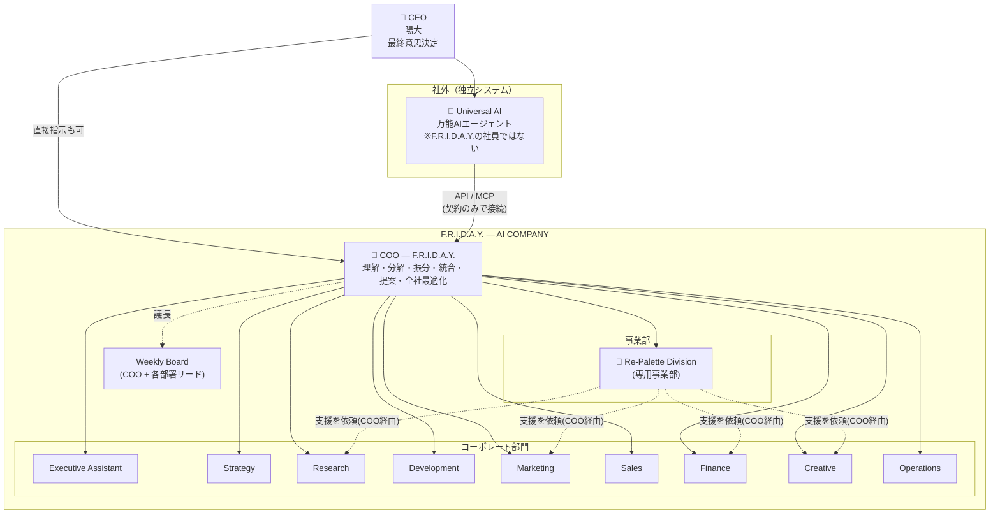

# 03. AI組織図・部署構成・AI社員一覧（v1.0）

## 3.1 AI組織図

### 指揮系統ルール

| ルール | 内容 |
|---|---|
| R1 | 依頼の入口は COO のみ（CEO直接 / Universal AI / Scheduler） |
| R2 | 部署間の協力依頼は COO 経由（`handoff`として記録） |
| R3 | 部署リードは自部署メンバーへ再分配できる |
| R4 | CEO への判断依頼は COO または Executive Assistant が整形して出す |
| R5 | **Universal AI は組織の外**。`agents` テーブルには存在せず、`api_clients` の1つとして扱う。CEO の承認を代行できない |
| R6 | Re-Palette は**事業部**として独自の KPI・予算・ダッシュボードを持ち、コーポレート部門の支援を受ける |

## 3.2 部署構成

| 部署 (code) | 種別 | ミッション | 担当 | 主な成果物 |
|---|---|---|---|---|
| COO (`coo`) | 経営 | 会社全体を動かす | 理解・分解・振分・統合・提案・最適化、Board議長 | CEO提案書、Weekly Board Report |
| Executive Assistant (`executive`) | コーポレート | CEOの時間を守る | CEOサポート、スケジュール、朝礼、日報、判断待ちの整理 | Morning Briefing、CEO Inbox |
| Strategy (`strategy`) | コーポレート | 勝ち筋を描く | 新規事業、市場分析、KPI、競合分析、事業計画 | 事業計画書、戦略レポート |
| Research (`research`) | コーポレート | 世界を知る | Web調査、AIニュース、美容ニュース、論文、補助金・助成金 | 調査レポート |
| Development (`development`) | コーポレート | 作る | Web開発、API開発、AIエージェント、Claude Code、Obsidian連携 | コード、システム |
| Marketing (`marketing`) | コーポレート | 届ける | SNS、SEO、コンテンツ、コミュニティ | 投稿案、分析レポート |
| Sales (`sales`) | コーポレート | つなぐ | 企業開拓、提携、CRM | 提案書、企業リスト |
| Finance (`finance`) | コーポレート | 守る・増やす | 予算、売上、ROI | 財務レポート |
| Creative (`creative`) | コーポレート | 魅せる | UI、UX、LP、ブランド | デザイン |
| Operations (`operations`) | コーポレート | 回す | KPI管理、タスク管理、自動化、バックアップ監視 | 運営レポート |
| **Re-Palette** (`repalette`) | **事業部** | 美容と福祉で社会を彩る | 美容福祉、不登校支援、イベント運営、助成金、学会連携、企業連携、効果測定、SNS発信 | 活動レポート、申請書、効果測定レポート（[04章](./04-repalette-division.md)） |

部署は `divisions` テーブルのデータ。部署の追加・名称変更にコード修正は不要。

## 3.3 AI社員一覧

### モデル階層（Provider非依存）

| tier | 用途 | Gemini 例 | Claude 例 |
|---|---|---|---|
| `fast` | 分類・要約・定型 | Flash-Lite 系 | Haiku 系 |
| `standard` | 通常業務・執筆 | Flash 系 | Sonnet 系 |
| `deep` | 戦略・統合・コード | Pro 系 | Opus 系 |

### 社員名簿

★ = MVP（Phase 2）で稼働する11名。☆ = Re-Palette 強化で Phase 5 に採用。無印 = Phase 5 以降に段階採用。

| | ID | 表示名 | 役職 | 部署 | level | tier | 主な担当 | 評価指標（[07章](./07-agent-evaluation.md)） |
|---|---|---|---|---|---|---|---|---|
| ★ | `friday` | F.R.I.D.A.Y. | COO | coo | executive | deep | 統括・分解・統合・提案 | 提案採用率、Directive完了率、リードタイム |
| ★ | `assistant` | Executive Assistant | 秘書室長 | executive | lead | standard | 朝礼・日報・CEO Inbox・予定 | 期限内配信率、判断待ち滞留時間 |
| ★ | `strategist` | Strategy AI | CSO | strategy | lead | deep | 事業計画、KPI設計 | 提案数、採用率 |
| | `market-analyst` | Market Analyst | 市場分析 | strategy | specialist | standard | 市場規模・競合 | 分析件数、参照回数 |
| ★ | `researcher` | Research AI | リサーチ部長 | research | lead | standard | 調査全般 | **調査件数・採用率・参照回数** |
| | `news-scout` | News Scout | ニュース担当 | research | specialist | fast | AI・美容ニュース | 収集件数、参照回数 |
| | `grant-hunter` | Grant Hunter | 補助金担当 | research | specialist | standard | 補助金・助成金の探索（全社） | 発見件数、申請化率 |
| | `paper-reader` | Paper Reader | 論文担当 | research | specialist | standard | 論文要約 | 要約件数、参照回数 |
| ★ | `cto` | CTO | CTO | development | lead | deep | 設計・レビュー・Deploy申請 | **実装数・修正数・完了率** |
| | `engineer` | Engineer AI | エンジニア | development | specialist | deep | 実装（Claude Code連携） | 実装数・修正数・完了率 |
| | `integrator` | Integrator | 連携担当 | development | specialist | standard | API・Obsidian連携 | 実装数・完了率 |
| ★ | `cmo` | CMO | CMO | marketing | lead | standard | マーケ戦略 | **投稿作成数・採用率・成果数** |
| | `sns-writer` | SNS Writer | SNS担当 | marketing | specialist | standard | 投稿案 | 投稿作成数・採用率・成果数 |
| | `seo-editor` | SEO Editor | SEO担当 | marketing | specialist | standard | 記事 | 記事数・採用率・流入 |
| ★ | `sales` | Sales AI | 営業部長 | sales | lead | standard | 企業開拓・提案書 | リスト件数、提案採用率、商談化数 |
| | `crm-keeper` | CRM Keeper | CRM担当 | sales | specialist | fast | 企業リスト・フォロー | 更新件数 |
| ★ | `cfo` | CFO | CFO | finance | lead | deep | 予算・ROI・財務 | レポート数、予測誤差 |
| ★ | `designer` | Designer AI | デザイン部長 | creative | lead | standard | UI/UX/LP/ブランド | デザイン数、採用率、修正回数 |
| ★ | `ops` | Operations AI | 運営部長 | operations | lead | standard | KPI・タスク監視・自動化・バックアップ監視 | 検知件数、自動化数 |
| ★ | `repalette` | Re-Palette AI | 事業部長 | repalette | lead | deep | 事業部統括 | 事業部KPI達成率 |
| ☆ | `rp-welfare` | Welfare Program AI | 美容福祉担当 | repalette | specialist | standard | 美容福祉プログラム | 企画数、実施数 |
| ☆ | `rp-youth` | Youth Support AI | 不登校支援担当 | repalette | specialist | standard | 不登校支援プログラム | 企画数、継続率分析 |
| ☆ | `rp-event` | Event Producer AI | イベント担当 | repalette | specialist | standard | イベント運営 | 開催準備数、満足度分析 |
| ☆ | `rp-grant` | Grant Writer AI | 助成金担当 | repalette | specialist | deep | 申請書作成・進捗管理 | 申請数、採択率 |
| ☆ | `rp-academic` | Academic Liaison AI | 学会連携担当 | repalette | specialist | deep | 学会・研究者連携 | 発表準備数、連携数 |
| ☆ | `rp-partner` | Partnership AI | 企業連携担当 | repalette | specialist | standard | 企業・団体連携 | 提案数、提携数 |
| ☆ | `rp-impact` | Impact Analyst AI | 効果測定担当 | repalette | specialist | deep | 効果測定・ロジックモデル | 測定レポート数 |
| ☆ | `rp-sns` | Re-Palette SNS AI | SNS発信担当 | repalette | specialist | standard | Re-Palette 公式SNS | 投稿作成数・採用率・成果数 |

AI社員も `agents` テーブルのデータ。採用（追加）は設定画面から行え、コード修正は不要。

### AI社員の定義項目

| 項目 | 説明 |
|---|---|
| `id`, `display_name`, `title`, `division_id`, `level`, `reports_to`, `avatar_url` | 組織情報 |
| `persona` | 性格・口調・価値観 |
| `responsibilities` | 担当範囲（COOの振分け判断に使用） |
| `deliverable_types` | 作れる成果物 |
| `tools` | 使えるツール（allowlist、承認必須行為は `request_*` のみ） |
| `model_tier` / `model_override` | モデル階層 |
| `memory_policy` | Agent Memory の保持期間・容量・昇格基準（[06章](./06-agent-memory.md)） |
| `metric_set` | 評価指標セット（[07章](./07-agent-evaluation.md)） |
| `data_access` | 参照可能なデータ区分（例: Re-Palette の restricted データ） |
| `max_parallel_tasks`, `daily_token_budget`, `enabled` | 運用 |
