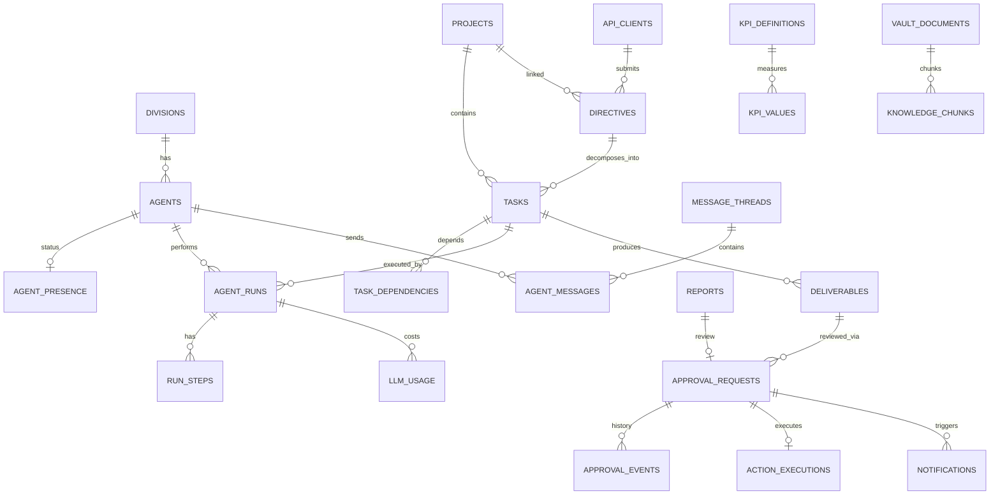

# 04. データモデル・DB設計

## 4.1 方針

- **Postgres（Supabase）= 運用状態の正（Source of Truth for state）**: タスク状態、承認状態、ステータス、KPI数値、通知。
- **Obsidian Vault = 記憶の正（Source of Truth for memory）**: 本文・議事録・知識・メモリ・意思決定の記録。
- 両者は **ULID** の共通IDで対応（Vaultのfrontmatter `id` = DBの `id`）。
- 全テーブル共通: `id (ULID text PK)`, `created_at`, `updated_at`（timestamptz, UTC）。論理削除が必要なものは `archived_at`。
- 状態は Postgres の enum で定義し、遷移はアプリ層のステートマシンで検証。
- すべての重要な変化は `activity_events` に追記（イベントソース。ダッシュボード・Vault・通知はここから派生）。

## 4.2 ER図（主要エンティティ）

## 4.3 テーブル定義

### 組織

**`divisions`**
| column | type | note |
|---|---|---|
| id | text PK | `strategy` 等のコードをそのままIDに |
| name / name_ja | text | |
| mission | text | |
| color | text | UIのアクセント色 |
| lead_agent_id | text FK agents | |
| sort_order | int | |

**`agents`**（AI社員）
| column | type | note |
|---|---|---|
| id | text PK | `friday`, `cto` … |
| display_name, title | text | |
| division_id | text FK | |
| level | enum(`executive`,`lead`,`specialist`) | |
| reports_to | text FK agents | |
| avatar_url | text | |
| persona | text | システムプロンプト用 |
| responsibilities | text[] | |
| deliverable_types | text[] | |
| tools | text[] | allowlist |
| model_tier | enum(`fast`,`standard`,`deep`) | |
| model_override | text null | 特定モデル固定したい場合のみ |
| max_parallel_tasks | int | |
| daily_token_budget | int | |
| enabled | bool | |
| vault_path | text | `04_AI Employees/cto` |

**`agent_presence`**（ライブ状態・1社員1行・高頻度更新）
| column | type | note |
|---|---|---|
| agent_id | text PK FK | |
| state | enum（03章 3.4） | |
| activity_label | text | 「ダッシュボード認証機能の実装」 |
| current_task_id | text FK null | |
| current_run_id | text FK null | |
| progress | smallint 0-100 null | |
| last_heartbeat_at | timestamptz | 60秒途絶で `offline` 表示 |

### 指示・プロジェクト・タスク

**`directives`**（CEO指示・依頼の正規化）
| column | type | note |
|---|---|---|
| id | ULID | |
| source | enum(`ceo`,`universal_agent`,`scheduler`,`system`) | 誰からの依頼か |
| api_client_id | FK null | 万能AI経由時 |
| raw_text | text | 原文 |
| spec | jsonb | DirectiveSpec（goal/constraints/deadline/success_criteria） |
| priority | enum(`p0`,`p1`,`p2`,`p3`) | |
| status | enum(`received`,`understanding`,`clarifying`,`planning`,`in_progress`,`integrating`,`awaiting_ceo`,`completed`,`cancelled`,`failed`) | |
| project_id | FK null | |
| result_summary | text | |
| idempotency_key | text unique null | 外部からの重複投入防止 |
| vault_path | text | |

**`clarifications`**（COO→CEOの質問）: `id, directive_id, question, options jsonb, answer, answered_at`

**`projects`**
| column | type | note |
|---|---|---|
| id | ULID | |
| code | text unique | `FRIDAY`, `REPALETTE`, `NEWTONE` |
| name | text | |
| description | text | |
| owner_division_id | FK | |
| status | enum(`proposed`,`planning`,`active`,`on_hold`,`completed`,`archived`) | |
| phase_label | text | 「開発中」「企画中」等 |
| progress | smallint | タスク完了率から自動算出（手動上書き可） |
| start_date, target_date | date | |
| health | enum(`on_track`,`at_risk`,`off_track`) | COOが判定 |
| vault_path | text | |

**`tasks`**
| column | type | note |
|---|---|---|
| id | ULID | |
| directive_id | FK null | |
| project_id | FK null | |
| parent_task_id | FK null | サブタスク |
| title, description | text | |
| division_id | FK | |
| assignee_agent_id | FK null | |
| status | enum(`queued`,`blocked`,`in_progress`,`waiting_approval`,`review`,`done`,`failed`,`cancelled`) | |
| priority | enum p0–p3 | |
| deliverable_type | text | |
| due_at | timestamptz | |
| started_at, completed_at | timestamptz | |
| est_minutes, actual_minutes | int | |
| attempt | int | |
| vault_path | text | |

**`task_dependencies`**: `task_id, depends_on_task_id`（PK複合）

### 実行ログ

**`agent_runs`**: `id, task_id, agent_id, status(running/succeeded/failed/aborted), started_at, ended_at, step_count, input_tokens, output_tokens, cost_usd, error`

**`run_steps`**: `id, run_id, seq, kind(thought_summary/tool_call/tool_result/output), tool_name, summary text, payload jsonb(大きい場合はStorage参照), created_at`

**`message_threads`**: `id, topic, kind(handoff/review/meeting/chat), directive_id, project_id`

**`agent_messages`**: `id, thread_id, from_agent_id, to_agent_id null, body, created_at` — ダッシュボードの「AI社員の会話ログ」

### 成果物・レポート

**`deliverables`**
| column | type | note |
|---|---|---|
| id | ULID | |
| task_id, project_id | FK | |
| author_agent_id | FK | |
| kind | text | `strategy_report`, `research_report`, `sns_post_draft`, `code_pr`, `design`, `proposal`, `integrated` … |
| title | text | |
| summary | text | |
| content_md | text | 本文（Vaultにも書き出し） |
| files | jsonb | Storageパス配列 |
| status | enum(`draft`,`in_review`,`approved`,`rejected`,`published`) | |
| version | int | 差し戻しで増える |
| vault_path | text | |

**`reports`**
| column | type | note |
|---|---|---|
| id | ULID | |
| type | enum(`daily_executive`,`morning_briefing`,`weekly`,`strategy`,`research`,`marketing`,`sales`,`finance`,`operations`,`repalette`) | |
| title | text | |
| period_start, period_end | timestamptz | |
| author_agent_id | FK | |
| data_snapshot | jsonb | 生成時点の集計値（再現性） |
| content | jsonb | セクション構造（08章） |
| pdf_storage_path | text | |
| pdf_url_expires_at | timestamptz | 署名URLは都度発行 |
| status | enum(`generating`,`ready`,`pending_review`,`approved`,`revision_requested`,`failed`) | |
| vault_path | text | |

### 承認・実行

**`approval_requests`**
| column | type | note |
|---|---|---|
| id | ULID | |
| kind | enum(`report_review`,`proposal_review`,`deliverable_review`,`deploy`,`sns_post`,`email_send`,`external_integration`,`calendar_event`,`budget_spend`,`automation_enable`,`grant_submission`,`other`) | |
| title | text | 「Instagram投稿の承認」 |
| summary | text | CEOが10秒で判断できる要約 |
| requested_by_agent_id | FK | |
| division_id | FK | |
| subject_type / subject_id | text | 対象（deliverable / report / task …） |
| payload | jsonb | **実行される内容そのもの**（本文、宛先、diff、URL…） |
| payload_hash | text | sha256。承認後の改ざん検知 |
| preview | jsonb | UI表示用（画像URL、diff抜粋、PDF URL） |
| risk_level | enum(`low`,`medium`,`high`,`critical`) | |
| priority | enum p0–p3 | |
| status | enum(`pending`,`approved`,`rejected`,`revision_requested`,`expired`,`cancelled`,`executing`,`executed`,`execution_failed`) | |
| due_at | timestamptz | 期限（SNS予約時刻など） |
| expires_at | timestamptz | 過ぎたら `expired` |
| decided_at | timestamptz | |
| decision_comment | text | 差し戻し理由 |
| idempotency_key | text unique | |

**`approval_events`**: `id, approval_request_id, from_status, to_status, actor(ceo/system/agent:<id>), comment, created_at`（監査ログ・追記のみ）

**`action_executions`**: `id, approval_request_id, executor, status(running/succeeded/failed), attempt, payload_hash, result jsonb, external_ref (投稿URL/PR番号等), error, started_at, finished_at`

### 通知

**`notifications`**
| column | type | note |
|---|---|---|
| id | ULID | |
| category | enum(`action_required`,`report`,`project`,`task`,`system`,`alert`) | |
| severity | enum(`info`,`success`,`warning`,`critical`) | |
| title, body | text | |
| link | text | アプリ内遷移先 |
| approval_request_id | FK null | |
| dedupe_key | text | 同一事象の重複抑制 |
| read_at, archived_at | timestamptz | |

**`notification_deliveries`**: `id, notification_id, channel(in_app/web_push/email/line/slack), status(pending/sent/failed/skipped), sent_at, error`

**`push_subscriptions`**: `id, endpoint, keys jsonb, device_label, created_at`

**`notification_rules`**: `id, category, min_severity, channels text[], quiet_hours jsonb, enabled`

### KPI・予定・会議

**`kpi_definitions`**: `id, key (unique), name, division_id, unit, direction(up/down), target_value, period(daily/weekly/monthly), source(manual/computed/integration)`

**`kpi_values`**: `id, kpi_id, period_start, value numeric, note`（`(kpi_id, period_start)` unique）

**`schedule_events`**: `id, title, start_at, end_at, category, attendees text[], location, source(google_calendar/manual/ai), external_id`

**`meetings`**: `id, title, kind(ceo_meeting/ai_meeting/morning_brief), started_at, participants text[], summary, decisions jsonb, vault_path`

### イベント・システム

**`activity_events`**（追記のみ・イベントソース）
| column | type | note |
|---|---|---|
| id | ULID（時系列ソート可能） | |
| type | text | `task.created`, `task.completed`, `approval.requested`, `report.ready`, `agent.state_changed`… |
| actor | text | `ceo` / `agent:cto` / `system` / `client:<id>` |
| subject_type / subject_id | text | |
| data | jsonb | |
| vault_synced_at | timestamptz null | Vault書き出し済み印 |

**`company_state`**（1行）: `paused bool, autonomy_level, timezone, report_schedule jsonb, daily_token_budget, updated_at`

### AI Provider

**`provider_configs`**: `id, provider(gemini/claude/mock/openai_compatible), enabled, display_name, base_url null, api_key_ref (環境変数名。キー本体は保存しない), rate_limits jsonb(rpm/rpd/tpm), priority`

**`model_routes`**: `id, tier(fast/standard/deep/embedding), provider_config_id, model_id, params jsonb, fallback_route_id null, active bool`

**`llm_usage`**: `id, run_id null, agent_id null, purpose, provider, model_id, input_tokens, output_tokens, cost_usd numeric, latency_ms, status, created_at`

### 外部接続（万能AI）

**`api_clients`**: `id, name, key_prefix, key_hash, scopes text[], rate_limit, last_used_at, revoked_at`

**`webhook_subscriptions`**: `id, api_client_id, url, events text[], secret_ref, active`

**`webhook_deliveries`**: `id, subscription_id, event_type, payload jsonb, status, attempts, last_error, next_retry_at`

### Vault・知識

**`vault_documents`**: `id (= frontmatter id), path, type, title, content_hash, frontmatter jsonb, last_indexed_at, git_commit`

**`knowledge_chunks`**: `id, document_id, chunk_index, text, embedding vector(768|1024 ※モデル依存), tokens`

**`agent_memories`**: `id, agent_id, kind(fact/preference/lesson/relationship), content, importance smallint, source_ref, embedding vector, created_at` — Vault の `Memory.md` と双方向同期

**`vault_sync_log`**: `id, direction(out/in), commit_sha, files_changed int, status, error, created_at`

## 4.4 主要インデックス

- `tasks (status, division_id)`, `tasks (assignee_agent_id, status)`, `tasks (project_id)`
- `approval_requests (status, priority, due_at)` — CEO ACTION REQUIRED の並び順
- `notifications (read_at) where archived_at is null`
- `activity_events (created_at desc)`, `activity_events (vault_synced_at) where vault_synced_at is null`
- `kpi_values (kpi_id, period_start desc)`
- `knowledge_chunks using hnsw (embedding vector_cosine_ops)`

## 4.5 ダッシュボード用ビュー（集計）

| view | 用途 |
|---|---|
| `v_dashboard_summary` | AI EMPLOYEES（総数/稼働中）、TASKS TODAY（総/完了/進行中）、PROJECTS（総/進行中）、CEO APPROVAL（件数） |
| `v_company_progress` | 会社全体の進捗%（アクティブPJの加重平均）と7日推移 |
| `v_today_performance` | 本日の完了/進行/待機、時間別完了数（チャート） |
| `v_ceo_action_queue` | 承認待ちを「リスク×期限×優先度」でソートした一覧 |
| `v_project_progress` | PJ別進捗リング |

## 4.6 セキュリティ（RLS）

- Supabase RLS を全テーブル有効化。`auth.uid()` = CEO の UID のみ読み書き可。
- Worker / API はサーバー側で service role を使用（ブラウザに露出させない）。
- `approval_requests.status` を `approved` にできるのは **CEOセッションからのAPIのみ**（APIキー経由・Workerからは不可）。DBトリガーでも `approval_events.actor = 'ceo'` を強制。
