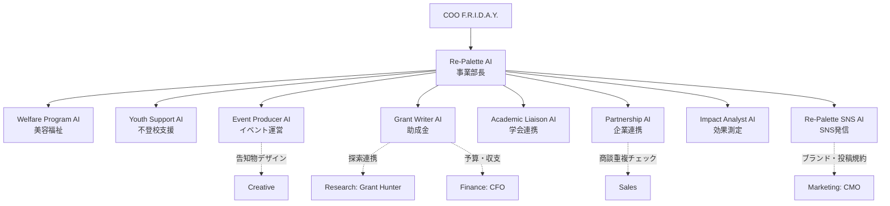
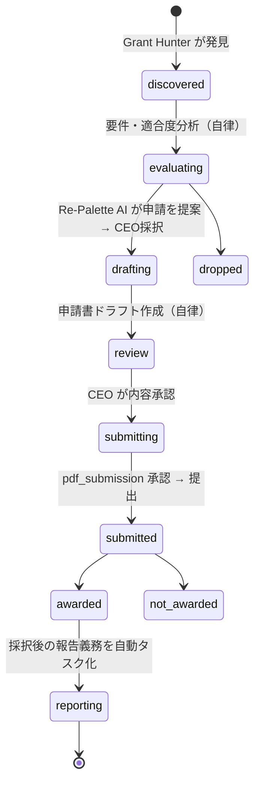

# 04. Re-Palette Division（専用事業部）

Re-Palette は F.R.I.D.A.Y. における**最重要事業の1つ**。コーポレート部門の1つではなく、独自の KPI・予算・ダッシュボード・データ保護ルールを持つ**事業部**として設計する。

## 4.1 ミッションと事業領域

| 領域 | code | 内容 | 担当AI |
|---|---|---|---|
| 美容福祉 | `beauty_welfare` | 美容を通じた福祉・ケア活動（施設訪問・セルフケア支援など）の企画・運営支援 | Welfare Program AI |
| 不登校支援 | `youth_support` | 不登校の子ども・保護者向けプログラムの企画・運営支援 | Youth Support AI |
| イベント運営 | `events` | イベントの企画・準備・集客・振り返り | Event Producer AI |
| 助成金 | `grants` | 助成金の探索連携・申請書作成・採択後の報告管理 | Grant Writer AI（探索は Research の Grant Hunter と連携） |
| 学会連携 | `academic` | 学会発表・共同研究・研究者ネットワーク | Academic Liaison AI |
| 企業連携 | `partnerships` | CSR・協賛・協業パートナーの開拓と関係管理 | Partnership AI |
| 効果測定 | `impact` | ロジックモデル設計、事前事後測定の集計、インパクトレポート | Impact Analyst AI |
| SNS発信 | `sns` | Re-Palette 公式SNSの企画・投稿案・分析 | Re-Palette SNS AI |

統括: **Re-Palette AI（事業部長）**。事業部の週次計画・KPI管理・Board への報告を担う。

## 4.2 事業部の組織図

コーポレート部門との境界:

| 論点 | ルール |
|---|---|
| 企業連携 vs Sales | 社会貢献・協賛・CSR 文脈は Re-Palette、商用取引は Sales。組織データ（`organizations`）は共有し、二重アプローチを防止 |
| SNS | Re-Palette 公式アカウントは事業部が担当。Marketing のブランド規約・投稿Playbookを使用 |
| 助成金 | 全社的な探索は Research、Re-Palette 向けの申請・報告は事業部 |

## 4.3 専用KPI

KPIは `kpi_definitions` のデータとして登録（`project_id = Re-Palette`）。追加・変更にコード修正不要。

### 事業部トップKPI（ダッシュボードの Re-Palette カードに表示）

| KPI | 定義 | 周期 |
|---|---|---|
| **受益者数** | 全プログラムの延べ参加者数 | 月次 |
| **活動実施回数** | 美容福祉・不登校支援・イベントの実施回数合計 | 月次 |
| **助成金獲得額** | 採択された助成金の合計額 | 年度累計 |
| **アウトカム改善率** | 事前事後測定で改善が見られた参加者の割合 | 四半期 |
| **連携団体数** | 企業・学会・学校・施設とのアクティブな連携数 | 累計 |

### 領域別KPI

| 領域 | KPI |
|---|---|
| 美容福祉 | 実施回数、受益者数、協力美容師数、参加者満足度、継続実施施設数 |
| 不登校支援 | 参加者数、継続参加率（3回以上参加の割合）、事前事後の自己肯定感スコア変化、保護者満足度、連携学校・フリースクール数 |
| イベント運営 | 開催数、参加者数、満足度、ボランティア数、イベント経由の問い合わせ数 |
| 助成金 | 候補発見数、申請数、採択数、**採択率**、獲得金額、報告書の期限内提出率 |
| 学会連携 | 発表数、論文・ポスター数、共同研究数、連携研究者数 |
| 企業連携 | 提案数、商談数、提携数、協賛額 |
| 効果測定 | 測定実施率（実施回のうち測定を行った割合）、アウトカム指標の改善率、インパクトレポート公開数 |
| SNS発信 | フォロワー数、エンゲージメント率、投稿数、SNS経由の問い合わせ数 |

## 4.4 業務フロー（代表例）

### 助成金パイプライン

### 効果測定（ロジックモデル）

`Input → Activity → Output → Outcome → Impact` の各段の指標を `impact_frameworks` に定義し、プログラム実施ごとに集計値を `impact_measurements` に記録。Impact Analyst AI が四半期ごとにインパクトレポートを作成し、助成金報告・学会発表・企業連携資料に再利用する。

## 4.5 データ保護（最重要）

不登校支援の参加者には未成年が含まれるため、v1.0 では次を原則とする。

| # | ルール |
|---|---|
| P1 | **個人を特定できる参加者情報は F.R.I.D.A.Y. に保存しない**。保存するのは集計値（人数・平均スコア・割合）のみ |
| P2 | 名簿・同意書・個別記録は F.R.I.D.A.Y. の外（CEOが管理する別の保管場所）に置く |
| P3 | 自由記述（アンケートの声など）を扱う場合は、CEOが匿名化したものだけを取り込む |
| P4 | Re-Palette の `restricted` 区分データは、Re-Palette 事業部と COO のみ参照可。外部AIモデルへ送る場合は `data_sensitivity` ルール（[11章](./11-ai-provider.md)）に従い、無料枠モデルには送らない |
| P5 | SNS投稿で参加者が写る素材は、同意確認済みフラグがない限り投稿申請を作れない |

## 4.6 Re-Palette 専用画面

`/divisions/repalette`（Home からは Re-Palette KPI カードで遷移）

- 事業部トップKPI（5つ）と前期比
- 領域別タブ（8領域）: KPI・進行中タスク・成果物
- 助成金パイプライン（カンバン + 締切カレンダー）
- 活動カレンダー（プログラム・イベント）
- 連携団体リスト（企業・学会・学校・施設）
- 効果測定ダッシュボード（ロジックモデル図 + 指標推移）
- 事業部メンバー（AI社員）の稼働と評価

## 4.7 定例

| 時期 | 内容 |
|---|---|
| 毎週 | Weekly Board Meeting で事業部報告（KPI・助成金締切・リスク） |
| 毎月1日 | Re-Palette 月次活動レポート（PDF → 承認 → アーカイブ） |
| 四半期 | インパクトレポート |
| 助成金締切の14日・7日・3日前 | 自動リマインド（ACTION REQUIRED に判断が必要な場合のみ） |
