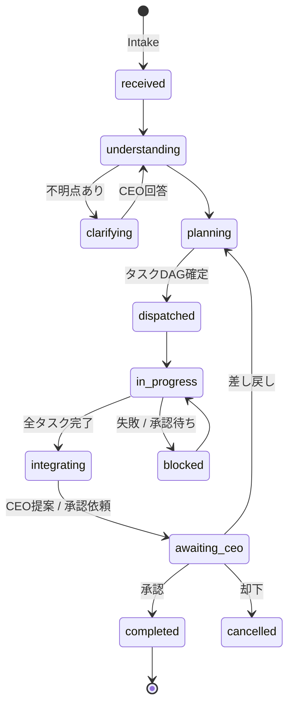
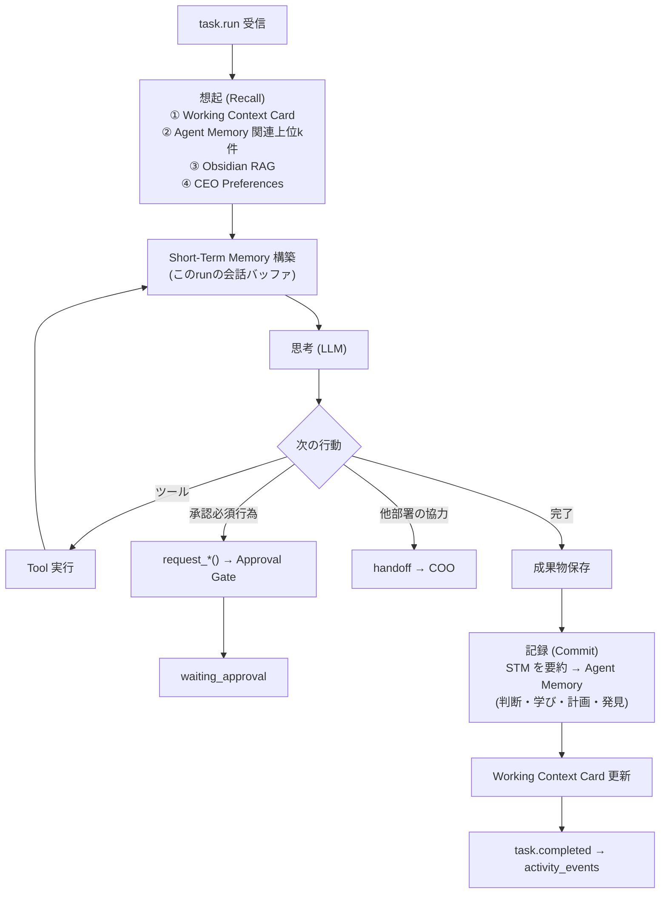

# 05. エージェント実行基盤（COOオーケストレーション）

## 5.1 COO パイプライン

| ステージ | COOがやること | 出力（構造化JSON） |
|---|---|---|
| Understand | 目的・制約・期限・成功条件の抽出。曖昧なら CEO に最大3問 | `DirectiveSpec` |
| Plan | 対象プロジェクトの判定、タスク分解・依存・担当・見積り | `Plan { project_id, tasks[] }` |
| Dispatch | キュー投入（依存順）、優先度・並列度 | `tasks` |
| Monitor | 詰まり検知・再割当 | `activity_events` |
| Integrate | 成果物の統合・矛盾チェック | `deliverable(kind=integrated)` |
| Propose | 推奨案・代替案・根拠・リスク・必要な承認 | `proposal` + `approval_request` |
| Optimize | 週次で負荷・コスト・評価指標を見て配置を提案（Board議題） | Board議題 |

## 5.2 AI社員の実行ループ（Memory Layer 連携）

- 1タスクの上限: `max_steps`（例: 15）、`max_tokens`。超過で `blocked`。
- 各ステップは `run_steps` に記録（思考は要約のみ）。
- 状態変化は `agent_presence` → Realtime で Live Workforce に反映。

## 5.3 ツール体系

| 区分 | ツール | 運用ルール上の扱い |
|---|---|---|
| Read（社内） | `read_vault`, `search_knowledge`, `query_tasks`, `query_kpis`, `get_deliverable` | 自律可 |
| Read（社外） | `web_search`, `fetch_url`, `rss_fetch`, `paper_search` | 自律可（調査） |
| Write（社内） | `create_deliverable`, `write_vault_note`, `update_task`, `post_message` | 自律可（作成） |
| Memory | `remember`, `recall`, `update_plan`, `forget` | 自律可 |
| Coordination | `handoff`, `ask_ceo`, `create_subtask`, `propose_project` | 自律可（提案） |
| Approval Request | `request_email_send`, `request_sns_post`, `request_external_publish`, `request_deploy`, `request_contract`, `request_payment`, `request_external_integration`, `request_pdf_submission` | **申請のみ**（[02章](./02-ai-operating-rules.md)） |

## 5.4 presence（Live Workforce 表示）

| state | 表示 | 色 |
|---|---|---|
| `idle` | 待機中 | gray |
| `thinking` | Thinking | violet |
| `researching` | Researching | cyan |
| `coding` | Coding | blue |
| `writing` | Writing | teal |
| `designing` | Designing | pink |
| `meeting` | In Meeting | amber |
| `waiting_approval` | 承認待ち | orange |
| `blocked` | 要対応 | red |
| `offline` | 停止中 | dim |

## 5.5 キュー（pg-boss）

| queue | 内容 | 並列度 | リトライ |
|---|---|---|---|
| `intake` | 依頼受付 | 2 | 3 |
| `coo.plan` / `coo.integrate` | COO処理 | 1 | 3 |
| `agent.<division>` | 部署別タスク | 部署設定 | 2 |
| `action.execute` | 承認済みアクション | 1 | 0（手動再実行のみ） |
| `report.generate` / `report.archive` | レポート | 1 | 3 / 5 |
| `memory.consolidate` | Agent Memory → Obsidian 昇格 | 1 | 3 |
| `metrics.snapshot` | 評価集計 | 1 | 3 |
| `vault.sync` | Vault 書き出し・取込 | 1（Git競合防止） | 5 |
| `backup.run` | Daily Backup | 1 | 3 |
| `notify.dispatch` | 通知配信 | 4 | 5 |
| `webhook.dispatch` | Universal AI への Webhook | 2 | 指数バックオフ（最大72h） |

## 5.6 Weekly Board Meeting（AI会議）

| 時刻（日曜） | 処理 |
|---|---|
| 18:30 | 各部署リードが週次報告を作成（KPI・成果・課題・翌週計画）※Re-Palette 含む |
| 19:00 | COO が統合し、議題（決議事項）を最大5件に絞る |
| 19:30 | Board Pack（PDF）を配信 |
| 20:00 | **Board Meeting**: CEO が Meeting 画面で議題ごとに「承認 / 差し戻し / 保留」。各部署AIは質問に回答 |
| 終了後 | 議事録 → `07_Meetings/`、決議 → タスク化、Weekly Board Report → 承認 → アーカイブ |

CEO が出席できなかった場合、議題は `board_decision` として CEO ACTION REQUIRED に残る。

## 5.7 コスト・暴走防止

- 全LLM呼び出しを `llm_usage` に記録。
- 予算3段（全社日次 / 社員日次 / タスク）。80%で警告、100%で降格 or 停止。
- ループ検知、**Kill Switch**（`company_settings.paused`）。
