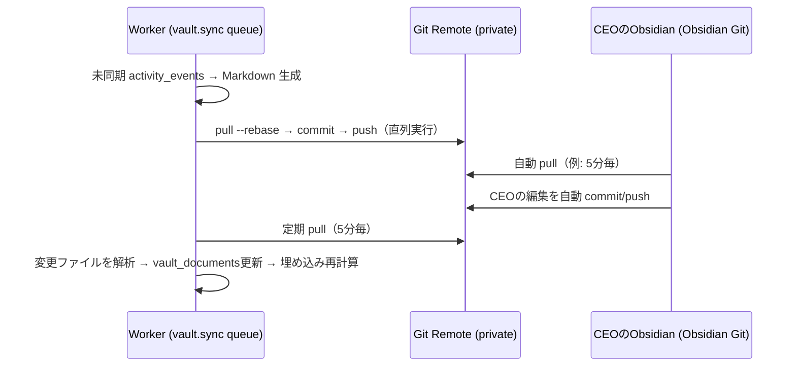

# 05. Obsidian Vault 設計（会社の脳）

## 5.1 役割

Obsidian Vault は **会社の長期記憶**。AI社員はここを読んで思い出し、ここに書いて覚える。CEO は Obsidian で会社の歴史をいつでも読める・直接書き足せる。

| 保存対象 | 場所 | 主な書き手 |
|---|---|---|
| CEO指示 | `01_CEO/Directives/` | システム（Intake） |
| CEO意思決定 | `01_CEO/Decisions/` | システム（承認時） |
| タスク | `05_Projects/<PJ>/Tasks/` もしくは `06_Tasks/` | COO・AI社員 |
| プロジェクト | `05_Projects/<PJ>/` | COO |
| AI社員メモリ | `04_AI Employees/<id>/Memory.md` | 各AI社員 |
| 会議記録 | `07_Meetings/` | EA・COO |
| レポート | `08_Reports/` | 各部署・EA |
| 活動ログ | `10_Activity/` | システム |
| 知識 | `09_Knowledge/` | Research 他・CEO |

## 5.2 フォルダ構成

```
FRIDAY-Vault/
├── 00_Inbox/                      # CEOのメモ置き場。Indexerが拾いCOOがトリアージ
├── 01_CEO/
│   ├── Directives/                # 2026-10-02_今月の売上施策_01JA....md
│   ├── Decisions/                 # 承認・却下の記録（理由つき）
│   ├── Daily/                     # CEOデイリーノート（Morning Briefingへのリンク）
│   └── Preferences.md             # CEOの好み・判断基準（全AI社員が参照）
├── 02_Company/
│   ├── Vision.md
│   ├── Org Chart.md               # Mermaid組織図（自動更新）
│   ├── Policies/                  # 承認ポリシー、ブランド規約、口調ガイド
│   └── KPI/                       # KPI定義と月次推移
├── 03_Divisions/
│   ├── Strategy/
│   │   ├── README.md              # ミッション・担当・メンバー
│   │   └── Playbooks/             # 部署の手順書（AIの作業品質を上げる）
│   ├── Research/ ... Re-Palette/
├── 04_AI Employees/
│   └── cto/
│       ├── Profile.md             # 定義（DB agentsと同期）
│       ├── Memory.md              # 長期記憶（学び・CEOの好み・関係性）
│       └── Journal/2026-10-02.md  # 日次作業ログ
├── 05_Projects/
│   └── FRIDAY/
│       ├── FRIDAY.md              # プロジェクト概要（進捗・健康度・リンク）
│       ├── Tasks/                 # T-01JA...-ダッシュボード認証機能.md
│       ├── Deliverables/          # 成果物
│       └── Decisions/
├── 06_Tasks/                      # プロジェクトに属さない単発タスク
├── 07_Meetings/2026/10/           # 2026-10-02_朝礼.md
├── 08_Reports/
│   ├── Daily/2026/10/             # 2026-10-02_Daily Executive Report.md（PDFリンク付き）
│   ├── Morning/2026/10/
│   ├── Weekly/
│   └── Research/ Strategy/ Marketing/ Sales/ Finance/ Re-Palette/
├── 09_Knowledge/
│   ├── AI/  Beauty/  Subsidies/  Re-Palette/  Business/  Tech/
│   └── _MOC.md                    # Map of Content
├── 10_Activity/2026/10/2026-10-02.md   # 1日1ファイルの活動ログ
├── 90_Templates/                  # 各ノート種別のテンプレート
└── 99_System/
    ├── schema.md                  # frontmatter仕様
    └── sync-state.json            # 最終同期コミット等
```

## 5.3 命名規則

- ファイル名: `<YYYY-MM-DD>_<タイトル>.md`（時系列系）／ `<タイトル>.md`（恒久系）
- タスク・成果物などDB由来のノートはファイル名末尾に短縮ID: `ダッシュボード認証機能 (T-7K2M).md`
- リネームされても追跡できるよう、**同一性は frontmatter `id` で判定**（パスでは判定しない）。

## 5.4 Frontmatter スキーマ（共通）

```yaml
---
id: 01JA7K2M9X...          # ULID。DBと共通
type: task                 # directive|decision|project|task|deliverable|report|meeting|agent|memory|knowledge|activity
title: ダッシュボード認証機能の実装
status: in_progress
division: development
assignee: "[[04_AI Employees/cto/Profile|CTO]]"
project: "[[05_Projects/FRIDAY/FRIDAY|F.R.I.D.A.Y.]]"
directive: "[[01_CEO/Directives/2026-10-02_...]]"
priority: p1
created: 2026-10-02T08:24:00+09:00
updated: 2026-10-02T09:10:00+09:00
tags: [friday/task, division/development]
friday_managed: true       # システム管理ノート
---
```

種別ごとの追加項目は `99_System/schema.md` で定義（例: report → `period`, `pdf_url`, `approval_status`、knowledge → `source_url`, `confidence`, `expires`）。

## 5.5 書き込みルール（人間とAIの共存）

ノート本文を **管理領域** と **自由領域** に分ける。

```markdown
<!-- friday:begin summary -->
（システムが毎回上書きする領域：状態・進捗・リンク一覧）
<!-- friday:end summary -->

## CEOメモ
（ここはCEOが自由に書ける。システムは絶対に上書きしない）
```

| ルール | 内容 |
|---|---|
| W1 | システムは `friday:begin/end` マーカー内だけを書き換える |
| W2 | マーカー外の変更（CEOメモ）は Indexer が取り込み、関連AI社員のコンテキストに含める |
| W3 | `status` などの frontmatter を CEO が Obsidian で変更した場合、**DB側を正**とし、差分は「CEOからの変更提案」として Inbox に通知（勝手に状態を変えない） |
| W4 | `00_Inbox/` に置かれたノートは COO がトリアージ → 知識化 or 指示化（指示化する場合は CEO に確認） |
| W5 | AI社員は `09_Knowledge/` に書く際、出典URLと `confidence` を必須 |
| W6 | 削除はしない。不要になったら `archived: true` |

## 5.6 同期方式

推奨: **Vault = Private Git リポジトリ**（レビュー論点 D3）



- Worker は Vault を **VaultAdapter** インターフェース越しに扱う（`FileSystemAdapter` / `GitAdapter` / `ObsidianRestAdapter`）。同期方式は後から差し替え可能。
- 書き込みは `vault.sync` キューで直列化し、Git 競合を回避。競合時はマーカー外（CEO側）を常に優先。
- コミットメッセージ規約: `friday: task.completed T-7K2M (cto)`。

## 5.7 RAG（AI社員が"思い出す"仕組み）

1. Indexer が Markdown を見出し単位でチャンク化 → `knowledge_chunks` に埋め込み保存。
2. タスク実行時、コンテキストに以下を自動注入:
   - `01_CEO/Preferences.md`（常時）
   - 担当AI社員の `Memory.md` の重要度上位
   - タスク・プロジェクトに関連するノート（ベクトル検索 + リンクグラフ1ホップ）
3. タスク完了時、AI社員は「次回に活かす学び」を `remember()` → `agent_memories` + `Memory.md` に追記。
4. 埋め込みモデルも Provider Layer の `embedding` tier で解決（モデル変更時は再インデックスジョブ）。
