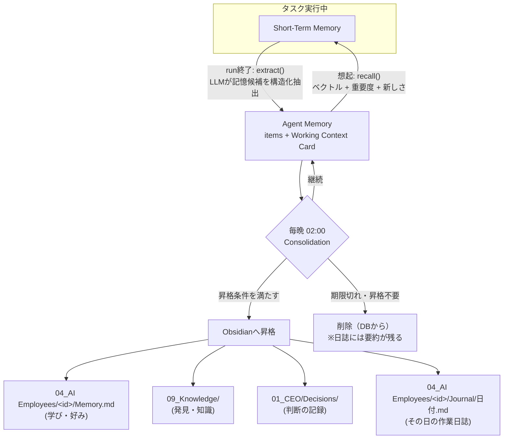

# 06. AI Memory Layer（3層メモリ）

## 6.1 構造

```
Short-Term Memory   …… 今この瞬間（1回のタスク実行の中）
        ↓ 要約・抽出
Agent Memory        …… 最近のこと（数日〜数週間）。社員ごと
        ↓ 昇格（毎晩）
Obsidian            …… 会社の長期記憶（永続）
```

| 層 | 保持するもの | 保存先 | 寿命 | 誰が読む |
|---|---|---|---|---|
| **Short-Term Memory (STM)** | 実行中の会話・ツール結果・途中の思考要約 | Worker メモリ + `run_steps` | 1 run | その run のAI社員 |
| **Agent Memory (AM)** | **直近の会話 / 担当中のタスク / 最近の判断 / 現在のプロジェクト** / 計画 / 発見 | Postgres（`agent_working_context`, `agent_memory_items` + pgvector） | kind別TTL（下表） | 本人、COO、共有指定された部署 |
| **Long-Term (Obsidian)** | 学び・知識・意思決定・日誌・レポート | Vault（`04_AI Employees/<id>/Memory.md` ほか） | 永続 | 全社（RAG） |

**分離の原則**: 短期記憶は Agent Memory、長期保存は Obsidian。Agent Memory は「作業机の上」、Obsidian は「書庫」。机の上は定期的に片付け、残す価値があるものだけ書庫へ移す。

## 6.2 Agent Memory の構成

### (1) Working Context Card（社員ごと1枚）

各AI社員の「今」を要約したカード。**毎回のタスク実行で必ずコンテキストに注入**される（上限 約1,500トークン）。

```yaml
agent: researcher
updated_at: 2026-10-02T09:40+09:00
current_projects: [Re-Palette, NEWTONE]
active_tasks:
  - T-7K2M 美容業界のAI活用事例調査（期限 10/03）
recent_decisions:
  - 10/01 補助金調査は自治体系を優先（CEO指示 D-01JA..）
recent_findings:
  - 10/01 「〇〇財団 福祉助成」締切 11/15、Re-Palette 適合度 高 → Grant Writer に共有済
open_threads:
  - Sales AI から提携候補企業の業界動向調査を依頼されている
```

更新タイミング: タスク完了時 / 承認・却下を受けた時 / 毎晩の Consolidation。

### (2) Memory Items（社員ごと複数）

| kind | 内容 | 例 | 既定TTL |
|---|---|---|---|
| `conversation` | 直近の会話（CEO・他社員とのやり取り）の要約 | 「CMOとInstagram方針を協議、リール中心で合意」 | 7日 |
| `active_task` | 担当中タスクの途中経過・次の一手 | 「競合3社中2社まで調査済」 | タスク完了まで |
| `decision` | 最近の判断とその理由（自分の判断・CEOの判断） | 「CEOが投稿案Bを採用。理由: トーンが柔らかい」 | 30日 |
| `project_context` | 現在関わっているプロジェクトの状況 | 「NEWTONE: 企画中、来週PoC判断」 | PJがactiveの間 |
| `plan` | 期間つきの計画 | 「今週の投稿計画（W40）: 月・水・金」 | 計画期間終了まで |
| `finding` | 調査・分析で得た発見 | 「昨日調べた〇〇補助金の要件」 | 30日 |
| `preference` | CEOや関係者の好みの観察 | 「CEOは結論先出しの要約を好む」 | 90日（昇格候補） |

各 item: `content`, `importance(1-5)`, `source_ref`（タスク・成果物・判断へのリンク）, `embedding`, `expires_at`, `access_count`, `last_accessed_at`, `shared_with`（部署）, `promoted_to`（昇格先Vaultパス）。

容量上限: 社員ごとアクティブ200件。超過時は低重要度・古いものから要約統合（compaction）。

### 具体例

| 社員 | Agent Memory にあるもの | 効果 |
|---|---|---|
| Research AI | `finding`: 昨日調査した補助金3件の要点 / `active_task`: 継続調査の進捗 | 翌日「昨日の続き」から再開でき、同じ調査を繰り返さない |
| Marketing AI (CMO) | `plan`: 今週の投稿計画 / `decision`: CEOが採用・却下した投稿とその理由 | 計画どおりに投稿案を作り、却下理由を次の案に反映 |
| CTO | `active_task`: 実装中ブランチと残課題 / `decision`: 設計判断 | 差し戻し後も文脈を失わず修正できる |
| COO | 全社の `decision` と各PJの `project_context`（共有） | 部署横断で整合した計画を立てる |

## 6.3 ライフサイクル



### 昇格（Promotion）条件 — いずれかを満たせば Obsidian へ

| 条件 | 例 |
|---|---|
| `importance >= 4` | 重要な発見・判断 |
| `access_count >= 3`（複数回思い出された） | よく使う知識 |
| CEO の判断に関係する `decision` | 承認・却下とその理由 |
| `preference` で同じ観察が2回以上 | CEOの好みとして定着 |
| 成果物が承認された `finding` | 採用された調査結果 |

日誌（Journal）は条件にかかわらず毎晩全社員分を作成（その日の Agent Memory の要約）。これにより Agent Memory から消えた情報も Obsidian から辿れる。

### 想起（Recall）のスコア

```
score = 0.5 × 類似度(query, item) + 0.3 × 重要度/5 + 0.2 × 新しさ(半減期7日)
```
上位k件（既定8件）を Working Context Card と一緒に注入。Agent Memory で足りない場合に Obsidian RAG を検索。

## 6.4 共有とアクセス

| ルール | 内容 |
|---|---|
| 既定は本人のみ | Agent Memory は社員ごとのプライベート領域 |
| COO は全員分を参照可 | 全社最適化のため |
| `shared_with` | 部署単位で共有（例: Grant Hunter の finding を Re-Palette に共有） |
| CEO | Dashboard の社員詳細で「今覚えていること」を閲覧・削除・修正できる |
| restricted データ | Re-Palette の restricted 区分に由来する記憶は Re-Palette 事業部と COO のみ |

## 6.5 ダッシュボード表示

- AI社員詳細画面「🧠 今覚えていること」: Working Context Card、Memory Items（kind別）、昇格履歴
- Live Workforce カードのホバー: 現在のタスクと「直近の判断」1件
