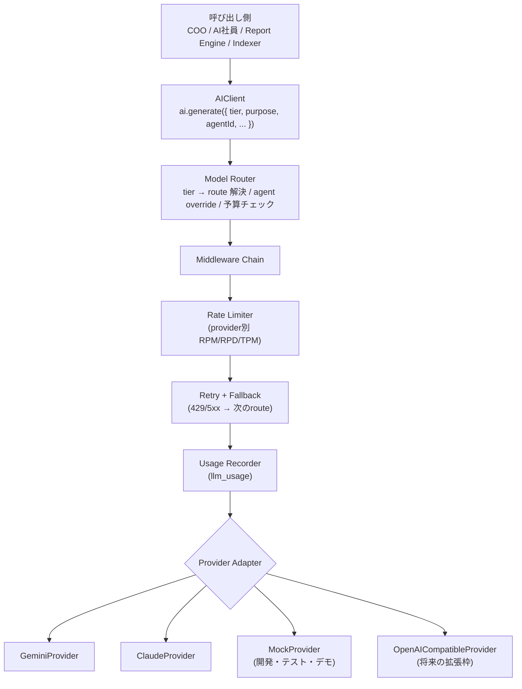

# 06. AI Provider Layer 設計

## 6.1 目的

- **モデル固定禁止**。アプリのどこにもモデル名をハードコードしない。
- 初期は **Gemini API（無料枠）**、将来 **Claude API** に設定画面から切替。
- 社員単位・用途単位で混在も可能（例: COOだけ Claude、他は Gemini）。

## 6.2 レイヤー構成

## 6.3 共通インターフェース（概念）

| メソッド | 説明 |
|---|---|
| `generateText(req)` | テキスト生成 |
| `streamText(req)` | ストリーミング（Command Centerの返答表示） |
| `generateObject(req, schema)` | **構造化出力**（JSON Schema / Zod）。COOの計画・承認要約・レポート本文で必須 |
| `generateWithTools(req, tools)` | ツール呼び出しループ（Agent Executorが使用） |
| `embed(texts)` | 埋め込み |
| `capabilities()` | 対応機能（tools, json_schema, vision, context_window, web_search_grounding） |

リクエスト共通項目: `messages`, `system`, `tier`, `purpose`, `agentId`, `runId`, `maxOutputTokens`, `temperature`, `timeoutMs`。

レスポンス共通項目: `text | object | toolCalls`, `usage {input, output}`, `model`, `provider`, `finishReason`, `latencyMs`。

> 実装時は Vercel AI SDK のような provider 抽象ライブラリを内部で利用し、その上に自前の Router / Rate Limiter / Usage Recorder を載せる案を推奨（ライブラリ差し替えも Adapter 内に閉じる）。

## 6.4 ルーティング表（設定画面で編集）

| tier | 初期 route（Gemini） | fallback | 切替後 route（Claude） |
|---|---|---|---|
| `fast` | Gemini Flash-Lite 系 | Gemini Flash 系 | Claude Haiku 系 |
| `standard` | Gemini Flash 系 | Gemini Flash-Lite 系 | Claude Sonnet 系 |
| `deep` | Gemini Pro 系 | Gemini Flash 系 | Claude Opus 系 |
| `embedding` | Gemini Embedding 系 | — | （Claudeは埋め込み非提供のため Gemini 継続 or 別プロバイダ） |

- 具体モデルIDは `model_routes.model_id` に保存（例の値はシード時に最新の公開モデルを確認して設定）。
- 解決順: `agents.model_override` → `model_routes(tier, active)` → fallback。
- **ワンクリック切替**: 設定画面に「Provider Preset」（`Gemini Free` / `Claude` / `Hybrid: COOのみClaude`）を用意し、`model_routes` を一括更新。

## 6.5 Gemini 無料枠への対応

無料枠は RPM / RPD（1日あたり回数）が厳しく、上限値は変更されうるため **値は `provider_configs.rate_limits` で設定**する。

| 対策 | 内容 |
|---|---|
| トークンバケット | provider×model 単位の RPM/RPD/TPM を Postgres 上で管理（Worker複数でも共有） |
| 優先度キュー | CEO直接指示・承認関連 > 定期レポート > バックグラウンド調査 |
| 降格 | deep の枠が尽きたら standard へ、standard が尽きたら fast へ（品質低下を `run_steps` に記録） |
| 日次枠の予約 | 21:00 の Daily Report 用に RPD の一定割合を予約 |
| キャッシュ | 同一入力の要約・埋め込みは content hash でキャッシュ |
| 可視化 | 設定画面とヘッダーに「本日の残り枠」を表示 |

> 注意: 無料枠は入力データがモデル改善に利用される規約の場合がある。社外秘情報・個人情報（Re-Palette の支援対象者情報など）を扱うタスクは、**`data_sensitivity: confidential` の場合は有料枠/Claude のみにルーティング**するポリシーを設ける。

## 6.6 プロンプト管理

- システムプロンプトは `packages/agents/prompts/` にテンプレートとして管理（Provider非依存）。
- 構成: `会社共通（Vision・Policies）` + `CEO Preferences` + `部署Playbook` + `社員Persona` + `タスク` + `RAGコンテキスト`。
- Provider ごとの差分（ツール定義形式、JSONモード、システムプロンプトの扱い）は Adapter が吸収。
- プロンプトはバージョン管理し、`agent_runs.prompt_version` に記録して品質比較できるようにする。

## 6.7 コスト記録

- `llm_usage` に全呼び出しを記録。単価表は `model_routes.params.pricing` に保持。
- ダッシュボード / 設定画面: 本日・今月のコスト、社員別・部署別・用途別。
