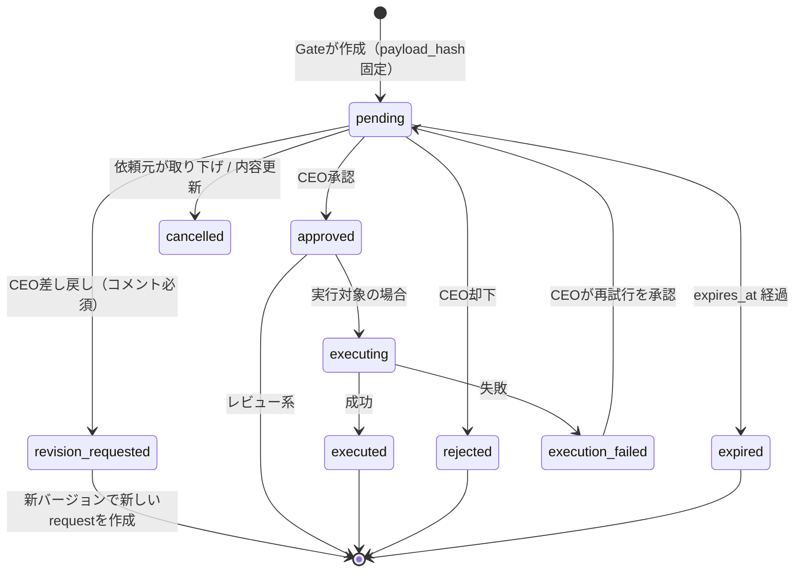
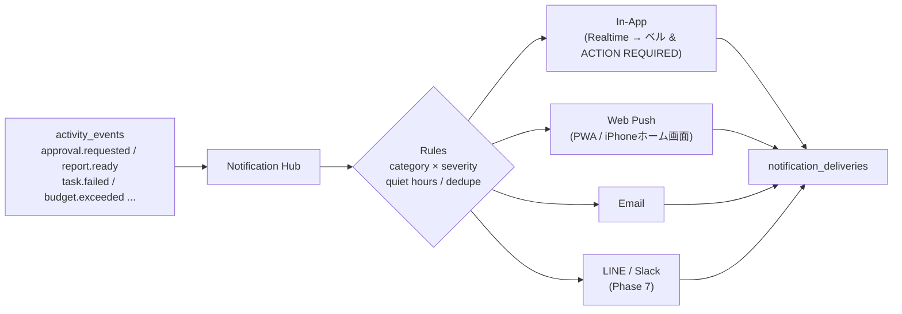

# 07. 通知システム・承認フロー設計

## 7.1 承認フロー

### 承認が必要な行為（Approval Policy）

自律度 **L2（推奨）**: 社内作業は自律、社外に影響する行為は全件承認。

| kind | 例 | risk | 期限の扱い | 承認後の実行 |
|---|---|---|---|---|
| `report_review` | Daily Executive Report | low | なし（翌朝リマインド） | ステータス更新のみ |
| `proposal_review` | COOからの施策提案 | medium | 任意 | 承認内容でタスク生成 |
| `deliverable_review` | 事業計画書・デザイン | low〜medium | 任意 | 成果物を `approved` |
| `sns_post` | Instagram投稿 | high | 予約投稿時刻 | 投稿API実行 |
| `email_send` | 企業への提案メール | high | 任意 | メール送信 |
| `deploy` | F.R.I.D.A.Y. v0.2 本番Deploy | high | 任意 | PRマージ / Deploy |
| `external_integration` | 新しい外部サービス接続 | high | なし | 連携有効化 |
| `calendar_event` | 打ち合わせ登録 | medium | 予定時刻 | カレンダー登録 |
| `budget_spend` | 有料ツール契約・広告費 | critical | 任意 | 支払い（初期は「人間が支払う」タスク化のみ） |
| `grant_submission` | 助成金申請 | critical | 申請締切 | 提出（初期はCEOが手動提出、AIは書類一式準備） |
| `automation_enable` | 新しい自動化ルール | medium | なし | ルール有効化 |

### 状態遷移



### 安全設計（重要）

| # | ルール |
|---|---|
| S1 | AI社員は副作用ツールを持たない。`request_*` は ActionRequest を作るだけ |
| S2 | 承認時の `payload_hash` と実行時のハッシュが一致しなければ実行しない（承認後の改ざん防止） |
| S3 | 内容を修正したい場合は旧リクエストを `cancelled` にして**新しいリクエスト**を作る（承認の使い回し禁止） |
| S4 | `approved` への遷移はCEOの認証済みセッションからのみ。APIキー（万能AI）からは不可 |
| S5 | 実行は `idempotency_key` で一度きり。失敗時の自動リトライなし（再試行はCEOが明示） |
| S6 | `critical` は 2ステップ確認（承認ボタン → 内容再表示 → 確定） |
| S7 | すべての遷移を `approval_events` に追記（監査ログ）し、Vault `01_CEO/Decisions/` に記録 |
| S8 | 一括承認は `low` のみ許可 |

### CEO ACTION REQUIRED の並び順

```
score = risk_weight(critical 40 / high 30 / medium 20 / low 10)
      + urgency(期限まで: <1h 40 / <6h 30 / <24h 20 / それ以外 0)
      + priority(p0 20 / p1 10 / p2 5 / p3 0)
      + age(待ち時間 1時間ごと +1、上限 10)
```

### 承認UI（1件あたり）

- カードに: 種別アイコン / タイトル / 依頼者AI社員 / 10秒要約 / リスクバッジ / 期限カウントダウン
- インライン操作: **[承認] [差し戻し] [詳細]**（差し戻しはコメント入力欄が展開）
- 詳細ドロワー: プレビュー（投稿画像・メール本文・diff・PDFビューア）、根拠、影響範囲、COOの推奨

## 7.2 通知システム

### アーキテクチャ



### ルーティング既定値

| category | 例 | In-App | Push | Email | 静音時間(23:00–07:00) |
|---|---|---|---|---|---|
| `action_required` (high/critical) | Deploy・SNS投稿・メール送信・外部連携 | ✅ | ✅ | ✅（30分未対応で） | critical のみ通知、他は朝にまとめる |
| `action_required` (low/medium) | レポート確認・提案レビュー | ✅ | ✅（まとめて） | — | 朝にまとめる |
| `report` | Daily Report 完成 | ✅ | ✅ | ✅（PDFリンク） | 翌朝 |
| `alert` | タスク失敗・予算超過・Worker停止 | ✅ | ✅ | — | critical のみ |
| `project` / `task` | 完了・新規提案 | ✅ | — | — | — |
| `system` | 同期エラー等 | ✅ | — | — | — |

### 通知の品質ルール

- **CEO承認が必要なものは必ず通知**（全チャネル失敗時は In-App に `critical` で残し、次回ログイン時にモーダル表示）。
- `dedupe_key` で同一事象の重複を抑制（例: 同じタスクの連続失敗は1件に集約）。
- リマインド: 未対応の `action_required` は 2h / 6h / 翌朝 に再通知（期限付きは期限の1h前にも）。
- EA が 1時間ごとに未読通知を束ねて「CEO Inbox ダイジェスト」を作る（洪水防止）。
- 「通知」パネル（FYI）と「CEO ACTION REQUIRED」（要判断）を **明確に分離**。参考画像では両方に同じ項目が並んでいたが、本設計では重複表示しない。
