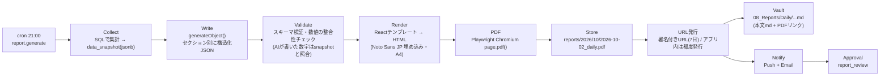

# 08. PDFレポート設計

## 8.1 レポート種別とスケジュール

| 種別 | 時刻(JST) | 作成者 | 承認 | 形式 |
|---|---|---|---|---|
| **Morning Briefing** | 毎日 07:30 | Executive Assistant | 不要（既読管理のみ） | 画面 + Push（PDFは任意） |
| **Daily Executive Report** | 毎日 21:00 | COO（統合）+ EA（編集） | `report_review` | **PDF** + Vault md |
| Weekly Report | 日曜 20:00 | COO | `report_review` | PDF |
| 部署レポート（戦略・調査・財務…） | タスク成果物として随時 | 各部署 | `deliverable_review` | PDF（任意）+ Vault md |

時刻は `company_state.report_schedule` で変更可能。

## 8.2 Daily Executive Report の構成

| # | セクション | データソース | AI執筆 |
|---|---|---|---|
| 0 | 表紙: 日付・会社全体進捗%・CEO要対応件数 | `v_dashboard_summary` | — |
| 1 | **Executive Summary**（3行） | 全セクション | COO |
| 2 | **本日の成果**（完了タスク・成果物ハイライト） | `tasks(done today)`, `deliverables` | COO |
| 3 | **プロジェクト進捗**（PJ別進捗リング・前日比・健康度・次のマイルストーン） | `v_project_progress` | COO（コメント） |
| 4 | **AI社員活動**（社員別 完了数・稼働時間・主な作業・差し戻し率） | `agent_runs`, `tasks` | EA（要約） |
| 5 | **KPI**（目標比・前日/前週比・スパークライン） | `kpi_values` | Finance/Ops（コメント） |
| 6 | **CEO提案**（推奨アクション最大3件：提案・根拠・期待効果・必要な承認） | COOの統合結果 | COO |
| 7 | 承認待ち一覧・明日の予定 | `v_ceo_action_queue`, `schedule_events` | — |
| 8 | 付録: コスト（LLM使用量）・エラー | `llm_usage` | — |

## 8.3 生成パイプライン

### 設計ポイント

- **数字はAIに作らせない**: KPI・件数はすべて `data_snapshot` から差し込み、AIは解釈とコメントのみを書く（ハルシネーション防止）。
- **再現性**: `data_snapshot` と `content` を DB に保存し、同じ内容でPDFを再生成可能。
- **デザイン**: ダッシュボードと同じダークネイビー基調＋印刷用ライトテーマを選択可（既定は印刷向けライト・表紙のみダーク）。
- **URL**: Storage は private。ダウンロードURLは署名付き（期限つき）で、アプリ内から開くときは都度再発行。
- **失敗時**: 3回リトライ → 失敗なら `alert` 通知とテキスト版のみ送付。
- **差し戻し**: CEOのコメントを入力に再生成し `version` を上げる。

## 8.4 Morning Briefing（07:30）

1. 今日の予定（カレンダー）
2. CEO ACTION REQUIRED（件数とトップ3）
3. 昨夜〜今朝にAI社員が進めたこと
4. 今日のAI社員の作業計画（COOが前夜に立案）
5. ニュースダイジェスト（AI・美容・補助金の新着から3件）
6. ひとこと（EAから）

ダッシュボード上部のヒーローエリア（"Good morning, 陽大。"）に要約を表示し、クリックで全文。
