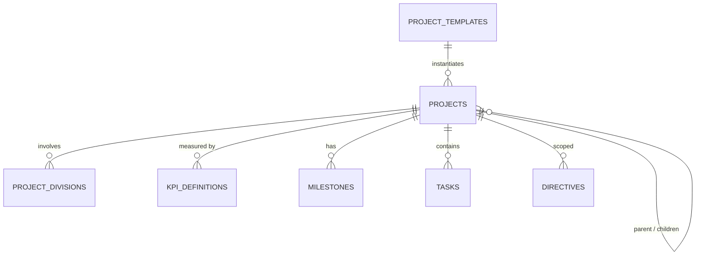
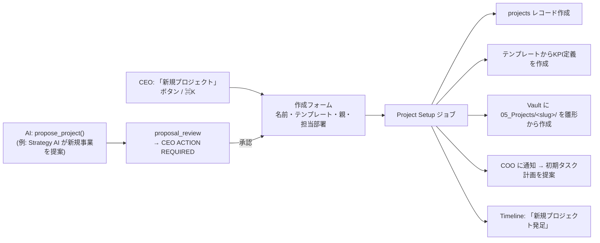

# 08. プロジェクト管理（拡張可能設計）

## 8.1 方針

**プロジェクトの追加にコード修正を一切必要としない。** プロジェクトはすべてデータとして定義し、UI・Vault・KPI・ダッシュボードはデータから自動生成する。

コード上に `"repalette"` や `"NEWTONE"` のようなプロジェクト名を書かない（シードデータのみ）。

## 8.2 初期プロジェクト

| slug | 名称 | カテゴリ | 主担当部署 | テンプレート | 備考 |
|---|---|---|---|---|---|
| `repalette` | Re-Palette | social_business | repalette | `social_program` | 専用事業部と連動 |
| `arqo` | ARQO | company | coo | `company` | 会社本体。**F.R.I.D.A.Y. 開発は ARQO の子プロジェクト**として登録（要確認） |
| `friday` | F.R.I.D.A.Y. | product | development | `software_product` | parent = arqo |
| `newtone` | NEWTONE | venture | strategy | `venture` | |
| `university` | University | personal_growth | executive | `study` | 大学関連 |
| `personal` | Personal | personal | executive | `personal` | 個人事業・個人タスク |
| `future-ventures` | Future Ventures | portfolio | strategy | `portfolio` | 新規事業の**受け皿**。新しいアイデアは子プロジェクト（status=proposed）として生まれる |

## 8.3 データ構造

### project_templates（テンプレート）

テンプレートは「プロジェクトの型」。新しい型もデータで追加できる。

| 項目 | 内容 |
|---|---|
| `key` | `software_product`, `social_program`, `venture`, `study`, `personal`, `portfolio`, `company` … |
| `default_divisions` | 関与する部署 |
| `default_kpis` | 作成時に自動登録するKPI定義の雛形 |
| `phases` | フェーズ定義（例: 構想→企画→開発→運用 / 準備中→実施中→振り返り） |
| `custom_fields_schema` | JSON Schema（例: venture なら「市場規模」「仮説」、study なら「科目」「試験日」） |
| `vault_scaffold` | Vault に作るフォルダ・ノート雛形 |
| `report_sections` | 部署・プロジェクトレポートの既定セクション |
| `approval_overrides` | 承認ポリシーの**追加**（緩和は不可） |

### projects

| 項目 | 内容 |
|---|---|
| `slug`, `name`, `description`, `category` | 識別・表示 |
| `template_key` | テンプレート |
| `parent_project_id` | 親子関係（ポートフォリオ / サブプロジェクト） |
| `owner_division_id` | 主担当部署 |
| `status` | `proposed` / `planning` / `active` / `on_hold` / `completed` / `archived` |
| `phase` | テンプレートの phases のどれか |
| `progress` / `health` | 自動算出（手動上書き可） |
| `color`, `icon`, `cover_image` | ダッシュボード表示 |
| `pinned`, `sort_order` | Home の進捗リングに出すか・順序 |
| `custom_fields` | テンプレートのスキーマで検証される自由項目 |
| `data_sensitivity` | `normal` / `confidential` / `restricted`（AI Provider のルーティングに影響） |
| `vault_path` | Vault フォルダ |

## 8.4 プロジェクト追加フロー

- AIはプロジェクトを**提案**できる（自律可）が、発足させるのは CEO（`proposal_review`）。
- Future Ventures 配下のアイデアは `proposed` のまま蓄積し、Board Meeting で昇格（active化）を判断。

## 8.5 UI での扱い

| 場所 | 表示 |
|---|---|
| Home: プロジェクト進捗 | `pinned = true` のプロジェクトを `sort_order` 順に進捗リング表示（最大6、超過分は横送り） |
| Projects 一覧 | カテゴリ・ステータス別。親子はツリー表示 |
| プロジェクト詳細 | 概要・フェーズ・KPI・タスクボード・成果物・判断履歴・関与AI社員・custom_fields |
| Command Center | 指示時に `@プロジェクト名` で対象を指定可能（未指定なら COO が推定） |
