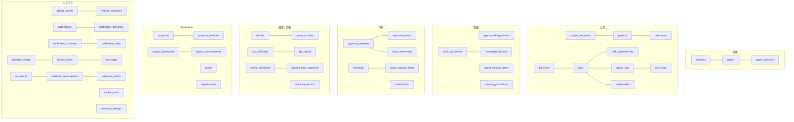
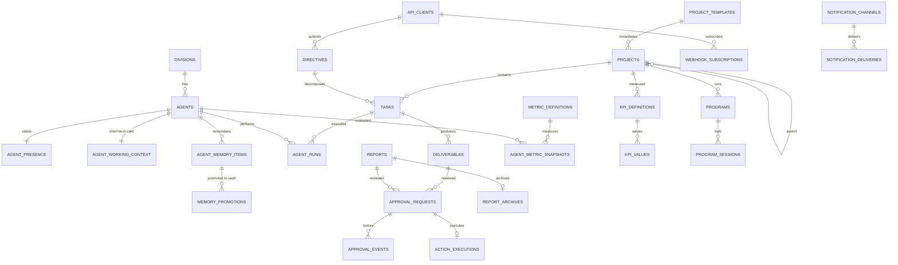

# 09. データモデル・DB設計（v1.0）

## 9.1 方針

| 原則 | 内容 |
|---|---|
| 3つの記憶の役割分担 | **Postgres = 現在の状態** / **Agent Memory（Postgres内の専用テーブル）= 短期記憶** / **Obsidian = 長期記憶** |
| 共通ID | ULID。Vault の frontmatter `id` = DB の `id` |
| 共通カラム | `id`, `created_at`, `updated_at`（timestamptz/UTC）、必要に応じ `archived_at` |
| イベントソース | 重要な変化はすべて `activity_events` に追記。Timeline・評価・Vault・通知・Webhook はここから派生 |
| データ駆動 | 部署・AI社員・プロジェクト・テンプレート・KPI・評価指標・通知チャネル・Timeline文言はデータで追加可能 |
| 列挙型 | 「システムの振る舞いを決めるもの」（状態・承認種別）は Postgres enum。「会社が増やすもの」（部署・PJ・カテゴリ）は参照テーブル |

## 9.2 ドメイン全体図

## 9.3 ER図（主要リレーション）

## 9.4 テーブル定義

> v0.1 からの変更は 🆕（新規）/ ✏️（変更）で表示。

### A. 組織

**`divisions`** ✏️
| column | type | note |
|---|---|---|
| id | text PK | `strategy`, `repalette` … |
| name, name_ja | text | |
| kind | enum(`executive`,`corporate`,`business_unit`) 🆕 | Re-Palette は `business_unit` |
| mission | text | |
| color, icon | text | |
| lead_agent_id | text FK | |
| sort_order | int | |

**`agents`** ✏️
| column | type | note |
|---|---|---|
| id | text PK | `friday`, `researcher` … |
| display_name, title, avatar_url | text | |
| division_id | FK | |
| level | enum(`executive`,`lead`,`specialist`) | |
| reports_to | FK agents | |
| persona | text | |
| responsibilities, deliverable_types, tools | text[] | |
| model_tier | enum(`fast`,`standard`,`deep`) | |
| model_override | text null | |
| memory_policy | jsonb 🆕 | `{ ttl_overrides, max_items, promotion_threshold }` |
| metric_set | text[] 🆕 | ハイライト指標キー（3つ） |
| data_access | text[] 🆕 | `normal`, `confidential`, `restricted:repalette` |
| max_parallel_tasks, daily_token_budget | int | |
| enabled | bool | |
| vault_path | text | |

**`agent_presence`**: `agent_id PK, state enum, activity_label, current_task_id, current_run_id, progress, last_heartbeat_at`

### B. Agent Memory 🆕

**`agent_working_context`**（社員ごと1行）
| column | type | note |
|---|---|---|
| agent_id | text PK FK | |
| card | jsonb | current_projects / active_tasks / recent_decisions / recent_findings / open_threads |
| card_text | text | プロンプト注入用に整形済み（≤1,500 tokens） |
| version | int | |
| updated_at | timestamptz | |

**`agent_memory_items`**
| column | type | note |
|---|---|---|
| id | ULID | |
| agent_id | FK | |
| kind | enum(`conversation`,`active_task`,`decision`,`project_context`,`plan`,`finding`,`preference`) | |
| content | text | |
| importance | smallint 1–5 | |
| source_type, source_id | text | task / deliverable / approval / message |
| project_id | FK null | |
| shared_with | text[] | 部署ID |
| sensitivity | enum(`normal`,`confidential`,`restricted`) | |
| embedding | vector | |
| access_count | int | |
| last_accessed_at | timestamptz | |
| valid_from, expires_at | timestamptz | `plan` は期間、他は TTL |
| status | enum(`active`,`promoted`,`expired`,`deleted`) | |

**`memory_promotions`**: `id, memory_item_id, agent_id, target(memory_md/knowledge/decision/journal), vault_path, vault_commit, reason, created_at`

### C. 仕事

**`project_templates`** 🆕
| column | type | note |
|---|---|---|
| key | text PK | `software_product`, `social_program` … |
| name | text | |
| default_divisions | text[] | |
| default_kpis | jsonb | KPI定義の雛形 |
| phases | jsonb | フェーズ一覧 |
| custom_fields_schema | jsonb | JSON Schema |
| vault_scaffold | jsonb | フォルダ・ノート雛形 |
| report_sections | jsonb | |
| approval_overrides | jsonb | 追加の承認必須ルール |

**`projects`** ✏️
| column | type | note |
|---|---|---|
| id | ULID | |
| slug | text unique | `repalette`, `arqo` … |
| name, description | text | |
| category | text | `social_business`, `venture`, `personal` … |
| template_key | FK project_templates | |
| parent_project_id | FK projects null | |
| owner_division_id | FK | |
| status | enum(`proposed`,`planning`,`active`,`on_hold`,`completed`,`archived`) | |
| phase | text | |
| progress | smallint | |
| health | enum(`on_track`,`at_risk`,`off_track`) | |
| color, icon, cover_image | text | |
| pinned | bool | |
| sort_order | int | |
| custom_fields | jsonb | テンプレートのスキーマで検証 |
| data_sensitivity | enum(`normal`,`confidential`,`restricted`) | |
| start_date, target_date | date | |
| vault_path | text | |

**`project_divisions`**: `project_id, division_id, role(owner/support)`
**`milestones`**: `id, project_id, title, due_date, status, completed_at`

**`directives`**: `id, source enum(ceo/universal_agent/scheduler/system), api_client_id, raw_text, spec jsonb, priority, status, project_id, result_summary, idempotency_key unique, vault_path`
**`clarifications`**: `id, directive_id, question, options, answer, answered_at`
**`tasks`**: `id, directive_id, project_id, parent_task_id, title, description, division_id, assignee_agent_id, status, priority, deliverable_type, due_at, started_at, completed_at, est_minutes, actual_minutes, attempt, vault_path`
**`task_dependencies`**: `task_id, depends_on_task_id`
**`agent_runs`**: `id, task_id, agent_id, status, prompt_version, started_at, ended_at, step_count, input_tokens, output_tokens, cost_usd, error`
**`run_steps`**: `id, run_id, seq, kind, tool_name, summary, payload, created_at`
**`message_threads`** / **`agent_messages`**: 社員間の会話（Timeline にも要約表示）

**`deliverables`** ✏️: `id, task_id, project_id, author_agent_id, kind, title, summary, content_md, files, status enum(draft/in_review/approved/rejected/published), adopted bool 🆕, version, vault_path`

### D. 判断

**`approval_requests`** ✏️
| column | type | note |
|---|---|---|
| id | ULID | |
| category | enum(`action`,`review`) 🆕 | action = 第2条（外部）、review = 第3条（社内） |
| kind | enum(`email_send`,`sns_post`,`external_publish`,`deploy`,`contract`,`payment`,`external_integration`,`pdf_submission`,`report_review`,`proposal_review`,`deliverable_review`,`board_decision`) | |
| title, summary | text | |
| requested_by_agent_id | FK | |
| division_id, project_id | FK | |
| subject_type, subject_id | text | |
| payload | jsonb | 実行内容そのもの |
| payload_hash | text | sha256 |
| preview | jsonb | |
| risk_level | enum(`low`,`medium`,`high`,`critical`) | |
| priority | enum p0–p3 | |
| blocking_count | int 🆕 | この判断で止まっているタスク数（ACTION REQUIRED に表示） |
| status | enum(`pending`,`approved`,`rejected`,`revision_requested`,`expired`,`cancelled`,`executing`,`executed`,`execution_failed`) | |
| due_at, expires_at, decided_at | timestamptz | |
| decision_comment | text | |
| idempotency_key | text unique | |

**`approval_events`**: 追記のみの監査ログ（`actor` が `ceo` 以外の `approved` 遷移はトリガーで拒否）
**`action_executions`**: `id, approval_request_id, executor, status, attempt, payload_hash, result, external_ref, error, started_at, finished_at`

**`meetings`** ✏️: `id, kind(board/ceo_meeting/ai_meeting/morning_brief), title, scheduled_at, started_at, ended_at, participants, summary, vault_path`
**`board_agenda_items`** 🆕: `id, meeting_id, division_id, title, background, recommendation, options jsonb, decision enum(approved/revised/deferred/rejected) null, decision_comment, approval_request_id`

### E. レポート・アーカイブ

**`reports`** ✏️
| column | type | note |
|---|---|---|
| id | ULID | |
| type | enum(`morning_briefing`,`daily_executive`,`weekly_board`,`board_pack`,`division`,`project`,`repalette_monthly`,`impact`) | |
| title | text | |
| period_start, period_end | timestamptz | |
| project_id, division_id | FK null | |
| author_agent_id | FK | |
| data_snapshot | jsonb | |
| content | jsonb | |
| version | int | 差し戻しで増える |
| pdf_storage_path | text | `reports/pending/...` |
| pdf_sha256 | text | |
| status | enum(`generating`,`ready`,`pending_review`,`revision_requested`,`approved`,`archiving`,`archived`,`failed`) | |
| approved_at | timestamptz | |

**`report_archives`** 🆕（Approved Reports）
| column | type | note |
|---|---|---|
| id | ULID | |
| report_id | FK unique | |
| approved_storage_path | text | `reports/approved/2026/10/...pdf`（上書き禁止） |
| pdf_sha256 | text | 改ざん検知 |
| vault_pdf_path | text | `08_Reports/Approved/2026/10/...pdf` |
| vault_note_path | text | |
| vault_commit | text | |
| github_pushed_at | timestamptz | |
| first_backup_run_id | FK backup_runs | 最初に含まれたバックアップ |
| retention | enum(`permanent`) | |

### F. KPI・評価

**`kpi_definitions`** ✏️: `id, key unique, name, project_id 🆕, division_id, domain 🆕 (例: repalette の youth_support), unit, direction, target_value, period, aggregation, source(manual/computed/integration), is_headline 🆕`
**`kpi_values`**: `id, kpi_id, period_start, value, note`（unique: kpi_id+period_start）

**`metric_definitions`** 🆕
| column | type | note |
|---|---|---|
| key | text PK | `research.report_count`, `common.adoption_rate` |
| name | text | 調査件数 |
| scope | enum(`common`,`division`,`agent`) | |
| division_id / agent_id | FK null | |
| calc_type | enum(`count`,`ratio`,`sum`,`avg_duration`) | |
| numerator | jsonb | イベント条件 `{ type, filters }` |
| denominator | jsonb null | |
| unit, format, direction | text | |

**`agent_metric_snapshots`** 🆕: `id, agent_id, metric_key, period(day/week/month), period_start, value, numerator, denominator`（unique: agent+metric+period+start）

**`outcome_records`** 🆕: `id, subject_type, subject_id (例: 投稿の action_execution), agent_id, outcome_type (engagement/meeting_booked/grant_awarded…), value, source(manual/integration), recorded_at`

### G. Re-Palette 🆕（集計値のみ・個人情報なし）

| table | columns |
|---|---|
| `programs` | `id, project_id, domain (beauty_welfare/youth_support/events …), name, description, status, partner_org_ids` |
| `program_sessions` | `id, program_id, held_on, location_type, participants_count, staff_count, volunteers_count, satisfaction_avg, consent_media bool, notes` |
| `impact_frameworks` | `id, program_id, logic_model jsonb (input/activity/output/outcome/impact), indicators jsonb` |
| `impact_measurements` | `id, framework_id, session_id null, indicator_key, phase(pre/post/followup), n, mean, improved_ratio, measured_on` |
| `grants` | `id, project_id, name, funder, url, amount_max, deadline, fit_score, status (discovered/evaluating/drafting/review/submitting/submitted/awarded/not_awarded/reporting/dropped), awarded_amount, report_due, deliverable_ids` |
| `organizations`（Sales と共有） | `id, name, type (company/academic/school/facility/ngo/government), relationship_owner (sales/repalette), status, notes, website` |

### H. Timeline 🆕

**`activity_events`** ✏️
| column | type | note |
|---|---|---|
| id | ULID | 時系列ソート |
| type | text | `task.completed`, `approval.decided` … |
| actor_type | enum(`ceo`,`agent`,`system`,`client`) | |
| actor_id | text | |
| subject_type, subject_id | text | |
| project_id, division_id | FK null | Timeline のフィルタ用 |
| data | jsonb | |
| importance | smallint 1–5 | Timeline 表示判定 |
| visibility | enum(`timeline`,`internal`) | `internal` は Timeline に出さない（heartbeat等） |
| processed | jsonb | `{ vault, metrics, webhook }` 各派生処理の完了印 |

**`timeline_templates`**: `event_type PK, icon, template_ja (例: "{actor} が {subject.title} を完成")`, `min_importance` — 文言はデータで管理（LLM不使用で高速・確実）

### I. 通知 ✏️

**`notification_channels`** 🆕: `id, provider (in_app/web_push/line/discord/slack/email), name, enabled, config jsonb (秘密情報は環境変数参照名のみ), capabilities jsonb, priority`
**`notification_rules`** ✏️: `id, category, min_severity, channel_ids[], quiet_hours, enabled`
**`notifications`**: `id, category, severity, title, body, link, approval_request_id, dedupe_key, read_at, archived_at`
**`notification_deliveries`** ✏️: `id, notification_id, channel_id, status, attempts, sent_at, error, provider_message_id`
**`push_subscriptions`**: `id, endpoint, keys, device_label`

### J. 外部接続（Universal AI） ✏️

**`api_clients`**: `id, name, key_prefix, key_hash, scopes, rate_limit, contract_version 🆕, last_used_at, revoked_at`
**`webhook_subscriptions`**: `id, api_client_id, url, events, secret_ref, active, paused_until 🆕`
**`webhook_outbox`** 🆕（v0.1 の webhook_deliveries を置換）: `id, subscription_id, event_id (activity_events), payload, status (pending/sent/failed/dead), attempts, next_retry_at, last_error, created_at` — 送信できなくても F.R.I.D.A.Y. の処理は継続、最大72h再送後 `dead`
**`idempotency_keys`** 🆕: `key, api_client_id, request_hash, response, created_at`（24h保持）

### K. AI Provider

`provider_configs`, `model_routes`, `llm_usage`（v0.1 と同じ。[11章](./11-ai-provider.md)）

### L. Vault・バックアップ ✏️

**`vault_documents`**: `id, path, type, title, content_hash, frontmatter, last_indexed_at, git_commit`
**`knowledge_chunks`**: `id, document_id, chunk_index, text, embedding, tokens`
**`vault_sync_log`**: `id, direction, commit_sha, files_changed, status, error`
**`backup_runs`** 🆕: `id, kind (vault/db/reports/restore_test), started_at, finished_at, status, artifact_path, size_bytes, sha256, commit_sha, verified bool, error`

### M. 設定

**`company_settings`**（1行） ✏️: `paused, timezone, schedule jsonb (morning_briefing "07:00", daily_report "23:00", weekly_board "SUN 20:00", consolidation "02:00", backup "03:00"), quiet_hours, daily_token_budget, approval_policy_additions jsonb`

## 9.5 主要インデックス

- `tasks (status, division_id)`, `tasks (assignee_agent_id, status)`, `tasks (project_id)`
- `approval_requests (status, risk_level, due_at)`
- `activity_events (created_at desc) where visibility='timeline'`, `activity_events (project_id, created_at desc)`
- `agent_memory_items (agent_id, status, expires_at)`, `agent_memory_items using hnsw (embedding)`
- `agent_metric_snapshots (agent_id, metric_key, period_start desc)`
- `webhook_outbox (status, next_retry_at)`
- `knowledge_chunks using hnsw (embedding)`

## 9.6 ダッシュボード用ビュー

| view | 用途 |
|---|---|
| `v_ceo_action_queue` | pending の判断（approval_requests + clarifications + 未決の board 議題）をスコア順 |
| `v_dashboard_summary` | AI社員数・稼働数、今日のタスク、PJ数、判断待ち件数 |
| `v_company_progress` | 会社全体進捗% と 7日推移 |
| `v_company_timeline` | activity_events × timeline_templates の表示用 |
| `v_agent_performance_7d` | 社員 × ハイライト指標 × 7日 |
| `v_project_progress` | pinned プロジェクトの進捗 |
| `v_repalette_headline` | Re-Palette トップKPI |

## 9.7 セキュリティ

- RLS 全テーブル有効。CEO の UID のみ。
- Worker / API は service role（サーバー側のみ）。
- `restricted` データ（Re-Palette）は Worker 内でも `data_access` を持つ社員の run にしか渡さない。
- 承認の `approved` 遷移は CEO セッションのみ（API + DBトリガーの二重チェック）。
