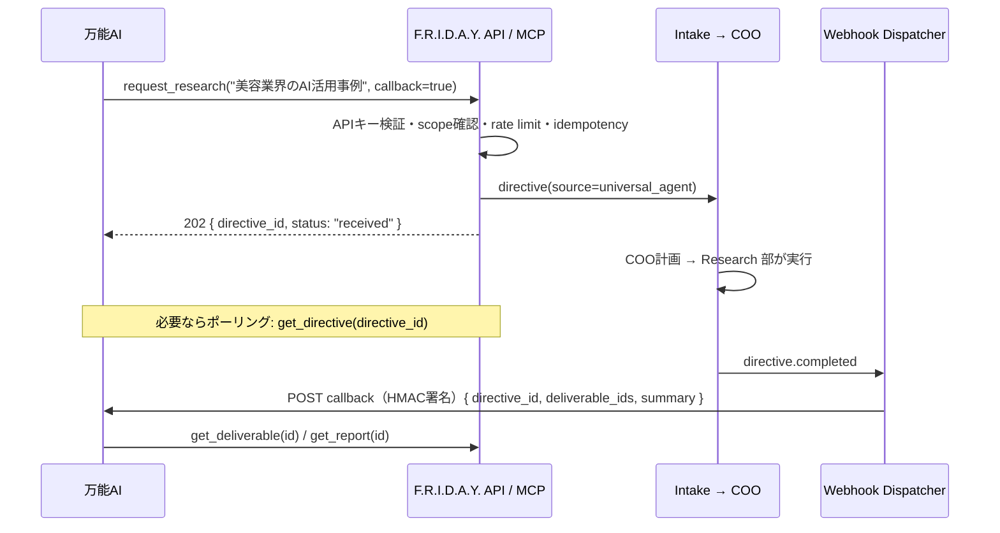

# 09. 万能AIエージェント接続設計

## 9.1 位置づけ

```
CEO
 ↓
万能AIエージェント（別システム・CEOの代理窓口）
 ↓
F.R.I.D.A.Y.（COO）
 ↓
部署
 ↓
AI社員
```

- 万能AIは **F.R.I.D.A.Y. の"外部クライアント"** として接続する。社内の部署・AI社員には直接アクセスさせない（R1: 入口はCOOのみ）。
- 万能AIができること: **タスク作成 / 調査依頼 / レポート取得 / 分析依頼 / 会社状況の照会**。
- 万能AIができないこと: **承認・却下**、AI社員設定変更、Provider設定変更、APIキー管理。

## 9.2 接続方式（3つを用意）

| 方式 | 用途 | Phase |
|---|---|---|
| **REST API** (`/api/v1/*`, APIキー認証) | 汎用。どんなシステムからでも呼べる | 6 |
| **MCP Server**（Streamable HTTP） | 万能AIがLLMエージェントの場合、ツールとして自然に使える | 6 |
| **Webhook**（F.R.I.D.A.Y. → 万能AI） | 非同期完了通知（調査完了・レポート完成） | 6 |



## 9.3 MCP ツール定義（公開予定）

| ツール | 説明 | scope |
|---|---|---|
| `get_company_status` | 会社全体の状況（KPIサマリー、稼働社員、承認待ち件数） | `read:status` |
| `create_task` | タスク（directive）作成。部署指定はヒント扱い（最終判断はCOO） | `write:directives` |
| `request_research` | 調査依頼（テーマ・深さ・期限） | `write:directives` |
| `request_analysis` | 分析依頼（対象データ・観点） | `write:directives` |
| `get_directive` | 依頼の進捗・結果 | `read:directives` |
| `list_reports` / `get_report` | レポート一覧・取得（PDF署名URL含む） | `read:reports` |
| `get_deliverable` | 成果物取得 | `read:deliverables` |
| `search_knowledge` | Vault知識検索 | `read:knowledge` |
| `list_pending_approvals` | 承認待ちの**閲覧のみ**（CEOへのリマインドに使える） | `read:approvals` |
| `add_comment` | 進行中依頼への補足コメント | `write:directives` |

## 9.4 セキュリティ

| 項目 | 内容 |
|---|---|
| 認証 | `Authorization: Bearer fri_live_xxx`。DBにはハッシュのみ保存、プレフィックスで識別 |
| 権限 | scope 単位。承認系の書き込み scope は**存在しない** |
| レート制限 | クライアント単位（例: 60 req/min、directive作成 100/日） |
| 冪等性 | `Idempotency-Key` ヘッダー必須（作成系） |
| Webhook | HMAC-SHA256 署名 + タイムスタンプ（リプレイ防止）、指数バックオフで最大8回再送 |
| 監査 | 全リクエストを `activity_events(actor=client:<id>)` に記録 |
| 可視化 | 万能AI起点の依頼はダッシュボードで 🤖 バッジ表示。CEOはいつでも取り消し可 |
| ループ防止 | F.R.I.D.A.Y. から万能AIへ依頼を返す機能は持たない（片方向） |
