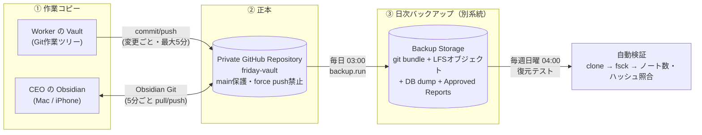

# 10. Obsidian Vault 設計（会社の脳）v1.0

## 10.1 役割

Obsidian Vault は**会社の長期記憶**。Agent Memory（短期）から昇格した記憶、承認済みレポート、意思決定、知識が永続的に蓄積される。

| 保存対象 | 場所 | 主な書き手 |
|---|---|---|
| CEO指示 | `01_CEO/Directives/` | Intake |
| CEO意思決定 | `01_CEO/Decisions/` | Approval Gate / Memory Consolidation |
| プロジェクト・タスク | `05_Projects/<slug>/` | COO・AI社員 |
| AI社員の長期記憶 | `04_AI Employees/<id>/Memory.md`, `Journal/` | Memory Consolidation |
| 会議記録 | `07_Meetings/` | EA・COO |
| **承認済みレポート（PDF含む）** | `08_Reports/Approved/` | Report Archive |
| 活動ログ | `10_Activity/` | Vault Writer |
| 知識 | `09_Knowledge/` | Research 他・Memory Consolidation・CEO |

## 10.2 フォルダ構成

```
FRIDAY-Vault/
├── 00_Inbox/                         # CEOのメモ置き場 → COO がトリアージ
├── 01_CEO/
│   ├── Directives/
│   ├── Decisions/                    # 承認・却下・Board決議（理由つき）
│   ├── Daily/                        # CEOデイリーノート（Morning Briefing リンク）
│   └── Preferences.md                # CEOの判断基準（全AI社員が常時参照）
├── 02_Company/
│   ├── Vision.md
│   ├── AI Operating Rules.md         # 02章の運用ルール（読み取り専用ミラー）
│   ├── Org Chart.md                  # 自動更新
│   ├── Policies/
│   └── KPI/
├── 03_Divisions/
│   ├── Strategy/ … Operations/
│   └── Re-Palette/                   # 事業部
│       ├── README.md
│       ├── Playbooks/
│       ├── Programs/                 # 美容福祉・不登校支援などのプログラム（集計値のみ）
│       ├── Grants/                   # 助成金ごとのノート（要件・締切・提出物）
│       ├── Impact/                   # ロジックモデル・効果測定
│       └── Partners/
├── 04_AI Employees/
│   └── researcher/
│       ├── Profile.md
│       ├── Memory.md                 # 昇格した長期記憶（学び・CEOの好み）
│       └── Journal/2026-10-02.md     # 毎晩の作業日誌（その日の Agent Memory 要約）
├── 05_Projects/                      # プロジェクトはテンプレートから自動生成
│   ├── repalette/  arqo/  arqo/friday/  newtone/  university/  personal/
│   └── future-ventures/
│       └── <slug>/
│           ├── <name>.md             # 概要（進捗・健康度・KPI・リンク）
│           ├── Tasks/  Deliverables/  Decisions/
├── 06_Tasks/                         # プロジェクト外の単発タスク
├── 07_Meetings/
│   ├── Board/2026/10/2026-10-04_Weekly Board Meeting.md
│   └── 2026/10/
├── 08_Reports/
│   ├── Approved/                     # ★ 承認済みのみ（長期アーカイブ）
│   │   └── 2026/10/
│   │       ├── 2026-10-02_Daily Executive Report.md
│   │       ├── 2026-10-02_Daily Executive Report.pdf   (Git LFS)
│   │       └── _Index.md             # 月次索引（自動）
│   ├── Drafts/                       # 承認前のmd版（PDFは置かない）
│   └── _Index.md                     # 年次索引
├── 09_Knowledge/
│   ├── AI/  Beauty/  Subsidies/  Welfare/  Education/  Business/  Tech/
│   └── _MOC.md
├── 10_Activity/2026/10/2026-10-02.md # Company Timeline の日次ログ
├── 90_Templates/                     # ノート種別テンプレート + プロジェクトテンプレート雛形
└── 99_System/
    ├── schema.md                     # frontmatter仕様
    ├── sync-state.json
    └── BACKUP.md                     # バックアップ・復元手順（自動更新）
```

## 10.3 命名・Frontmatter

- 時系列系: `<YYYY-MM-DD>_<タイトル>.md`、DB由来: `<タイトル> (T-7K2M).md`
- 同一性は frontmatter `id` で判定（パスではない）

```yaml
---
id: 01JA7K2M9X...
type: report            # directive|decision|project|task|deliverable|report|meeting|agent|memory|journal|knowledge|activity
title: Daily Executive Report 2026-10-02
status: approved
approved_at: 2026-10-03T07:12:00+09:00
approved_by: ceo
pdf: "[[2026-10-02_Daily Executive Report.pdf]]"
pdf_sha256: 3f9a...
project: "[[05_Projects/arqo/ARQO|ARQO]]"
tags: [friday/report, report/daily]
friday_managed: true
---
```

## 10.4 書き込みルール（人間とAIの共存）

| ルール | 内容 |
|---|---|
| W1 | システムは `<!-- friday:begin -->`〜`<!-- friday:end -->` 内のみ書き換える |
| W2 | マーカー外（CEOメモ）は取り込んでAIのコンテキストに反映。システムは上書きしない |
| W3 | frontmatter の status を CEO が変えた場合は DB が正。差分は「CEOからの変更提案」として通知 |
| W4 | `00_Inbox/` は COO がトリアージ |
| W5 | `09_Knowledge/` への書き込みは出典URLと `confidence` 必須 |
| W6 | 削除しない（`archived: true`）。**`08_Reports/Approved/` は追記のみ・変更禁止** |
| W7 | Re-Palette の個人情報は Vault に書かない（集計値のみ） |

## 10.5 保全設計：Vault → Git → Private GitHub → Daily Backup

**目標: 会社の記憶を絶対に失わない。** 3-2-1 ルール（3つのコピー、2種類の媒体、1つは別系統）を満たす。



### ① Git（作業コピー）
- Worker の書き込みは `vault.sync` キューで直列化 → `pull --rebase` → commit → push。
- コミット規約: `friday: <event> <id> (<agent>)`。
- PDF などのバイナリは **Git LFS**（`*.pdf`, `*.png`, `*.jpg`）。

### ② Private GitHub Repository（正本）
| 設定 | 内容 |
|---|---|
| 可視性 | Private |
| ブランチ保護 | `main` への force push・ブランチ削除を禁止 |
| Worker の権限 | リポジトリ単位の Deploy Key（write のみ、admin なし） |
| CEO の端末 | Obsidian Git プラグインで同期 |
| 監視 | push 失敗が 30 分続いたら `alert` 通知（Operations AI が検知） |
| 容量 | LFS 使用量を監視し 80% で通知（PDF は約 0.5–1MB/日の想定） |

### ③ Daily Backup（別系統の長期保管）
| 項目 | 内容 |
|---|---|
| 時刻 | 毎日 03:00 JST |
| 対象 | (a) `git bundle --all`（全履歴）(b) LFS オブジェクト一式 (c) Postgres の論理ダンプ (d) Storage の `reports/approved/` |
| 保存先 | GitHub とは**別系統**のオブジェクトストレージ（推奨: Cloudflare R2 / S3 互換。Supabase Storage の別バケットでも可）。暗号化して保存 |
| 世代管理 | 日次30世代 / 月次12世代 / 年次は永久保存 |
| 整合性 | 各成果物の sha256 を `backup_runs` と `99_System/BACKUP.md` に記録 |
| 復元テスト | 毎週日曜 04:00 に最新バンドルから自動復元し、`git fsck`・ノート数・承認済みレポートのハッシュを照合。失敗時 `critical` 通知 |
| 削除防止 | バックアップ側はオブジェクトロック（または削除権限のない書き込み専用キー）で、F.R.I.D.A.Y. 自身も消せない（AI運用ルール X3） |

### 復旧目標

| 事象 | 復旧方法 | RPO | RTO |
|---|---|---|---|
| Worker のディスク消失 | GitHub から clone | ≤5分 | 10分 |
| GitHub リポジトリ消失・破損 | 最新 bundle から新リポジトリへ push | ≤24h | 1h |
| 誤った大量変更 | Git 履歴から revert | 0 | 10分 |
| DB 消失 | DB dump から復元 + Vault から再インデックス | ≤24h | 1h |

## 10.6 RAG（長期記憶の想起）

1. Indexer が見出し単位でチャンク化 → `knowledge_chunks`。
2. 想起順序: **Working Context Card → Agent Memory → Obsidian RAG**（[06章](./06-agent-memory.md)）。
3. 常時注入: `01_CEO/Preferences.md`、`02_Company/AI Operating Rules.md` の要約。
4. 埋め込みモデル変更時は再インデックスジョブ。
