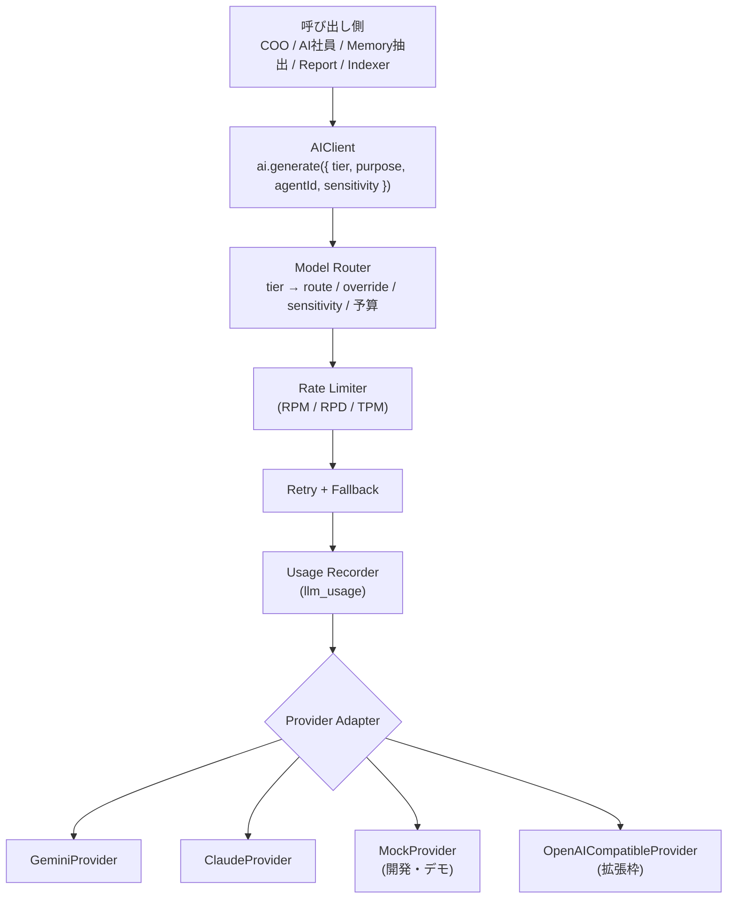

# 11. AI Provider Layer 設計

## 11.1 目的

- **モデル固定禁止**。アプリのどこにもモデル名をハードコードしない。
- 初期は **Gemini API（無料枠）**、将来 **Claude API** に設定画面から切替。
- 社員単位・用途単位で混在可能（例: COO だけ Claude）。

## 11.2 レイヤー構成

## 11.3 共通インターフェース

| メソッド | 説明 |
|---|---|
| `generateText` / `streamText` | テキスト生成 / ストリーミング |
| `generateObject(schema)` | 構造化出力（COO計画、Memory抽出、レポート本文、承認要約で必須） |
| `generateWithTools(tools)` | ツール呼び出しループ |
| `embed(texts)` | 埋め込み（Agent Memory・Vault RAG） |
| `capabilities()` | tools / json_schema / vision / context_window / grounding |

リクエスト: `messages, system, tier, purpose, agentId, runId, sensitivity, maxOutputTokens, temperature, timeoutMs`
レスポンス: `text | object | toolCalls, usage, model, provider, finishReason, latencyMs`

## 11.4 ルーティング表（設定画面で編集）

| tier | 初期（Gemini） | fallback | 切替後（Claude） |
|---|---|---|---|
| `fast` | Flash-Lite 系 | Flash 系 | Haiku 系 |
| `standard` | Flash 系 | Flash-Lite 系 | Sonnet 系 |
| `deep` | Pro 系 | Flash 系 | Opus 系 |
| `embedding` | Gemini Embedding 系 | — | （Claude は埋め込み非提供のため別プロバイダ継続） |

- 具体モデルIDは `model_routes.model_id`（Phase 0 のシード時に最新公開モデルを確認して設定）。
- 解決順: `agents.model_override` → `model_routes(tier)` → fallback。
- **Provider Preset**: `Gemini Free` / `Claude` / `Hybrid（COOのみClaude）` をワンクリックで切替。

## 11.5 データ機密区分によるルーティング

| sensitivity | 送信先の制約 |
|---|---|
| `normal` | 制約なし |
| `confidential` | 入力データが学習に使われない契約のプロバイダ/プランのみ（無料枠は不可） |
| `restricted` | `confidential` と同じ + Re-Palette の `data_access` を持つ社員の run のみ。そもそも個人情報は保存しない（[04章](./04-repalette-division.md)） |

条件を満たすルートがない場合は実行せず、`blocked` として CEO に通知（無料枠に勝手に流さない）。

## 11.6 Gemini 無料枠への対応

| 対策 | 内容 |
|---|---|
| トークンバケット | provider×model 単位の RPM/RPD/TPM を Postgres で共有管理（値は `provider_configs.rate_limits` で設定） |
| 優先度 | CEO直接指示・判断関連 > 定時レポート > Memory処理 > バックグラウンド調査 |
| 降格 | deep → standard → fast |
| 枠の予約 | 22:30〜23:00 の Daily Report、06:30 の Morning Briefing、日曜の Board 用に RPD を予約 |
| キャッシュ | 同一入力の要約・埋め込みは content hash でキャッシュ |
| 可視化 | ヘッダーに「本日の残り枠」 |

## 11.7 プロンプト管理

- `packages/agents/prompts/` にテンプレート管理（Provider非依存）。
- 構成: `AI運用ルール（常時）` + `会社共通` + `CEO Preferences` + `部署Playbook` + `社員Persona` + `Working Context Card` + `Agent Memory 想起` + `RAG` + `タスク`。
- バージョンを `agent_runs.prompt_version` に記録し、評価指標（採用率など）と比較できるようにする。

## 11.8 コスト記録

`llm_usage` に全呼び出しを記録。設定画面・Analytics で本日/今月、社員別・部署別・用途別に表示。評価システムの「成果物1件あたりコスト」にも使用。
