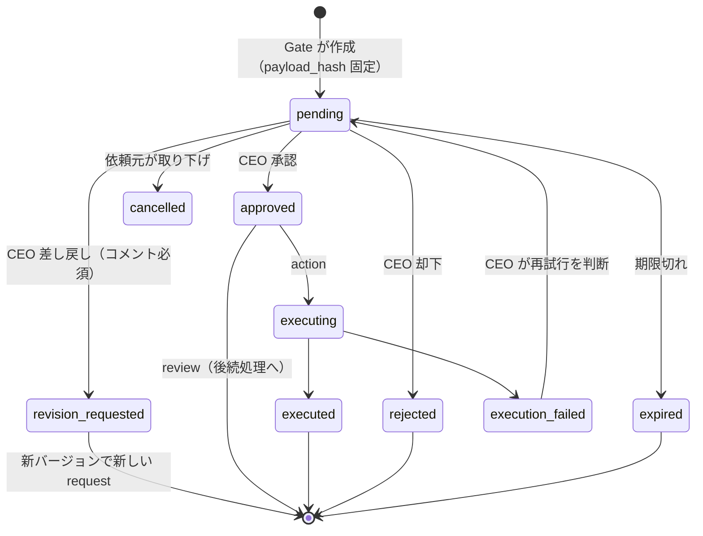

# 12. 承認フロー設計 / CEO ACTION REQUIRED

## 12.1 CEO ACTION REQUIRED の定義

> **CEO が判断しないと先に進まないものだけ**を表示する。

| 表示する（判断待ち） | 表示しない（→ Timeline / 通知へ） |
|---|---|
| 承認必須行為の申請（第2条の8種） | タスク完了・成果物作成の報告 |
| レビュー承認（レポート・提案・成果物確定） | 「レポートができました」だけの情報 |
| COO からの確認質問（clarification） | AI社員のステータス変化 |
| Weekly Board の未決議題 | KPI変化・ニュース |
| 実行失敗の再試行判断 | 同期成功などのシステム情報 |

各カードには「**この判断で止まっているもの**」（`blocking_count` タスク数・関係プロジェクト）を必ず表示する。

## 12.2 承認種別

| category | kind | 例 | 既定 risk | 承認後 |
|---|---|---|---|---|
| action | `email_send` | 企業への提案メール | high | 送信 |
| action | `sns_post` | Instagram 投稿 | high | 投稿（予約時刻） |
| action | `external_publish` | LP公開・資料URL公開 | high | 公開 |
| action | `deploy` | 本番デプロイ | high | マージ / デプロイ |
| action | `contract` | 契約・申込み | critical | 初期は「CEOが手続きするタスク」化＋書類準備 |
| action | `payment` | 支払い | critical | 初期は「CEOが支払うタスク」化 |
| action | `external_integration` | 外部サービス連携 | high | 連携有効化 |
| action | `pdf_submission` | 助成金申請PDF提出 | critical | 提出（窓口がAPI非対応なら CEO 提出タスク化＋提出物一式） |
| review | `report_review` | Daily Executive Report | low | **Approved Reports → Obsidian → 長期アーカイブ** |
| review | `proposal_review` | COOの施策・新規PJ提案 | medium | タスク生成 / PJ発足 |
| review | `deliverable_review` | 事業計画書確定 | low〜medium | 成果物確定 |
| review | `board_decision` | Board 議題 | medium | 決議の実行 |

## 12.3 状態遷移



## 12.4 安全ルール

| # | ルール |
|---|---|
| S1 | AI社員は承認必須行為のツールを持たない（`request_*` のみ） |
| S2 | 承認時と実行時の `payload_hash` が一致しなければ実行しない |
| S3 | 内容修正は新しい request を作る（承認の使い回し禁止） |
| S4 | `approved` にできるのは CEO 認証済みセッションのみ（Universal AI のAPIキー不可） |
| S5 | 実行は `idempotency_key` で一度きり。自動リトライなし |
| S6 | `critical` は2段階確認 |
| S7 | 全遷移を監査ログ + Vault `01_CEO/Decisions/` に記録 |
| S8 | 一括承認は `review` かつ `low` のみ |

## 12.5 並び順スコア

```
score = risk(critical 40 / high 30 / medium 20 / low 10)
      + urgency(期限 <1h 40 / <6h 30 / <24h 20 / それ以外 0)
      + blocking(止まっているタスク数 × 3、上限 15)
      + priority(p0 20 / p1 10 / p2 5)
      + age(待ち1時間ごと +1、上限 10)
```

## 12.6 承認UI

- **カード**（Home 最上部の横並び）: 種別アイコン / タイトル / 依頼者 / 10秒要約 / リスクバッジ / 期限カウントダウン / 止まっているもの / **[承認] [差し戻し] [詳細]**
- **詳細ドロワー**: プレビュー（投稿画像・メール本文・diff・PDF）、根拠、影響範囲、COOの推奨、関連する過去の判断（Agent Memory / Decisions から）
- **スマホ**: スワイプ（右=承認、左=差し戻し）。`high` 以上は詳細を開かないと承認不可。

## 12.7 判断後の記録

承認・却下・差し戻しは次に反映される:
- Company Timeline（「09:45 CEO 承認: Instagram投稿」）
- 評価システム（`deliverable.decided` / `adopted` / `revised`）
- 依頼元AI社員の Agent Memory（`decision` として理由とともに記録 → 次回に反映）
- Vault `01_CEO/Decisions/`
