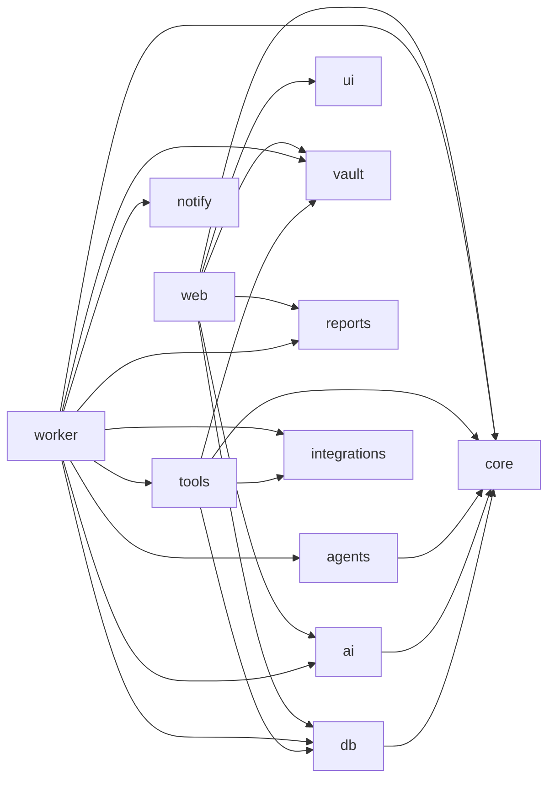

# 12. フォルダ構成（モノレポ）

```
ARQO-Company/
├── apps/
│   ├── web/                              # Next.js — 本社（Dashboard + REST API + MCP）
│   │   ├── app/
│   │   │   ├── (auth)/login/
│   │   │   ├── (company)/                # 認証後レイアウト（サイドバー・ヘッダー・Command Bar）
│   │   │   │   ├── page.tsx              # Home Dashboard
│   │   │   │   ├── command/
│   │   │   │   ├── employees/[id]/
│   │   │   │   ├── departments/[id]/
│   │   │   │   ├── projects/[id]/
│   │   │   │   ├── tasks/
│   │   │   │   ├── reports/[id]/
│   │   │   │   ├── activity/
│   │   │   │   ├── meetings/[id]/
│   │   │   │   ├── knowledge/
│   │   │   │   ├── analytics/
│   │   │   │   └── settings/{company,providers,notifications,integrations,vault}/
│   │   │   ├── api/v1/                   # REST（10章）
│   │   │   └── api/mcp/                  # MCP Server（Streamable HTTP）
│   │   ├── components/
│   │   │   ├── dashboard/                # HeroBriefing, KpiStrip, CompanyProgress, LiveWorkforce,
│   │   │   │                             # TodayPerformance, ActionRequired, ProjectRings,
│   │   │   │                             # LatestReports, AgentConversation, TodaySchedule, CommandBar
│   │   │   ├── approvals/                # ApprovalCard, ApprovalDrawer, Previews(SNS/Email/Diff/PDF)
│   │   │   ├── agents/                   # AgentCard, PresenceDot, AgentAvatar
│   │   │   └── layout/                   # Sidebar, Header, CommandPalette(⌘K)
│   │   ├── lib/                          # supabase client, realtime hooks, api client
│   │   ├── public/                       # avatars, hero images, manifest(PWA), service worker
│   │   └── styles/                       # design tokens
│   │
│   └── worker/                           # Company Runtime（常駐プロセス）
│       └── src/
│           ├── main.ts                   # pg-boss 起動・キュー登録
│           ├── intake/                   # Intake Gateway
│           ├── coo/                      # understand / plan / integrate / propose / optimize
│           ├── executor/                 # Agent Executor（実行ループ）
│           ├── gate/                     # Approval Gate（作成・遷移・hash）
│           ├── actions/                  # Action Executor（sns, email, deploy, calendar ...）
│           ├── reports/                  # Report Engine（collect / write / render / pdf / store）
│           ├── notify/                   # Notification Hub（in_app, web_push, email, line）
│           ├── vault/                    # Vault Writer / Indexer
│           ├── scheduler/                # cron 定義（朝礼・日報・定期調査・週次最適化）
│           └── webhooks/                 # 万能AIへの Webhook 配信
│
├── packages/
│   ├── core/                             # ドメイン型・Zodスキーマ・ステートマシン・enum（全体で共有）
│   ├── db/                               # Drizzle スキーマ・マイグレーション・シード・ビュー
│   ├── ai/                               # Provider Layer（AIClient, Router, RateLimiter, Usage, adapters/）
│   │   └── adapters/{gemini,claude,mock,openai-compatible}/
│   ├── agents/                           # AI社員・部署の定義データ、プロンプトテンプレート、Playbook
│   │   ├── definitions/                  # friday.yaml, cto.yaml ...（シードの元）
│   │   └── prompts/
│   ├── tools/                            # エージェントツール（read/write/coordination/request_*）
│   ├── vault/                            # VaultAdapter（fs / git / obsidian-rest）、frontmatter、マーカー編集
│   ├── reports/                          # レポートテンプレート（React → HTML）、PDF化
│   ├── notify/                           # 通知チャネル実装（共通インターフェース）
│   ├── integrations/                     # 外部サービス（GitHub, Vercel, Instagram, Gmail, Calendar, Search）
│   ├── ui/                               # 共有UI（shadcn拡張・デザイントークン・チャート）
│   └── config/                           # tsconfig / eslint / tailwind preset
│
├── vault-template/                       # Obsidian Vault の初期構成（05章）＋ 90_Templates
├── docs/
│   └── design/                           # 本設計書
├── supabase/                             # ローカル開発用 config・seed（Supabase CLI）
├── .github/workflows/                    # CI（lint, typecheck, test, migration check）
├── turbo.json
├── pnpm-workspace.yaml
├── package.json
└── .env.example                          # GEMINI_API_KEY, ANTHROPIC_API_KEY, SUPABASE_*, VAULT_GIT_URL ...
```

## 依存方向のルール



- `core` は何にも依存しない（純粋な型・スキーマ・ステートマシン）。
- `web` は `tools` / `integrations` を import しない（副作用実行は Worker のみ）。
- 外部サービスSDKは `integrations` の中だけで使う。
