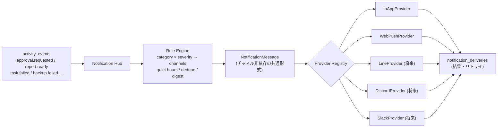

# 13. 通知システム設計（Notification Provider Layer）

## 13.1 チャネル

| チャネル | 状態 | 用途 |
|---|---|---|
| **App Notification** | **必須（Phase 0〜3）** | ベル・ACTION REQUIRED バッジ・トースト（Realtime） |
| **Web Push** | **必須（Phase 3）** | PWA（Mac / iPhone ホーム画面）へのプッシュ |
| LINE | 将来 | スマホでの即時通知 |
| Discord | 将来 | ログ・ダイジェスト |
| Slack | 将来 | ログ・ダイジェスト |
| Email | 将来（任意） | Daily Report の PDF リンク送付 |

**プロバイダは交換可能**。新しいチャネルの追加は「アダプタを1つ実装して登録」するだけで、通知を出す側のコードは一切変わらない。

## 13.2 アーキテクチャ



## 13.3 Provider インターフェース（概念）

| 要素 | 内容 |
|---|---|
| `id` | `in_app`, `web_push`, `line`, `discord`, `slack`, `email` |
| `capabilities` | `rich_text`, `image`, `action_buttons`, `deep_link`, `max_length` |
| `validateConfig(config)` | 設定の検証（秘密情報は環境変数参照） |
| `render(message)` | 共通形式 → チャネル固有形式（capabilities に合わせて劣化） |
| `send(rendered, target)` | 送信。`{ status, providerMessageId, retryable }` を返す |
| `healthCheck()` | 接続確認（設定画面の「テスト送信」） |

### 共通メッセージ形式 `NotificationMessage`

```yaml
category: action_required        # action_required | report | alert | project | task | system
severity: warning                # info | success | warning | critical
title: "Instagram投稿の承認"
body: "Marketing AI · 期限 10:00 · 止まっているタスク 2件"
deep_link: "/approvals/01JA..."  # アプリ内の該当画面
image_url: null
actions: [{ label: "開く", url: "/approvals/01JA..." }]
dedupe_key: "approval:01JA..."
```

**承認操作はアプリ内のみ**（S4）。LINE / Slack / Discord には「開く」リンクだけを送り、承認ボタンは置かない。

## 13.4 ルーティング既定値

| category | 例 | App | Web Push | 静音時間 |
|---|---|---|---|---|
| `action_required`（high/critical） | 承認必須行為 | ✅ | ✅ 即時 | critical のみ即時、他は朝 07:00 のブリーフィングに集約 |
| `action_required`（low/medium） | レポート確認・提案 | ✅ | ✅（30分単位でまとめる） | 朝に集約 |
| `report` | Daily Report（23:00）/ Morning Briefing（07:00）/ Board Pack（日曜 19:30） | ✅ | ✅ | 定時配信のため対象外 |
| `alert` | タスク失敗・予算超過・**バックアップ失敗**・Vault同期停止 | ✅ | ✅ | critical のみ即時 |
| `project` / `task` | 完了・新規 | ✅ | — | — |
| `system` | 同期成功など | ✅（既読不要） | — | — |

既定の静音時間: **00:00〜06:30**（23:00 の Daily Report 配信を妨げないよう v0.1 から変更）。設定画面で変更可。

## 13.5 品質ルール

- **CEO 判断が必要なものは必ず通知**。全チャネルが失敗した場合は App に `critical` で残し、次回表示時にモーダル。
- `dedupe_key` で重複抑制。
- リマインド: 未判断の `action_required` は 2h / 6h / 翌朝 07:00、期限付きは期限の1h前。
- Executive Assistant が1時間ごとに未読を束ねてダイジェスト化（通知の洪水防止）。
- フォールバック: Web Push の購読が失効していたら App に残し、設定画面で再購読を促す。

## 13.6 チャネル追加手順（将来）

1. `packages/notify/providers/<name>/` にアダプタを実装
2. Provider Registry に登録
3. 設定画面でチャネルを追加（`notification_channels` にレコード）、テスト送信
4. `notification_rules` で配信するカテゴリを選択

→ Notification Hub・呼び出し側・DB スキーマの変更は不要。
