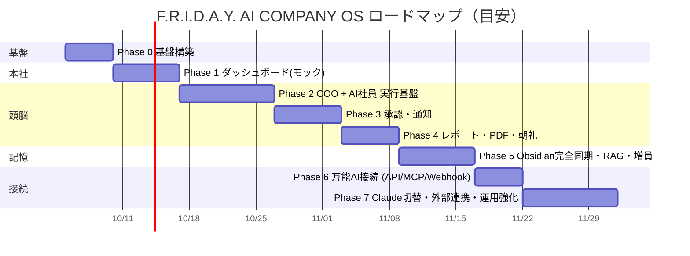

# 13. 実装ロードマップ

方針: **早い段階で「本社に入った」体験を作り**、その裏側を段階的に本物にしていく。各フェーズの終わりに CEO レビューを挟む。

| Phase | ゴール | 主な成果物 | 完了条件（CEOが確認できること） |
|---|---|---|---|
| **0. 基盤** | 開発の土台 | モノレポ、Supabase（DB/Auth/Storage）、Drizzleスキーマ v1、シード（部署・11名のAI社員）、CI、`.env.example`、Provider Layer 骨格（Gemini + Mock） | ログインでき、Gemini 接続テストが通る |
| **1. 本社（モック）** | 「本社に入った」体験 | Home Dashboard 全パネル、サイドバー全画面の骨組み、⌘K、デザイントークン、Realtime配線、**デモモード**（Mock Provider + シミュレータで社員が動いて見える） | 1920×1080 でスクロールなしに会社全体が見え、社員ステータスがライブで変わる |
| **2. COO + AI社員** | 本当に働く | Intake → COO（理解・計画・振分・統合・提案）、Agent Executor、ツール（Read/Write/Coordination）、pg-boss、presence、会話ログ、コスト記録、Kill Switch | Command Center に指示 → COO がタスク分解 → 複数部署が並列で作業 → 統合提案が届く |
| **3. 承認・通知** | CEOは判断だけ | Approval Gate（hash固定・状態遷移・監査）、ACTION REQUIRED 完成、承認ドロワー＋プレビュー、通知Hub（In-App / Web Push / Email）、PWA、リマインド | 承認が必要なものが必ず通知され、スマホから承認・差し戻しできる |
| **4. レポート** | 毎日のリズム | Report Engine、Daily Executive Report（PDF・署名URL・承認）、Morning Briefing（ヒーロー連動）、Weekly、スケジューラ | 21:00 にPDFが届き、07:30 に朝礼が表示される |
| **5. 記憶** | 会社の脳 | Vault テンプレート、VaultAdapter(Git)、Writer/Indexer、マーカー方式、pgvector RAG、社員メモリ、AI会議、MVP外のAI社員を採用 | Obsidian で会社の全履歴が読め、CEOのメモが次のタスクに反映される |
| **6. 万能AI接続** | 外部から指揮 | APIキー管理、REST scope、MCP Server、Webhook（HMAC）、🤖バッジ | 万能AIから調査依頼 → 完了Webhook → レポート取得 が通る |
| **7. 本番運用** | 実務で使える | Claude Adapter と Provider Preset 切替、外部連携（GitHub/Vercel Deploy、Instagram、Gmail、Calendar）、LINE通知、予算アラート、バックアップ、エラーモニタリング | 設定画面で Gemini → Claude に切替でき、承認後に実際の投稿・送信・Deployが実行される |

## リスクと対策

| リスク | 対策 |
|---|---|
| Gemini 無料枠のレート制限で業務が止まる | 優先度キュー・降格・日報枠の予約（06章）、Phase 7 で有料/Claude へ移行可能 |
| AIの暴走・コスト増 | 予算3段階・ループ検知・Kill Switch・L2 承認ポリシー |
| 承認疲れ（通知が多すぎる） | EAによる束ね、一括承認（lowのみ）、スコア順表示、静音時間 |
| Vault と DB の不整合 | 状態はDBが正、本文はVaultが正、IDで結合、同期の直列化、`vault_sync_log` で監視 |
| 外部SNS/メールAPIの審査・制約 | Phase 7 まではドラフト生成＋「CEOが手動投稿」タスク化で代替 |
| 個人情報（Re-Palette 支援対象者等） | `data_sensitivity` による Provider 制限、Vault の private リポジトリ、最小限保存 |

## 次のアクション

1. 本設計書のレビュー（特に README の **D1〜D7**）
2. 決定事項を反映して設計書を v1.0 に更新
3. Phase 0 着手
