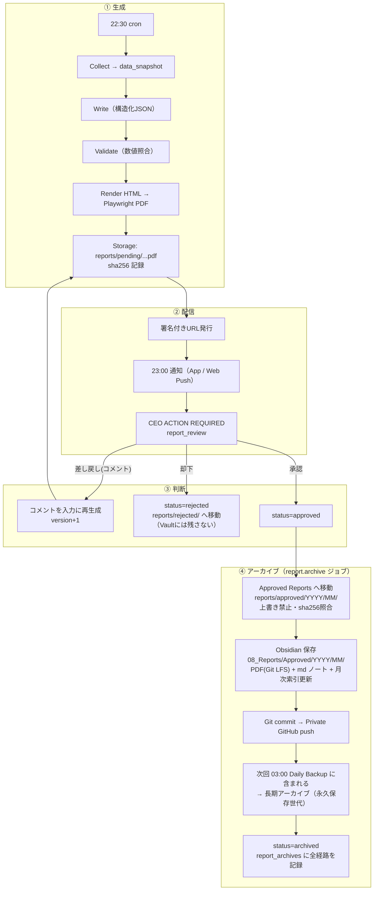

# 14. レポート設計（生成 → 承認 → アーカイブ）

## 14.1 レポート種別とスケジュール

| 種別 | 時刻（JST） | 作成者 | 判断 | 形式 |
|---|---|---|---|---|
| **Morning Briefing** | **毎日 07:00**（06:30 生成開始） | Executive Assistant | 不要 | Home ヒーロー + 通知 |
| **Daily Executive Report** | **毎日 23:00**（22:30 生成開始） | COO + EA | `report_review` | PDF |
| **Board Pack** | 日曜 19:30 | COO | 不要（会議資料） | PDF |
| **Weekly Board Report** | **日曜 20:00 の Board Meeting 後** | COO | `report_review` | PDF |
| Re-Palette 月次活動レポート | 毎月1日 09:00 | Re-Palette AI | `report_review` | PDF |
| インパクトレポート | 四半期 | Impact Analyst AI | `report_review` | PDF |
| 部署・プロジェクトレポート | 随時 | 各部署 | `deliverable_review` | PDF / md |

時刻は `company_settings.schedule` で変更可。

## 14.2 Daily Executive Report の構成

| # | セクション | データソース | AI執筆 |
|---|---|---|---|
| 0 | 表紙: 日付・会社全体進捗%・判断待ち件数 | `v_dashboard_summary` | — |
| 1 | Executive Summary（3行） | 全体 | COO |
| 2 | 本日の成果 | `tasks`, `deliverables` | COO |
| 3 | プロジェクト進捗（pinned PJ・前日比・健康度） | `v_project_progress` | COO |
| 4 | **AI社員活動と評価**（ハイライト指標・採用率・前日比） | `agent_metric_snapshots` | EA |
| 5 | KPI（全社 + **Re-Palette トップKPI**） | `kpi_values` | Finance / Re-Palette AI |
| 6 | Company Timeline ハイライト（重要度4以上） | `activity_events` | — |
| 7 | CEO提案（最大3件） | COO統合 | COO |
| 8 | 判断待ち一覧・明日の予定 | `v_ceo_action_queue`, `schedule_events` | — |
| 9 | 付録: コスト・エラー・バックアップ状況 | `llm_usage`, `backup_runs` | — |

**数字はAIに作らせない**: 数値はすべて `data_snapshot` から差し込み、AIは解釈とコメントのみ。AIの文章中の数値は snapshot と照合して不一致なら再生成。

## 14.3 ライフサイクル全体

### アーカイブの保証

| 項目 | 内容 |
|---|---|
| 不変性 | Approved Reports は上書き・削除不可（Storage ポリシー + Vault W6）。訂正が必要な場合は「訂正版」を新規レポートとして作成し、元レポートからリンク |
| 完全性 | `pdf_sha256` を DB・Vault frontmatter・バックアップ記録の3か所に保存し、復元テストで照合 |
| 追跡性 | `report_archives` に Storage パス / Vault パス / commit / GitHub push 時刻 / 最初のバックアップID を記録 |
| 一覧性 | Reports 画面に「Approved Reports」タブ（年月ツリー）、Vault に `_Index.md`（年次・月次） |
| リトライ | アーカイブの各段は冪等。途中失敗は `archiving` のまま再実行（最大5回）、失敗時 `alert` |

## 14.4 PDF の仕様

- A4 縦、Noto Sans JP 埋め込み。表紙のみダーク（ブランド）、本文は印刷向けライト。
- フッター: レポートID・バージョン・生成日時・ページ番号。承認後のアーカイブ版には「Approved by CEO / 承認日時」を表紙に追記した**確定版**を生成し、それをアーカイブ対象とする（確定版の sha256 を記録）。
- Storage は private。URL は署名付き（期限つき）、アプリ内からは都度発行。

## 14.5 Morning Briefing（07:00）

1. 今日の予定
2. CEO ACTION REQUIRED（件数とトップ3）
3. 昨夜〜今朝にAI社員が進めたこと（Timeline から）
4. 今日のAI社員の作業計画
5. Re-Palette の締切・イベント（直近7日）
6. ニュースダイジェスト（AI・美容・補助金から3件）
7. 静音時間中に保留された通知のまとめ

## 14.6 Weekly Board Meeting（日曜 20:00）

| 資料 | 内容 |
|---|---|
| Board Pack（19:30） | 週次KPI、部署別報告（Re-Palette 含む）、AI社員評価（週次）、決議事項（最大5件・推奨案つき） |
| Board Meeting（20:00） | Meeting 画面で議題ごとに判断。未決は `board_decision` として ACTION REQUIRED に残る |
| Weekly Board Report | 議事録・決議・翌週計画 → `report_review` → アーカイブ |
