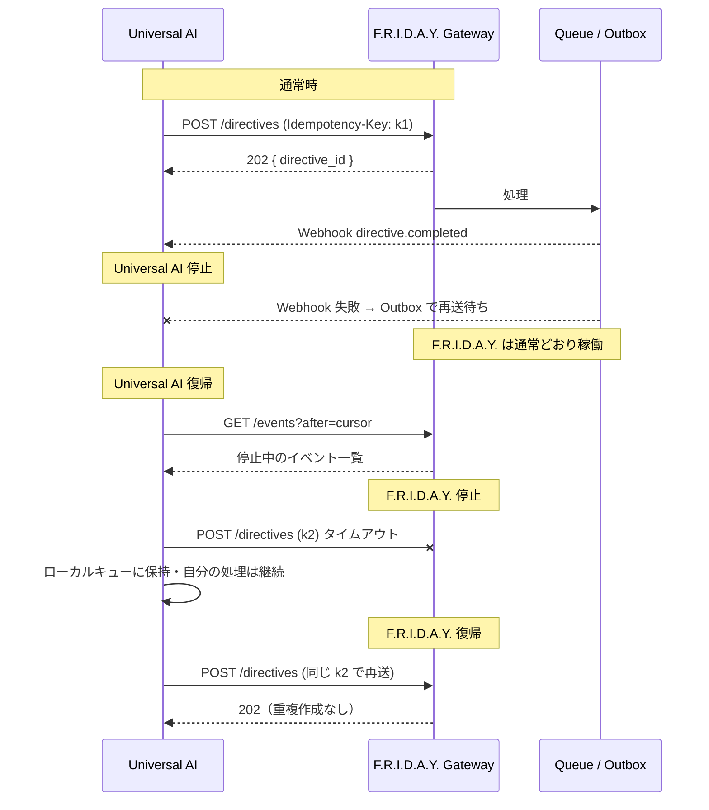

# 15. Universal AI（万能AIエージェント）接続設計 — 疎結合

## 15.1 位置づけ

```
CEO
 ↓
Universal AI          ← 社外の独立システム（F.R.I.D.A.Y. の AI社員ではない）
 ↓  REST API / Webhook / MCP（契約のみで接続）
F.R.I.D.A.Y.
 ↓
Departments
 ↓
Employees
```

| 原則 | 内容 |
|---|---|
| 別システム | 別デプロイ・別DB・別の認証情報。コードもDBも共有しない |
| 契約で接続 | 共有するのは**公開契約**（OpenAPI スキーマ、Webhook イベントスキーマ、MCP ツール定義）のみ。契約はバージョン管理（`v1`） |
| 社員ではない | `agents` テーブルに存在しない。`api_clients` の1つ |
| 権限 | タスク作成・調査依頼・レポート取得・分析依頼・状況照会。**承認はできない** |
| 独立稼働 | **片方が止まっても、もう片方は稼働し続ける** |

## 15.2 独立稼働の設計

### Universal AI が停止しているとき → F.R.I.D.A.Y. は継続

| 仕組み | 内容 |
|---|---|
| 依存ゼロ | F.R.I.D.A.Y. の処理経路（Intake・COO・部署・Scheduler・レポート）は Universal AI を一切呼ばない。Universal AI 起点の依頼も、受付後は F.R.I.D.A.Y. 内部で完結 |
| Webhook Outbox | 通知すべきイベントは `webhook_outbox` に書くだけ（業務処理と同一トランザクション）。送信は別ジョブ。失敗しても業務処理は止まらない |
| 再送 | 指数バックオフで最大72時間再送 → `dead`。連続失敗時はサブスクリプションを自動一時停止（`paused_until`）し、Timeline に記録（CEO への通知は低優先度） |
| 取りこぼし回収 | Universal AI は復帰後 `GET /api/v1/events?after=<cursor>` で停止中のイベントを取得できる（Webhook に依存しない） |
| ヘルス表示 | 設定画面に接続状態（最終通信・Outbox 滞留数）を表示 |

### F.R.I.D.A.Y. が停止しているとき → Universal AI は継続

| 仕組み | 内容 |
|---|---|
| F.R.I.D.A.Y. 側の提供物 | `GET /api/v1/health`（軽量）、全作成系 API の `Idempotency-Key`（再送しても二重作成されない）、`Retry-After` ヘッダー |
| Universal AI 側の推奨実装 | タイムアウト（5秒）・サーキットブレーカー・ローカル送信キュー（復帰後に再送）。F.R.I.D.A.Y. の応答を待たずに自分の処理を続ける |
| 部分停止 | Web（API）だけ生きていて Worker が停止中でも、依頼は `202 Accepted` で受け付けてキューに滞留 → Worker 復帰時に処理 |



## 15.3 接続方式

| 方式 | 方向 | 用途 | Phase |
|---|---|---|---|
| REST API | UA → F | 依頼・照会（汎用） | 6 |
| MCP Server（Streamable HTTP） | UA → F | Universal AI が LLM エージェントの場合のツール公開（REST の薄いラッパー） | 6 |
| Webhook | F → UA | 非同期完了通知（HMAC署名） | 6 |
| Event Feed | UA → F（pull） | 取りこぼし回収・ポーリング | 6 |

MCP Server は REST API と同じ認証・scope を使い、独自ロジックを持たない（契約の二重管理を避ける）。

## 15.4 MCP ツール / API の対応

| ツール | REST | scope | 内容 |
|---|---|---|---|
| `get_company_status` | `GET /status` | `read:status` | KPIサマリー・稼働社員・判断待ち件数 |
| `create_task` | `POST /directives` | `write:directives` | タスク作成（部署指定はヒント、最終判断はCOO） |
| `request_research` | `POST /directives` (type=research) | `write:directives` | 調査依頼 |
| `request_analysis` | `POST /directives` (type=analysis) | `write:directives` | 分析依頼 |
| `get_directive` | `GET /directives/:id` | `read:directives` | 進捗・結果 |
| `list_reports` / `get_report` | `GET /reports` | `read:reports` | **承認済みレポートのみ**（署名URL付き） |
| `get_deliverable` | `GET /deliverables/:id` | `read:deliverables` | 成果物 |
| `search_knowledge` | `GET /knowledge/search` | `read:knowledge` | Vault 検索（restricted は除外） |
| `list_pending_decisions` | `GET /approvals` | `read:approvals` | 判断待ちの閲覧のみ |
| `get_events` | `GET /events` | `read:events` | イベントフィード |

## 15.5 セキュリティ

| 項目 | 内容 |
|---|---|
| 認証 | `Authorization: Bearer fri_live_...`（DBにはハッシュのみ） |
| 権限 | scope 単位。**承認系の書き込み scope は存在しない** |
| データ境界 | `restricted`（Re-Palette）データ・Agent Memory・未承認レポートは返さない |
| レート制限 | クライアント単位 |
| Webhook 署名 | `X-Friday-Signature: t=<unix>,v1=<hmac-sha256>`（リプレイ防止） |
| 監査 | `activity_events(actor_type=client)`。Timeline に 🤖 バッジで表示 |
| ループ防止 | F.R.I.D.A.Y. から Universal AI へ依頼を出す機能は持たない（片方向）。Webhook は通知のみ |
| 契約変更 | 破壊的変更は `/api/v2` として並行提供し、旧版は告知後に廃止 |
