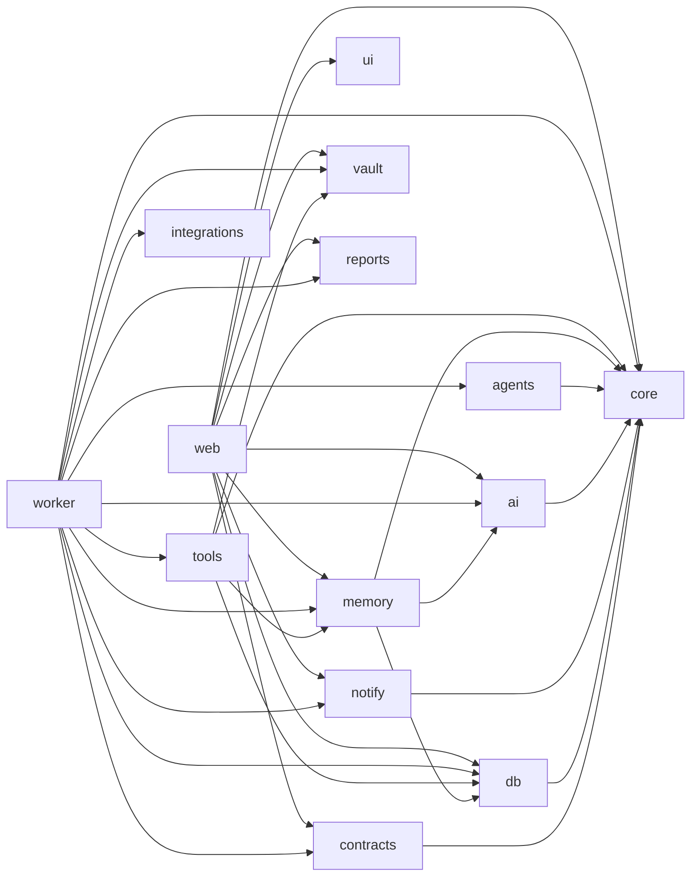

# 18. フォルダ構成（モノレポ）v1.0

```
ARQO-Company/
├── apps/
│   ├── web/                              # Next.js — 本社（Dashboard + REST API + MCP）
│   │   ├── app/
│   │   │   ├── (auth)/login/
│   │   │   ├── (company)/
│   │   │   │   ├── page.tsx              # Home
│   │   │   │   ├── command/  employees/[id]/  departments/[id]/  projects/[slug]/
│   │   │   │   ├── tasks/  reports/{approved}/  board/  activity/  knowledge/  analytics/
│   │   │   │   └── settings/{company,operating-rules,providers,notifications,integrations,vault,backups}/
│   │   │   ├── api/v1/                   # REST（16章）
│   │   │   └── api/mcp/                  # MCP Server（REST の薄いラッパー）
│   │   ├── components/
│   │   │   ├── dashboard/                # ActionRequiredBand, KpiStrip, CompanyTimeline, LiveWorkforce,
│   │   │   │                             # AgentPerformance, ProjectRings, ScheduleReportsTabs,
│   │   │   │                             # RePaletteHeadline, HeaderBriefing, CommandBar
│   │   │   ├── approvals/  agents/  memory/  timeline/  board/  repalette/  layout/
│   │   ├── lib/                          # supabase, realtime hooks, api client
│   │   └── public/                       # avatars, images, manifest(PWA), service worker
│   │
│   └── worker/                           # Company Runtime（常駐）
│       └── src/
│           ├── main.ts
│           ├── intake/  coo/  executor/
│           ├── gate/                     # Approval Gate
│           ├── actions/                  # Action Executor（外部認証情報はここだけ）
│           ├── memory/                   # extract / recall / consolidate
│           ├── evaluation/               # metrics counter / snapshot
│           ├── reports/                  # generate / archive
│           ├── board/                    # Weekly Board Meeting
│           ├── projects/                 # Project Setup ジョブ
│           ├── notify/                   # Notification Hub
│           ├── vault/                    # Writer / Indexer
│           ├── backup/                   # Daily Backup / 復元テスト
│           ├── gateway/                  # Webhook Outbox dispatcher
│           └── scheduler/                # 07:00 / 23:00 / 日曜20:00 / 02:00 / 03:00
│
├── packages/
│   ├── core/                             # ドメイン型・Zod・ステートマシン・enum
│   │   └── policy/                       # ★ AI運用ルール（承認必須リスト＝コード定数）
│   ├── contracts/                        # ★ Universal AI との公開契約（OpenAPI・Webhookイベント・MCPツール定義）
│   ├── db/                               # Drizzle スキーマ・マイグレーション・シード・ビュー
│   │   └── seed/                         # divisions, agents, projects, templates, kpis, metrics, timeline_templates
│   ├── ai/                               # Provider Layer
│   │   └── adapters/{gemini,claude,mock,openai-compatible}/
│   ├── memory/                           # Agent Memory（STM バッファ・AM ストア・recall スコア）
│   ├── agents/                           # AI社員・部署の定義、プロンプト、Playbook
│   ├── tools/                            # エージェントツール（read/write/memory/coordination/request_*）
│   ├── vault/                            # VaultAdapter（fs / git）、frontmatter、マーカー編集
│   ├── reports/                          # レポートテンプレート・PDF
│   ├── notify/                           # Notification Provider Layer
│   │   └── providers/{in-app,web-push,line,discord,slack,email}/   # line以降は将来
│   ├── integrations/                     # 外部サービス（Action Executor からのみ使用）
│   ├── ui/                               # 共有UI・デザイントークン・チャート
│   └── config/                           # tsconfig / eslint / tailwind preset
│
├── vault-template/                       # Obsidian Vault 初期構成（10章）+ 90_Templates
├── docs/
│   ├── design/                           # 本設計書
│   └── adr/                              # Architecture Decision Records（Phase 0 で開始）
├── supabase/                             # ローカル開発 config
├── .github/workflows/                    # CI
├── turbo.json  pnpm-workspace.yaml  package.json
└── .env.example
```

## 依存方向のルール



| ルール | 理由 |
|---|---|
| `core` は何にも依存しない | ドメインの純粋性 |
| `tools` は `integrations` に依存しない | AI社員が外部副作用を起こせない構造（AI運用ルール） |
| `integrations` を import できるのは `worker/actions` のみ | 外部認証情報の隔離（lint ルールで強制） |
| `contracts` は Universal AI 側と共有してよい唯一のパッケージ | 疎結合 |
| `web` は `tools` / `integrations` を import しない | 副作用は Worker のみ |
