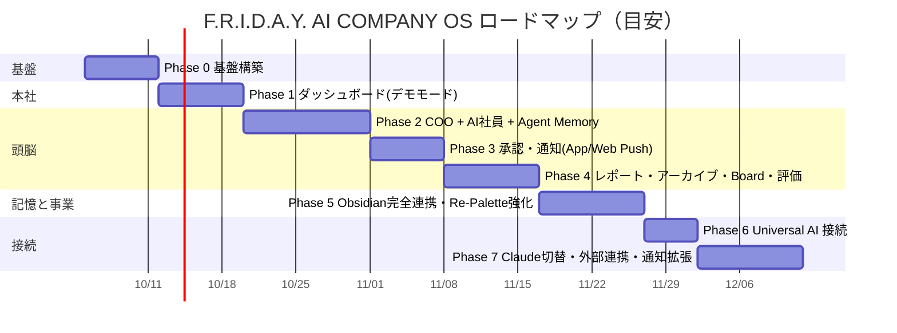

# 19. 実装ロードマップ（v1.0）

方針: **早い段階で「本社に入った」体験を作り**、裏側を段階的に本物にする。**記憶を失わない仕組み（Vault・バックアップ）は Phase 0 から**入れる。各フェーズ終了時に CEO レビュー。

| Phase | ゴール | 主な成果物 | 完了条件 |
|---|---|---|---|
| **0. 基盤** | 開発の土台と記憶の保全 | [20章](./20-phase0-plan.md) | 20章の受け入れ基準 |
| **1. 本社（デモモード）** | 「本社に入った」体験 | Home 全パネル（ACTION REQUIRED 最上部・Timeline 中央・Workforce・パフォーマンス・Re-Palette KPI）、⌘K、各画面の骨組み、Realtime 配線、**シミュレータ**（Mock Provider で社員が動き Timeline が流れる） | 1920×1080 でスクロールなしに会社全体が見え、Timeline と社員ステータスがライブで動く |
| **2. COO + AI社員 + Memory** | 本当に働き、覚えている | Intake→COO、Agent Executor、ツール、pg-boss、presence、**STM / Agent Memory（Working Context Card・items・recall・extract）**、Timeline 実データ化、コスト、Kill Switch | 指示 → 分解 → 並列作業 → 統合提案。翌日のタスクで「昨日の続き」から再開できる |
| **3. 承認・通知** | CEOは判断だけ | AI運用ルールの強制（policy・tools・資格情報隔離・DBトリガー）、Approval Gate、ACTION REQUIRED 完成、ドロワー＋プレビュー、**Notification Provider Layer（App + Web Push）**、PWA、リマインド | 承認必須8種が必ず ACTION REQUIRED に出て通知され、スマホから判断できる |
| **4. レポート・Board・評価** | 毎日・毎週のリズム | Morning Briefing（07:00）、Daily Executive Report（23:00）、**承認→Approved Reports→Obsidian→アーカイブ**、Weekly Board Meeting（日曜20:00）、**評価システム（指標定義・カウンタ・スナップショット・パネル）** | 23:00 に PDF → 承認 → Vault とバックアップに確定版が残る。Board で議題を判断できる。社員別の成果が見える |
| **5. Obsidian完全連携・Re-Palette** | 会社の脳と重要事業 | Vault Indexer・RAG、マーカー方式、**Memory Consolidation（02:00 昇格）**、Journal、Re-Palette 事業部（8名採用・専用KPI・助成金パイプライン・効果測定・専用画面）、プロジェクトテンプレート拡充 | Obsidian で全履歴と社員の学びが読める。Re-Palette 画面で事業部の状況が分かる |
| **6. Universal AI** | 外部から指揮（疎結合） | `contracts` 公開、APIキー・scope、REST、MCP、Webhook Outbox、Event Feed、`/health` | 片方を停止しても他方が稼働し、復帰後に取りこぼしなく同期される（停止試験で確認） |
| **7. 本番運用** | 実務で使える | Claude Adapter と Preset 切替、外部連携（GitHub/Vercel、Instagram、Gmail、Calendar）、**LINE / Discord / Slack プロバイダ**、予算アラート、監視 | Gemini → Claude を設定で切替。承認後に実際の投稿・送信・Deploy が実行される |

## リスクと対策

| リスク | 対策 |
|---|---|
| Gemini 無料枠のレート制限 | 優先度・降格・定時レポート枠の予約、Phase 7 で切替可能 |
| AIの暴走・コスト増 | AI運用ルールの構造的強制、予算3段階、Kill Switch |
| 承認疲れ | 「判断で止まっているものだけ」表示、EAの束ね、静音時間、一括承認（review/low のみ） |
| 記憶の消失 | Vault→GitHub→Daily Backup、復元テスト自動化（Phase 0 から） |
| Agent Memory の肥大・誤記憶 | TTL・容量上限・compaction、CEO による閲覧・削除 |
| Re-Palette の個人情報 | 個人情報を保存しない設計、restricted ルーティング |
| Universal AI との密結合化 | `contracts` パッケージ以外の共有禁止、停止試験を Phase 6 の完了条件に |
| GitHub LFS 容量 | 使用量監視（80%で通知）、PDF 圧縮 |
