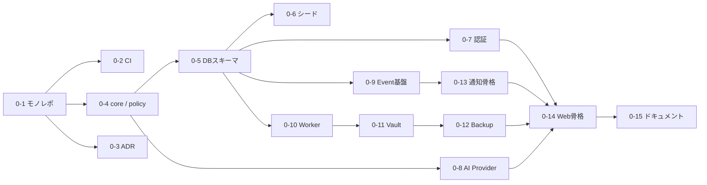

# 20. Phase 0 実装計画（基盤構築）

## 20.1 ゴール

**以降のすべてのフェーズが乗る土台**を作る。画面の見た目はまだ最小限でよいが、次の4つは Phase 0 で本物にする。

1. モノレポ・CI・型共有の開発基盤
2. v1.0 データモデル（コアテーブル）とシード（部署・AI社員・プロジェクト・ルール）
3. AI Provider Layer（Gemini + Mock）と AI運用ルールの土台（policy 定数）
4. **会社の記憶を失わない仕組み**（Vault → Private GitHub → Daily Backup）

期間目安: 7日（作業日）

## 20.2 事前に CEO に用意していただくもの

| # | 項目 | 用途 | 備考 |
|---|---|---|---|
| A1 | Supabase プロジェクト（または作成の許可） | DB / Auth / Storage / Realtime | リージョンは東京推奨 |
| A2 | Gemini API キー | Provider Layer | 無料枠で開始 |
| A3 | Private GitHub リポジトリ `friday-vault`（または作成の許可） | Vault の正本 | このセッションから操作できるよう GitHub App の権限付与が必要 |
| A4 | バックアップ先ストレージ | Daily Backup（GitHub とは別系統） | 推奨: Cloudflare R2。暫定案として Supabase Storage の別バケットでも開始可 |
| A5 | CEO のログイン用メールアドレス | 許可リスト | |
| A6 | Worker の稼働場所の決定 | 常駐プロセス | 推奨: Railway / Fly.io。Phase 0 はローカル実行でも可 |
| A7 | プロジェクト構成の確認 | シード | 「F.R.I.D.A.Y. を ARQO の子プロジェクトとする」で良いか |

APIキー等の秘密情報はチャットに貼らず、環境変数（ホスティング側のシークレット設定）に登録していただく。

## 20.3 作業分解（WBS）

| # | 作業 | 内容 | 成果物 |
|---|---|---|---|
| **0-1** | モノレポ初期化 | pnpm + Turborepo、TypeScript strict、ESLint / Prettier、`apps/web`・`apps/worker`・`packages/*` の空パッケージ、依存方向の lint ルール（`integrations` は `worker/actions` 以外 import 禁止） | リポジトリ骨格 |
| **0-2** | CI | GitHub Actions: install → lint → typecheck → test → マイグレーション検証 | `.github/workflows/ci.yml` |
| **0-3** | ADR 開始 | 主要な決定を記録（Supabase、pg-boss、Vault Git 方式、Provider Layer、Policy をコード定数化） | `docs/adr/0001〜0005` |
| **0-4** | `packages/core` | ドメイン型・enum・Zod スキーマ（Directive, Task, ApprovalRequest, MemoryItem, ActivityEvent…）、ステートマシン（承認・タスク・レポート）、**`policy/`（自律可 / 承認必須8種 / 禁止事項）** | 型とポリシー＋単体テスト |
| **0-5** | DB スキーマ v1（Drizzle） | Phase 0〜2 に必要なコアテーブル（下表）、enum、インデックス、RLS、`approved` 遷移を CEO に限定するトリガー | マイグレーション |
| **0-6** | シード | 部署11（Re-Palette は `business_unit`）、AI社員（MVP 11名 + 名簿全員を `enabled=false` で登録）、プロジェクトテンプレート7種、初期プロジェクト（Re-Palette / ARQO / F.R.I.D.A.Y. / NEWTONE / University / Personal / Future Ventures）、Re-Palette トップKPI定義、評価指標定義（共通 + Research / Marketing / Development）、Timeline テンプレート、スケジュール既定値（07:00 / 23:00 / 日曜20:00 / 02:00 / 03:00）、モデルルート（Gemini） | `packages/db/seed` |
| **0-7** | 認証 | Supabase Auth、CEO メールのみ許可、ログイン画面、保護レイアウト | ログイン可能 |
| **0-8** | AI Provider Layer 骨格 | `AIClient`、Model Router（tier 解決・fallback）、Gemini Adapter、Mock Adapter、簡易 Rate Limiter（Postgres）、`llm_usage` 記録、`generateObject` | 接続テストAPI |
| **0-9** | Event 基盤 | `activity_events` 書き込みヘルパー、`timeline_templates` による文言生成、`/api/v1/timeline` の最小実装 | Timeline データが取れる |
| **0-10** | Worker 骨格 | pg-boss 起動、キュー登録（空ハンドラ）、**Asia/Tokyo の cron 登録**、ハートビート、`/api/v1/health` の worker 状態 | Worker 稼働 |
| **0-11** | Vault 基盤 | `vault-template/` 作成（10章の構成 + `90_Templates` + `99_System/schema.md`）、`friday-vault` リポジトリへ初回 push、`VaultAdapter`（Git: clone / write / commit / push を直列実行）、ブランチ保護設定、Git LFS 設定 | Worker から Vault に書いて GitHub に反映 |
| **0-12** | Daily Backup | `backup.run`（git bundle + LFS + DB dump → 別系統ストレージ、sha256 記録、世代管理）、`backup_runs`、**復元テストジョブ**（bundle から clone → fsck → ノート数照合） | 03:00 バックアップと復元テストが成功 |
| **0-13** | Notification 骨格 | `NotificationProvider` インターフェース、Provider Registry、**InAppProvider**（DB + Realtime）、`notification_channels` シード（in_app 有効 / web_push 登録のみ） | アプリ内通知が届く |
| **0-14** | Web 骨格 | Next.js、デザイントークン、サイドバー・ヘッダーのレイアウト、Settings の最小画面（Provider 接続テスト / Vault 状態 / バックアップ状態 / スケジュール表示） | 運用状態が画面で確認できる |
| **0-15** | 開発者ドキュメント | `README`、`.env.example`、ローカル起動手順、シード手順、復旧手順（`99_System/BACKUP.md` の雛形） | |

### Phase 0 で作成するテーブル

| 区分 | テーブル |
|---|---|
| 組織 | `divisions`, `agents`, `agent_presence` |
| 仕事 | `project_templates`, `projects`, `project_divisions`, `milestones`, `directives`, `clarifications`, `tasks`, `task_dependencies`, `agent_runs`, `run_steps`, `deliverables` |
| 記憶 | `agent_working_context`, `agent_memory_items`, `memory_promotions`, `vault_documents`, `vault_sync_log` |
| 判断 | `approval_requests`, `approval_events`, `action_executions` |
| 評価・KPI | `kpi_definitions`, `kpi_values`, `metric_definitions`, `agent_metric_snapshots` |
| イベント | `activity_events`, `timeline_templates` |
| 通知 | `notification_channels`, `notification_rules`, `notifications`, `notification_deliveries` |
| AI | `provider_configs`, `model_routes`, `llm_usage` |
| システム | `company_settings`, `backup_runs` |

Phase 4 以降に追加: `reports`, `report_archives`, `meetings`, `board_agenda_items`, `outcome_records`, Re-Palette 系、`api_clients` / Webhook 系、`knowledge_chunks`, `push_subscriptions`。

## 20.4 実施順序

## 20.5 受け入れ基準（Phase 0 完了の定義）

| # | 確認項目 | 確認方法 |
|---|---|---|
| AC1 | CI（lint / typecheck / test）がグリーン | GitHub Actions |
| AC2 | CEO のメールだけがログインでき、他は拒否される | 手動確認 |
| AC3 | DB に部署11・AI社員（MVP 11名 enabled）・初期プロジェクト7件・指標定義がシードされている | Settings 画面 / SQL |
| AC4 | **プロジェクトをデータ追加だけで作れる**（コード変更なしに8件目を登録し一覧に出る） | API |
| AC5 | Settings の「接続テスト」で Gemini が応答し、`llm_usage` に記録される。Mock に切り替えても動く | 画面 |
| AC6 | `policy` の承認必須8種がテストで固定されている（リストを減らすとテストが落ちる） | 単体テスト |
| AC7 | `approval_requests` を CEO 以外が `approved` にしようとすると DB で拒否される | 統合テスト |
| AC8 | Worker が稼働し、`/health` に状態が出る。cron が JST で登録されている | API |
| AC9 | Worker から Vault にノートを書くと Private GitHub に push され、CEO の Obsidian で見える | 手動確認 |
| AC10 | Daily Backup が成功し、復元テストが自動で通る（sha256 照合まで） | `backup_runs` |
| AC11 | `activity_events` に書いたイベントが Timeline API で日本語1行として取得できる | API |
| AC12 | アプリ内通知が Realtime で届く | 画面 |

## 20.6 Phase 0 でやらないこと

- ダッシュボードの完成デザイン（Phase 1）
- COO / AI社員の実際の稼働（Phase 2）
- Web Push・承認UI（Phase 3）
- PDF レポート（Phase 4）
- Universal AI 接続（Phase 6）
- Claude 切替・外部サービス連携（Phase 7）

## 20.7 Phase 0 のリスク

| リスク | 対策 |
|---|---|
| 外部アカウントの準備待ちで止まる | A1〜A4 が揃うまでは Supabase ローカル（CLI）・ローカル Git リモート・ローカルバックアップで進め、後で接続先を差し替え（Adapter 構造のため影響は設定のみ） |
| GitHub 権限（Vault リポジトリ）不足 | このセッションから操作できるリポジトリは許可されたものに限られるため、`friday-vault` 作成後に権限付与を依頼 |
| スキーマの後戻り | Phase 0〜2 に必要なテーブルに限定し、後続フェーズのテーブルは追加マイグレーションで対応 |
