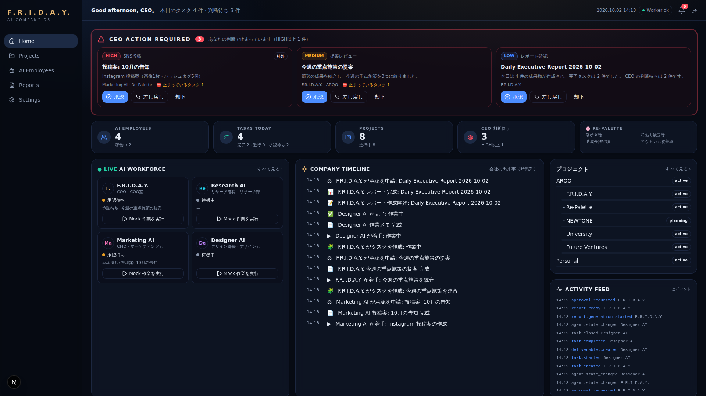
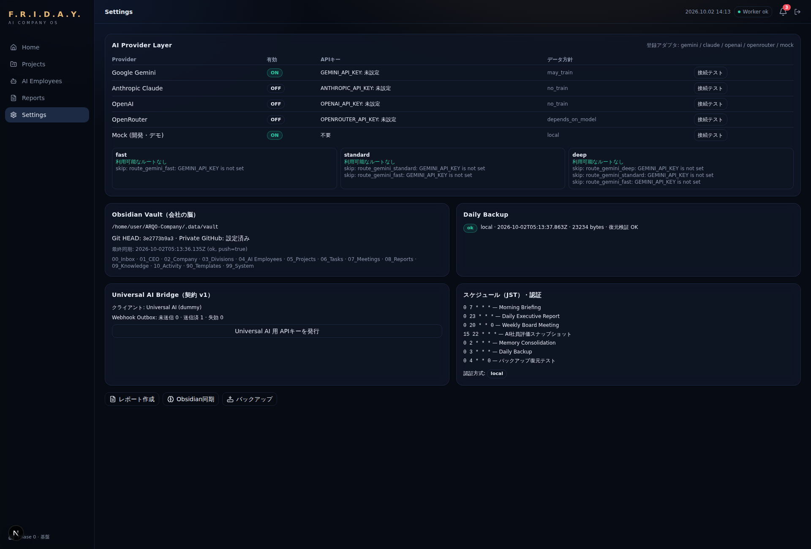

# Phase 0 完了報告 — 基盤構築

> 対象ブランチ: `claude/dreamy-euler-mbhe4r` / 報告日: 2026-10-02
> 設計書: [docs/design v1.0](../design/README.md) / 設計判断: [docs/adr](../adr/)

## 結論

**Phase 0 の完了条件 10 項目はすべて動作確認済み**。ただし「10. Gemini Provider 呼び出し」は、この環境に API キーがないため **「Google の本番エンドポイントへの実リクエスト到達」までの確認**です（生成の成功確認には CEO の `GEMINI_API_KEY` が必要）。

| 指標 | 結果 |
|---|---|
| 完了条件（ブラウザ E2E） | **18 / 18 チェック合格**（完了条件10項目＋追加検証8項目） |
| 単体・統合テスト | **48 / 48 合格**（7パッケージ。統合テストは実 Postgres 上で全フローを実行） |
| typecheck / lint | 10 / 10 パッケージ合格・lint エラー 0 |
| 本番ビルド | `next build` 成功（API 37 ルート + 6 画面） |



---

## 1. 実装内容一覧

| 必須項目 | 実装 | 主なファイル |
|---|---|---|
| Next.js 環境構築 | Next.js 16（App Router・Turbopack）、`proxy.ts`（旧 middleware）で未ログイン時の振り分け | `apps/web` |
| TypeScript | 全パッケージ strict（`noUncheckedIndexedAccess` 有効） | `tsconfig.base.json` |
| Tailwind | Tailwind CSS v4。設計書 17.5 のデザイントークン（ダークネイビー×ゴールド） | `apps/web/src/app/globals.css` |
| shadcn/ui | `components.json` + shadcn 形式のコンポーネント（Button / Card / Badge / Input / Label / Textarea / Separator） | `apps/web/src/components/ui` |
| Supabase 接続 | 標準 Postgres 接続（`DATABASE_URL`）で Supabase / ローカル / CI 共通。Supabase Auth・Storage に対応 | `packages/db`, `apps/web/src/lib/auth.ts` |
| 認証基盤 | CEO 1名のみ。本番: Supabase Auth マジックリンク（CEO_EMAIL 限定）／開発: ローカル認証（本番では自動無効）。ログイン試行制限、Cookie は httpOnly・SameSite=Lax、書き込み API は Origin 検証 | `apps/web/src/lib/auth.ts` |
| Provider Layer | tier 指定 → ルーティング表で解決、フォールバック、レート制限、機密区分ルール、使用量記録、ルート固定の接続テスト | `packages/ai` |
| Gemini Provider | `generateContent` REST、構造化出力（`responseJsonSchema`） | `packages/ai/src/adapters/gemini.ts` |
| （追加）Claude / OpenAI / OpenRouter | アダプタ実装済み・初期は無効。Claude は公式 SDK、OpenAI/OpenRouter は Chat Completions | `packages/ai/src/adapters/*` |
| Obsidian 連携基盤 | Vault 構造の自動生成、frontmatter、管理ブロック（CEO メモは上書きしない）、独立 Git リポジトリ、Private GitHub への push、日次バックアップ＋復元検証 | `packages/vault`, `packages/backup`, `packages/services/src/vault-*.ts` |
| Notification 基盤 | プロバイダ交換可能な通知層。App（有効）・Web Push（登録済み・Phase 3 で配信）・Slack / Discord（実装済み・無効）。LINE は registry に登録するだけで追加可能 | `packages/notify` |
| Approval 基盤 | AI運用ルール（承認必須8行為）をコード定数化、承認ゲート、ペイロードのハッシュ固定、CEO のみ承認可（API＋DB トリガー）、監査ログ追記のみ、スコア順の CEO ACTION REQUIRED | `packages/core/src/policy.ts`, `packages/services/src/approvals.ts` |
| Report 基盤 | 数値はスナップショットから挿入・文章は COO が作成 → `report_review` 承認 → **Approved Reports → Obsidian → GitHub →（次回バックアップ）** | `packages/services/src/reports.ts` |
| Project 基盤 | テンプレート駆動（7種）、親子ツリー、カスタム項目の検証、Vault フォルダ自動生成。**コード変更なしで追加可能** | `packages/services/src/projects.ts` |
| Agent Registry | AI社員はデータ。採用 API・UI、直接実行ツールの付与を拒否、プロフィールを Vault に生成 | `packages/services/src/agents.ts` |
| Mock Agent | COO（F.R.I.D.A.Y.）/ Research AI / Marketing AI（＋E2E で Designer AI を採用）。作業 → 成果物 → Agent Memory → 必要時は承認申請 | `packages/services/src/mock-agents.ts` |
| Universal AI Bridge | 公開契約 v1、APIキー（ハッシュ保存・scope）、冪等キー、Webhook Outbox（HMAC 署名・指数バックオフ）、Event Feed、ダミー受信口、耐障害クライアント | `packages/contracts`, `packages/services/src/bridge.ts` |
| Activity Event System | 全変化を `activity_events` に記録。Timeline はデータ化した文言テンプレートで生成（LLM 不使用）、Activity Feed は生イベント | `packages/services/src/events.ts`, `timeline.ts` |
| Dashboard | CEO ACTION REQUIRED（最上部・全幅・その場で承認/差し戻し/却下）、KPI、Live Workforce、Company Timeline（中央）、Activity Feed、Project 一覧、Command Center | `apps/web/src/app/page.tsx` |
| （追加）Worker | JST cron（07:00 / 23:00 / 日曜 20:00 / 02:00 / 03:00）、ハートビート、Webhook 配信、Vault 同期 | `apps/worker` |
| （追加）CI | GitHub Actions（Postgres 16 サービス付き）: typecheck / lint / test / migrate | `.github/workflows/ci.yml` |

### 指示への回答の反映

| 指示 | 反映 |
|---|---|
| F.R.I.D.A.Y. を ARQO 配下に | `ARQO ├ F.R.I.D.A.Y. / Re-Palette / NEWTONE / University / Future Ventures` としてシード。**会社データは `seed/companies/arqo.ts` に分離**し、システムコードは ARQO を一切参照しない（`SEED_PROFILE=system` で F.R.I.D.A.Y. 単体起動が可能） |
| バックアップ = Vault → Private GitHub → R2 | R2（S3 互換署名・上書き不可）を実装。**未設定時は Supabase Storage、どちらも無い開発環境のみローカル**へフォールバック |

---

## 2. フォルダ構成

```
ARQO-Company/
├── apps/
│   ├── web/                         Next.js 16
│   │   └── src/
│   │       ├── app/
│   │       │   ├── page.tsx         Home Dashboard
│   │       │   ├── login/ auth/callback/
│   │       │   ├── projects/ agents/ reports/ settings/
│   │       │   └── api/
│   │       │       ├── v1/…         REST API（37ルート）
│   │       │       └── dev/dummy-universal-ai/
│   │       ├── components/{ui,dashboard,shell}/
│   │       ├── lib/{auth,api,client-api,utils}.ts
│   │       └── proxy.ts
│   └── worker/src/{main,jobs}.ts    定時ジョブ
├── packages/
│   ├── core/        enums・policy・approval/report 状態遷移・hash・timeline・Zod 入力
│   ├── db/          schema.ts・migrations/（3本）・seed/{system,companies/arqo}.ts
│   ├── ai/          client（Router）・registry・rate-limit・adapters/{gemini,claude,openai-compatible,mock}
│   ├── vault/       layout・markdown（管理ブロック）・store・git・scaffold
│   ├── backup/      R2 / Supabase Storage / Local
│   ├── notify/      types・registry・rules・providers/{in-app,web-push,webhook-chat}
│   ├── contracts/   v1 スキーマ・Webhook 署名・FridayClient
│   └── services/    agents・approvals・decisions・reports・projects・bridge・events・timeline・
│                    notifications・mock-agents・vault-*・backup・dashboard・health・providers
├── docs/{design,adr,phase0}/
├── .github/workflows/ci.yml
└── turbo.json / pnpm-workspace.yaml / tsconfig.base.json
```

依存方向: `core` は何にも依存しない。外部連携の実行コードは Phase 0 では未実装（承認後の実行は Phase 3/7）。

---

## 3. DB スキーマ

**43 テーブル・27 enum・マイグレーション 3 本**（`packages/db/migrations`）。全テーブル RLS 有効。

| 区分 | テーブル |
|---|---|
| 組織 | `divisions`, `agents`, `agent_presence` |
| 仕事 | `project_templates`, `projects`, `project_divisions`, `milestones`, `directives`, `clarifications`, `tasks`, `task_dependencies`, `agent_runs`, `run_steps`, `deliverables` |
| Agent Memory | `agent_working_context`, `agent_memory_items`, `memory_promotions` |
| 判断 | `approval_requests`, `approval_events`, `action_executions` |
| レポート | `reports`, `report_archives` |
| KPI・評価 | `kpi_definitions`, `kpi_values`, `metric_definitions`, `agent_metric_snapshots` |
| イベント | `activity_events`, `timeline_templates` |
| 通知 | `notification_channels`, `notification_rules`, `notifications`, `notification_deliveries` |
| Universal AI | `api_clients`, `webhook_subscriptions`, `webhook_outbox`, `idempotency_keys` |
| AI Provider | `provider_configs`, `model_routes`, `llm_usage` |
| Vault・運用 | `vault_documents`, `vault_sync_log`, `backup_runs`, `company_settings` |

| マイグレーション | 内容 |
|---|---|
| `0000_init` | 全テーブル・enum・インデックス |
| `0001_security_guards` | RLS 有効化（ポリシーなし＝クライアント直アクセス不可）／**`approved` 遷移は `friday.actor='ceo'` 必須**／承認ペイロード改変禁止／`approval_events`・`report_archives` 追記のみ／`activity_events` 削除禁止 |
| `0002_worker_heartbeat` | `company_settings.worker_heartbeat_at` |

### ⚠️ 設計 v1.0（09章）との差分 — データ構造の変更につき確認をお願いします

| # | 差分 | 理由 | 提案 |
|---|---|---|---|
| S1 | `agents.runtime`（`mock` / `llm`）を追加 | Mock Agent と実AI社員を同じテーブルで区別するため | 採用 |
| S2 | `company_settings.worker_heartbeat_at` を追加 | Worker の稼働監視（`/health`） | 採用 |
| S3 | `agent_memory_items.embedding` / `knowledge_chunks` は未作成 | ローカル検証環境に pgvector がないため。Supabase では利用可能 | Phase 2 で追加 |
| S4 | `report_archives` は `content_sha256` を必須、PDF 関連列は任意 | Phase 0 のレポートは Markdown（PDF は Phase 4） | Phase 4 で PDF 列を必須化 |
| S5 | `reports.content_md` を追加 | 承認対象の本文を DB に保持し、ハッシュで固定するため | 採用 |
| S6 | `webhook_subscriptions.secret_ref` は `env:NAME` 形式のみ | Webhook 秘密鍵を DB に保存しないため | 採用 |
| S7 | Personal プロジェクトは ARQO の外（ルート）に配置 | ご指示のツリーに含まれていなかったため | ARQO 配下にすべきならご指示ください |

---

## 4. API 一覧（`/api/v1`）

🔐 = CEO セッションのみ / 🔑 = APIキーも可（scope） / 🌐 = 認証不要

| 区分 | エンドポイント |
|---|---|
| System | 🌐 `GET /health` ・ 🔑 `GET /status` |
| Dashboard | 🔐 `GET /dashboard` ・ 🔐 `GET /action-queue` ・ 🔐 `GET /timeline` ・ 🔐 `GET /activity` |
| Approvals | 🔑 `GET /approvals` ・ 🔐 `POST /approvals` ・ 🔑 `GET /approvals/:id` ・ 🔐 `POST /approvals/:id/approve`（`payload_hash` 必須）・ 🔐 `POST /approvals/:id/reject` ・ 🔐 `POST /approvals/:id/request-revision`（コメント必須） |
| Agents | 🔐 `GET/POST /agents` ・ 🔐 `GET /agents/:id` ・ 🔐 `POST /agents/:id/run`（Mock 作業） ・ 🔐 `GET /divisions` |
| Projects | 🔐 `GET/POST /projects` ・ 🔐 `GET /projects/:slug` ・ 🔐 `GET /project-templates` |
| Reports | 🔑 `GET /reports`（キーは承認済みのみ）・ 🔑 `GET /reports/approved` ・ 🔑 `GET /reports/:id` ・ 🔐 `POST /reports/generate` |
| Notifications | 🔐 `GET /notifications` ・ 🔐 `POST /notifications/:id/read` ・ 🔐 `POST /notifications/read-all` |
| Directives | 🔑 `POST /directives`（キー利用時は `Idempotency-Key` 必須・202）・ 🔑 `GET /directives` ・ 🔑 `GET /directives/:id` |
| Universal AI | 🔑 `GET /events?after=`（取りこぼし回収） |
| Settings | 🔐 `GET /settings/providers` ・ 🔐 `POST /settings/providers/:id/test` ・ 🔐 `GET /settings/vault/status` ・ 🔐 `POST /settings/vault/sync` ・ 🔐 `GET /settings/backups` ・ 🔐 `POST /settings/backups/run` ・ 🔐 `GET/POST /settings/api-clients` ・ 🔐 `POST /settings/webhooks` ・ 🔐 `PUT /settings/webhooks`（手動配信） |
| 開発用 | `GET/POST /api/dev/dummy-universal-ai`（`ENABLE_DUMMY_UNIVERSAL_AI=true` かつ非本番のみ） |

エラー形式: `{ "error": { "code", "message", "details?" } }` — `VALIDATION_ERROR` / `UNAUTHORIZED` / `FORBIDDEN` / `NOT_FOUND` / `CONFLICT` / `APPROVAL_HASH_MISMATCH` / `POLICY_VIOLATION` / `SERVICE_UNAVAILABLE`

---

## 5. 動作確認結果

環境: ローカル PostgreSQL 16、Next.js dev サーバー + Worker 常駐、Chromium（Playwright）で 1920×1080 と 390×844 を操作。Private GitHub は**ローカルの bare リポジトリで代替**、R2/Supabase Storage は**ローカルディレクトリで代替**。

### 完了条件

| # | 完了条件 | 結果 | 確認内容 |
|---|---|---|---|
| 1 | ログインできる | ✅ | 未ログインは `/login` へ。誤パスワード拒否（メールアドレスは保持）→ 正しい認証でダッシュボードへ |
| 2 | Dashboard 表示 | ✅ | CEO ACTION REQUIRED / KPI / Live Workforce / Company Timeline / Activity Feed / プロジェクト一覧。スマホでは ACTION REQUIRED が先頭 |
| 3 | Mock Agent 登録 | ✅ | Designer AI を API で採用 → 一覧・Vault プロフィール生成。`email_send` ツール付きの登録は `POLICY_VIOLATION` で拒否 |
| 4 | Project 作成 | ✅ | `ARQO Labs`（テンプレート venture、親 Future Ventures）をコード変更なしで作成。不正なカスタム項目は拒否 |
| 5 | Activity 生成 | ✅ | Mock Agent 4名の作業で Timeline 18件・Activity 29件。例:「Research AI 助成金情報を発見…」「Marketing AI 投稿案… 完成」「CEO 承認: …」 |
| 6 | Report 作成 | ✅ | Daily Executive Report 生成 → 承認待ち → UI で承認 → `08_Reports/Approved/2026/10/…md` に保存・コミット・push |
| 7 | Approval 作成 | ✅ | SNS投稿（社外・HIGH）と提案レビュー（MEDIUM）が自動申請。UI から承認すると ACTION REQUIRED から消える。**表示と異なるハッシュでの承認は 409 で拒否**、**DB 直接の承認更新もトリガーで拒否** |
| 8 | Notification 生成 | ✅ | 5件（action_required / report / project）。App は送信済、Web Push は「VAPID 未設定」で skipped と記録 |
| 9 | Obsidian へ保存 | ✅ | `05_Projects`・`08_Reports`（Drafts / Approved）・`07_Meetings`・`04_AI Employees`（Profile / Memory / Journal）・`01_CEO/Daily`・`01_CEO/Decisions`・`10_Activity` を生成。Vault コミット 11 件すべてが remote に push 済み |
| 10 | Gemini Provider 呼び出し | ⚠️ 部分確認 | API キー未設定のため、接続テストは「`GEMINI_API_KEY is not set`」を理由付きで 503。**無効キーで本番エンドポイントへ実リクエスト → Google から HTTP 400「API key not valid」**（リクエスト形式・到達・エラー分類・使用量記録を確認）。Mock 経由の呼び出しは成功 |

### 追加検証

| 項目 | 結果 |
|---|---|
| Universal AI Bridge | ✅ APIキーで依頼 202、同一冪等キーの再送は同じ ID を返す、別内容での再利用は 409、**APIキーでの承認は 403**、キーなし 401、ダミー受信口が **HMAC 署名を検証して** `directive.accepted` を受信、Event Feed で取得可 |
| Universal AI 停止時 | ✅（統合テスト）受信口ダウン中も依頼は受理され、Webhook は Outbox で再送待ち → 復帰後に配信 |
| Daily Backup | ✅ git bundle を保存 → 取り戻して clone・fsck・ノート数・sha256 照合で**復元検証 OK** |
| Health | ✅ `database: ok`, `worker: ok`（Worker のハートビート） |
| 本番ビルド | ✅ `next build` 成功 |



---

## ⚠️ 実装中に発生した不具合と対応（報告）

**事象**: Vault の保存先 `.data/vault` がこのリポジトリの内側にあり、Vault 用の Git 処理が「親リポジトリ（ARQO-Company）」を自分のリポジトリと誤認しました。その結果、

1. 作業中のソースコード一式が、ローカルのブランチに `friday: agent.registered designer` というコミット `f82f5a7` として記録された
2. `origin` の URL がローカルの検証用リポジトリに書き換えられた
3. ローカルの git 設定に `user.name/email = F.R.I.D.A.Y.` と git-lfs の設定・フックが追加された

**影響**: push は失敗していたため **GitHub には何も送られていません**（`git ls-remote` で確認済み）。Vault の内容（`.data/` は .gitignore 対象）もリポジトリには入っていません。

**対応**:
- `origin` を `https://github.com/Re-Palette/ARQO-Company` に戻し、誤って追加された git ユーザー設定を削除しました。
- コミット `f82f5a7` の取り消し（履歴の書き換え）と git-lfs フックの削除は、実行環境の安全確認でブロックされたため**行っていません**。`f82f5a7` は本来の Phase 0 コードのみを含むため、その上に通常のコミットを重ねて push しています（履歴上、Phase 0 のコードが2つのコミットに分かれ、1つ目のコミットメッセージが Vault 用の文言になっています）。気になる場合は PR 作成時に squash merge をお勧めします。ローカルの git-lfs フック（`.git/hooks/`）は無害ですが、不要であれば削除してください。
- **再発防止**: Vault の Git 操作は常に `GIT_DIR`/`GIT_WORK_TREE` を Vault 自身に固定し、Vault が親リポジトリの中にあっても親に一切書き込まないことを回帰テストで保証しました。あわせて、Web と Worker の同時書き込みを Postgres アドバイザリロックで直列化しました。

---

## 6. 未実装項目

| 項目 | 予定 | 備考 |
|---|---|---|
| 実AI社員（LLM 実行ループ・COO のタスク分解） | Phase 2 | Phase 0 は Mock Agent。Command Center の指示は Directive として受付・記録まで |
| Agent Memory の想起・昇格（pgvector・RAG・02:00 Consolidation） | Phase 2 / 5 | テーブル・記録のみ実装 |
| ジョブキュー（pg-boss） | Phase 2 | Phase 0 は Worker 内 cron（croner）＋同期処理 |
| Realtime | Phase 1 | Phase 0 は 10 秒ポーリングで更新 |
| Web Push 配信（VAPID・PWA） | Phase 3 | プロバイダ登録・設定検証のみ |
| 承認後の実行（SNS 投稿・メール送信・デプロイ等の Action Executor） | Phase 3 / 7 | 承認状態までは完成。実行コードは未実装（安全側） |
| PDF 生成（Playwright）・Storage への Approved Reports 保存・署名 URL | Phase 4 | Phase 0 は Markdown で Approved → Obsidian → GitHub |
| Morning Briefing / Weekly Board の本格版・AI社員評価の集計 | Phase 4 | ジョブ枠と指標定義のみ |
| MCP Server | Phase 6 | REST・Webhook・Event Feed・契約パッケージは完成 |
| Re-Palette 専用画面・KPI 入力 | Phase 5 | トップ KPI 定義と Home 表示枠のみ |
| 実環境接続（Supabase / Private GitHub / R2 / Gemini キー） | CEO の準備後 | コードは対応済み。環境変数を設定すれば切替 |

---

## 7. Phase 1 推奨内容

1. **実環境への接続（最優先・半日）**: Supabase プロジェクト、`friday-vault` Private リポジトリ（Deploy Key）、Cloudflare R2 バケット、`GEMINI_API_KEY` を設定し、本報告の E2E を実環境で再実行（完了条件 10 の完全確認）。
2. **Dashboard 完成版**: 設計 17章のレイアウト（1920×1080 スクロールなし）、Supabase Realtime による即時更新、⌘K、AI社員パフォーマンス、Re-Palette KPI カード、承認詳細ドロワー（プレビュー・履歴）。
3. **デモモード／シミュレータ**: Mock Agent が定期的に自走して Timeline が流れる状態（「本社に入った」体験の確認用）。
4. **E2E テストのリポジトリ化**: 今回の Playwright シナリオを `apps/web/e2e` に取り込み CI で実行。
5. **Phase 2 の下準備**: pg-boss 導入、pgvector マイグレーション（S3）、COO の構造化出力スキーマ定義。

### CEO にご用意いただきたいもの

| # | 項目 | 用途 |
|---|---|---|
| 1 | Supabase プロジェクト（東京リージョン推奨）の URL / anon key / service role key / DB 接続文字列 | DB・認証・Storage |
| 2 | `GEMINI_API_KEY` | 完了条件 10 の完全確認 |
| 3 | Private リポジトリ `friday-vault` と Deploy Key（書き込み可・admin なし） | Vault の正本 |
| 4 | Cloudflare R2 のバケットと API トークン（オブジェクト書き込みのみ推奨） | Daily Backup |
| 5 | データ構造差分 S1〜S7 の確認 | 上記「設計との差分」 |

秘密情報はチャットに貼らず、ホスティング側の環境変数に登録してください。
